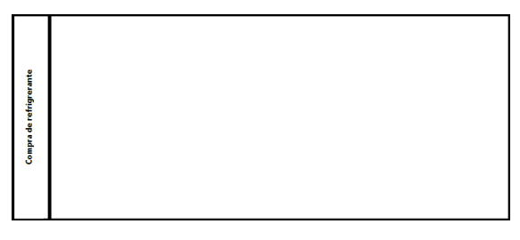
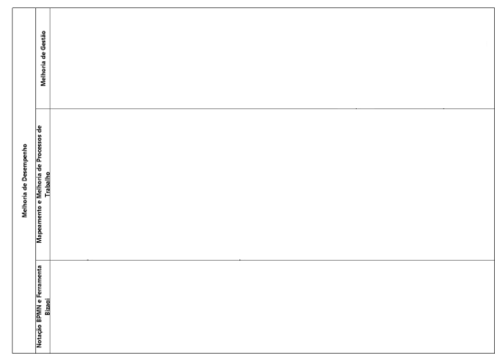
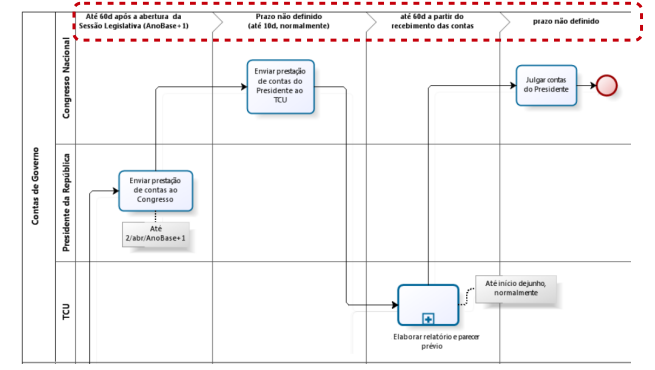
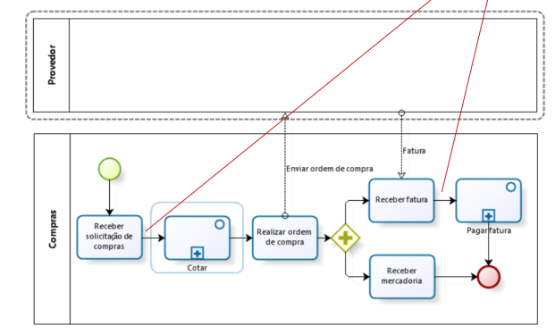
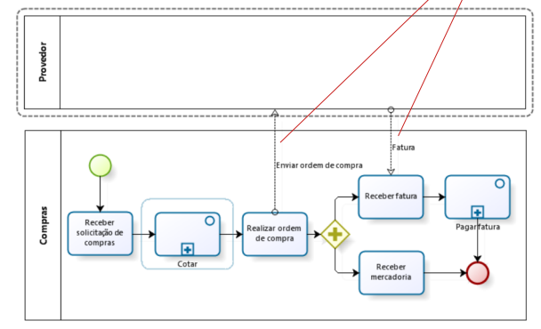
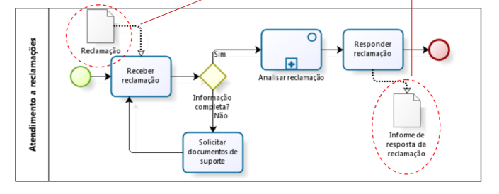
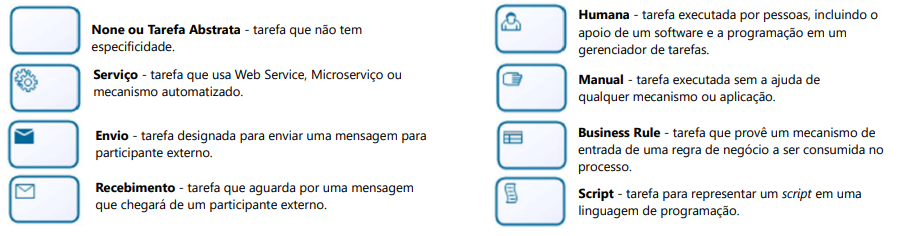
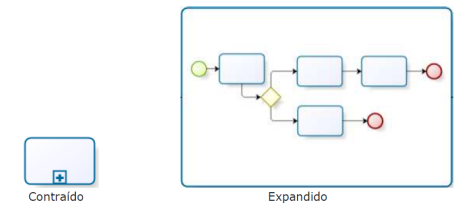
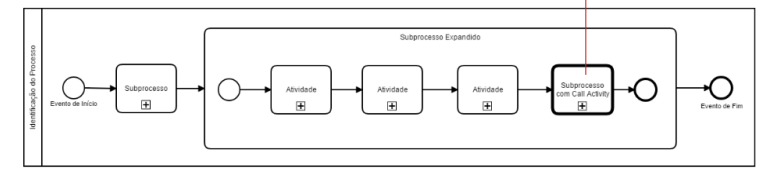

# BPMN (Business Process Model and Notation)

---

## **1. Conceito**

Notação padronizada para diagramação de fluxos de processos de negócio.

Mantida pela OMG (Object Management Group), um consórcio internacional de padronização.

Objetivo: facilitar a compreensão, comunicação e automação de processos entre áreas de negócio e TI.

---

## **2. Principais Abstrações da BPMN**

### **2.1 Piscina (Pool)**

Representa um participante de um processo (empresa, sistema ou organização).

Pode ser black box quando não se detalha o processo interno.

  

---

### **2.2 Raia (Lane)**

Subdivisão da pool.

Usada para representar funções, papéis, sistemas ou departamentos.

  

---

### **2.3 Fase/Milestone**

Subdivisão temporal ou de etapas dentro da pool.

Representa marcos do processo.

  

---

### **2.4 Conectores**
Definem o fluxo de execução, podem ser:

- **Sequência:** ordem das atividades.

  

- **Mensagem:** troca de informações entre participantes (pools).

  

- **Associação:** conecta anotações/artefatos a elementos.

  

---

### **2.5 Atividades**

Unidade de trabalho do processo.
único verbo.

Tipos comuns:

- Tarefa simples (atômica)
- Humana 
- Manual
- Serviço / Script / Business Rule
- Envio / Recebimento de mensagens

  

---

### **2.6 Subprocessos**

Conjunto de atividades agrupadas.

Quando não consegue representar só com um verbo.

Podem ser 

- Embutidos.
- Expandidos.
- Cíclicos.

  

---

### **2.7 Call Activity/Reutilizável**

Invoca subprocessos ou tarefas globais reutilizáveis.

Não possui dependência com o processo pai.

  

---

### **2.8 Eventos**

Ocorrências que iniciam, interrompem ou finalizam o fluxo.

Tipos: 

- Início.
- Intermediário 
- Fim.

Podem ser genérico, tempo, mensagem, sinal, erro, cancelamento, etc.

  

---

### **2.9 Gateways (Decisões)**

Controlam divergência ou convergência do fluxo.

Tipos principais:

- Exclusivo (XOR).

- Inclusivo (OR).

- Paralelo (AND).

- Baseado em evento.

- Complexo.

---

### **2.10 Itens e Dados**

Representam documentos, informações ou objetos físicos que transitam no processo.

Exemplo: artefatos de dados, anotações.