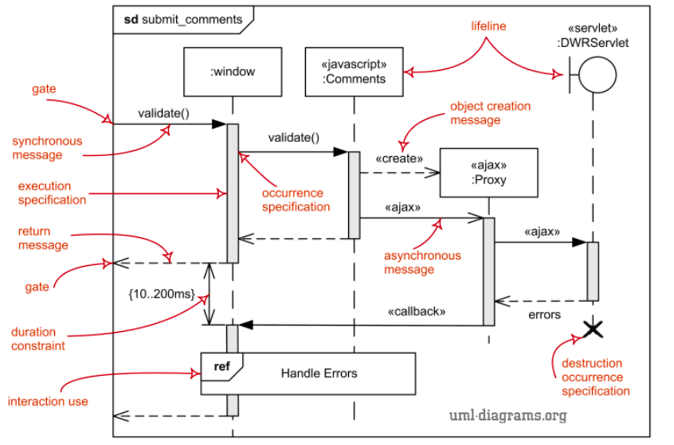
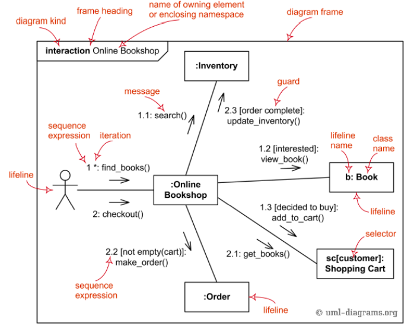
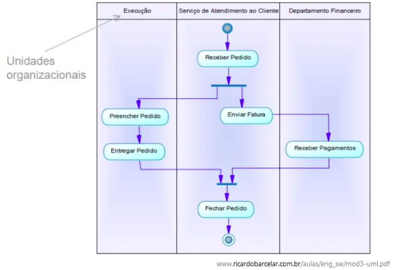
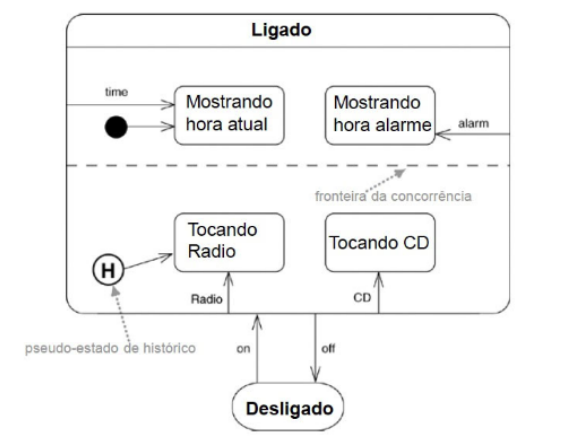

# Modelagem Dinâmica

---

## 1. Introdução

### 1.1 O que é

- Modelagem que mostra como o sistema se comporta ao longo do tempo.
- Representa interações, fluxos de ações e mudanças de estado entre objetos.
- Complementa a modelagem estática.
- Essencial nas fases em que quermos entender o comportamento do sistema.

### 1.2 Principais diagramas dinâmicos

- Diagrama de Sequência.
- Diagrama de Colaboração.
- Diagrama de Atividades.
- Diagrama de Estados

---

## 2. Diagrama de Sequência

### 2.1 Conceito

- Mostra a interação entre objetos (ou instâncias de classes) ao longo do tempo.
- Cada interação é representada como uma mensagem trocada entre objetos.

### 2.2 Elementos principais

| Elemento                               | Descrição                                                                       |
| -------------------------------------- | ------------------------------------------------------------------------------- |
| **Objeto**                             | Instância de uma classe; representado na parte superior.                        |
| **Linha de vida (lifeline)**           | Linha vertical que representa o tempo de existência do objeto.                  |
| **Caixa de ativação (activation bar)** | Representa o período em que o objeto está executando uma operação.              |
| **Mensagem**                           | Seta indicando a comunicação entre objetos (chamada de método, resposta, etc.). |
| **Retorno**                            | Linha tracejada mostrando o retorno de uma operação.                            |

### 2.3 Construções cocmuns

**Loop:** indica repetição de interações (ex: para cada item em uma lista).

**Fluxo alternativo:** representa decisões condicionais (if/else).

**Fragmentos combinados:** usados para organizar loops, condições ou exceções.

### 2.4 Usos práticos

- Útil para modelar cenários de caso de uso.
- Ajuda a visualizar a ordem das chamadas de métodos.
- Ferramenta de design para testar a lógica e coerência das interações

  

---

## 3. Diagrama de Colaboração

### 3.1 Conceito

- Mostra como os objetos colaboram entre si para realizar um comportamento específico.
- Enfatiza a estrutura da comunicação, não o tempo das mensagens.
- Cada mensagem é numerada para indicar a ordem de execução.

### 3.2 Diferenças em relação ao diagrama de sequência

| Diagrama de Sequência                                 | Diagrama de Colaboração                               |
| ----------------------------------------------------- | ----------------------------------------------------- |
| Foco no **tempo** das interações                      | Foco na **estrutura da comunicação**                  |
| Mensagens verticais, dispostas em ordem cronológica   | Mensagens numeradas, sem eixo temporal                |
| Mais intuitivo para representar **fluxo de execução** | Mais útil para representar **relações entre objetos** |

### 3.3 Aplicação prática
- Usado para detalhar casos de uso.
- Mostra quem envia mensagens a quem e como os objetos estão conectados.
- Bom para identificar acoplamentos e dependências entre objetos.

  

---

## 4. Diagrama de Atividades

### 4.1 Conceito

- Representa o fluxo de atividades ou ações dentro de um processo.

- É o diagrama comportamental mais usado para modelar fluxos de negócio.

- Pode ser comparado a um fluxograma, mas com semântica orientada a objetos.

### Elementos principais

| Elemento                   | Descrição                                                |
| -------------------------- | -------------------------------------------------------- |
| **Atividade/Ação**         | Representa uma tarefa ou operação.                       |
| **Transição**              | Mostra o fluxo entre atividades.                         |
| **Decisão / Fusão**        | Indica caminhos alternativos (if/else).                  |
| **Fork / Join**            | Representa paralelismo (tarefas simultâneas).            |
| **Swimlanes (raias)**      | Separação por responsabilidades (ex: módulos ou atores). |
| **Evento inicial / final** | Início e fim do fluxo.                                   |

### 4.3 Uso prático

- Ideal para modelar processos de negócio (ex: fluxo de pedido, login, matrícula).

- Usado para documentar regras de negócio ou algoritmos de alto nível.

- Pode mostrar interações entre classes e sistemas em nível mais abstrato.

  

---

## 5. Diagrama de Estados
### 5.1 Conceito

- Mostra os vários estados de um objeto e as transições entre esses estados.
- Um estado representa uma condição durante a vida do objeto.
- Um evento (interno ou externo) causa uma mudança de estado.

### 5.2 Elementos principais

| Elemento                 | Descrição                                                 |
| ------------------------ | --------------------------------------------------------- |
| **Estado**               | Representa uma condição do objeto (ex: ativo, inativo).   |
| **Transição**            | Mudança de um estado para outro, disparada por um evento. |
| **Evento**               | Ação que provoca a transição.                             |
| **Ação**                 | Atividade executada durante uma transição.                |
| **Estado inicial/final** | Define o início e o fim do ciclo de vida.                 |

  

