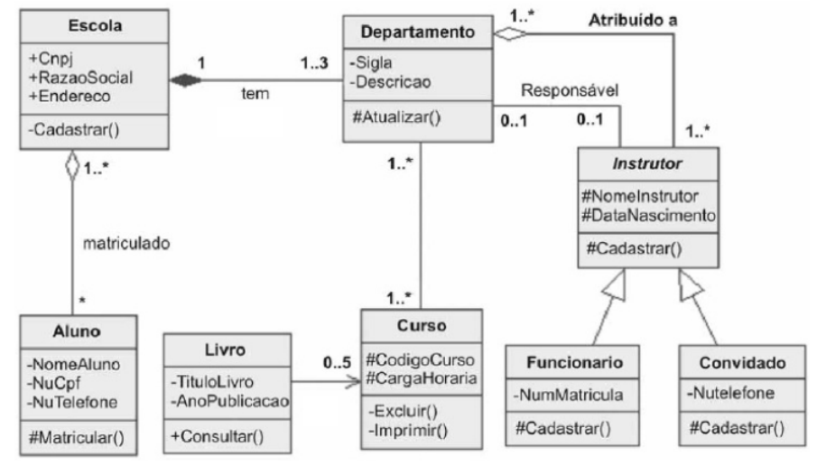
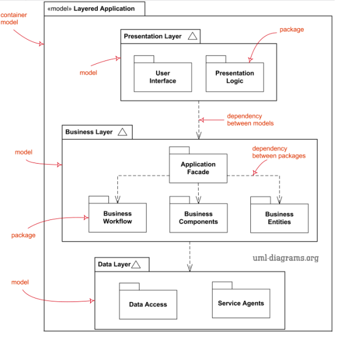
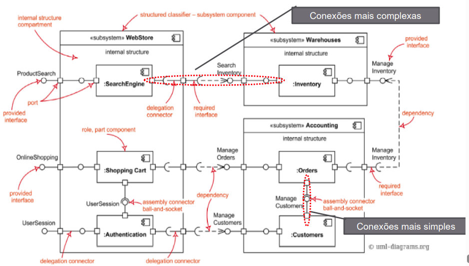

# Modelagem UML Estática

---

## 1. Introdução

### 1.1 O que é a UML

- É uma linguagem visual de modelagem usada para representar sistemas orientados a objetos.
- Cria uma visão comum entre desenvolvedores, analistas e clientes.
- Não é: um processo, metodologia, lingaugem de programação.

### 1.2 TIpos de Diagramas UML

**Estruturais/Estáticos:**

- Mostram a estrutura do sistema.
- Diagramas de Classes.
- Diagrama de Pacotes.

- Diagrama de Componentes. 

**Comportamentais/Dinâmicos:**

- Mostram o comportamento e interação.
- Diagrama de Casos de Uso.
- Diagrama de Sequência.
- Diagrama de Estados.

**Organizacionais:** mostram a modularização e dependências.
**Anotacionais:** acrescemtam notas e comentários explicativos.

---

## 2. Diagramas Estáticos

### 2.1 Estrutura

Representa a estrutura estática do sistema mostrando:
- Classes.
- Interfaces.
- Relacionamentos entre elas.

```bash title="Estrutura:"

-----------------
NomeDaClasse
-----------------
+ atributoPublico
- atributoPrivado
# atributoProtegido
-----------------
+ metodoPublico()
- MetodoPrivado ()
# metodoProtegido ()
```

<p align="center">
  
</p>


### 2.2 Tipos de Relacionamentos

| Tipo              | Significado                          | Exemplo                     |
| ----------------- | ------------------------------------ | --------------------------- |
| **Dependência**   | Uma classe usa outra temporariamente | Pedido → usa → Cliente      |
| **Associação**    | Ligação lógica entre classes         | Pessoa possui Conta         |
| **Agregação**     | Relação “tem”, mas com independência | Empresa tem Funcionários    |
| **Composição**    | Relação “é composto de”, dependente  | Carro contém Motor          |
| **Generalização** | Herança (é um(a))                    | Professor é uma Pessoa      |
| **Realização**    | Implementação de interface           | Classe implementa Interface |

### 2.3 Multiplicidade

| Símbolo | Significado        |
| ------- | ------------------ |
| 1..1    | Um para um         |
| 1..*    | Um para muitos     |
| *..*    | Muitos para muitos |
| 0..1    | Opcional           |
| 2..5    | Entre 2 e 5        |

### 2.4 Tipos Especiais

**Classe Associativa:** quando a relação entre duas classes possui atributos próprios.

**Associação Reflexiva:** uma classe se relaciona consigo mesma (ex: Funcionário supervisiona Funcionário).

**Classe Abstrata:** não gera instâncias; serve de base para outras.

**Polimorfismo e Sobrescrita:** métodos com mesma assinatura, mas comportamentos diferentes.

**Sobrecarga:** mesmo nome, mas parâmetros distintos.

---

## 3. Diagrama de Pacotes

- Organiza o sistema em módulos (pacotes).
- Mostra dependências em módulos (pacotes).
- Reflete a arquitetura em camadas.
- Facilita o reuso do código e manutenção.

<p align="center">
  
</p>

## 4. Diagrama de Componentes

- Representa partes físicas e reutilizáveis do sistema.
- Cada componente é uma unidade implementável e substuível.
- Usado para arquitetura de alto nível.

## 4.1 Estrutura

**Componente:** únidade lógica (ex: módulo de login, serviço de pagamento).
**Conector:** representa comunicação (ex: HTTP, API REST).
**Portas:** pontos de entrada e saída.

<p align="center">
  
</p>