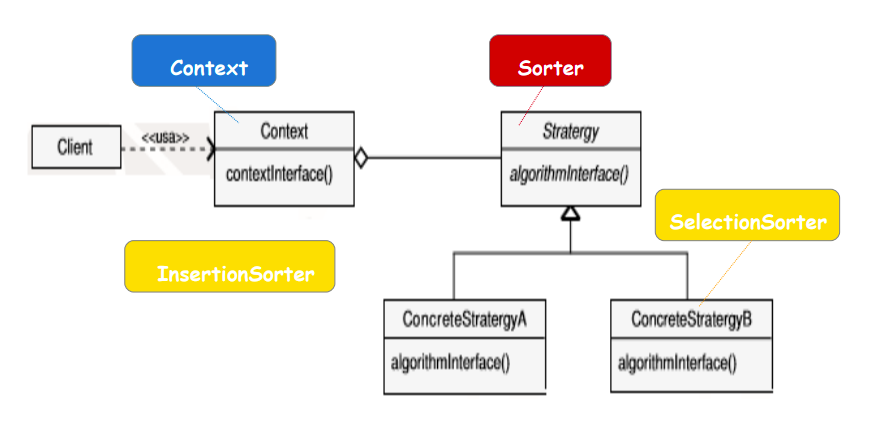
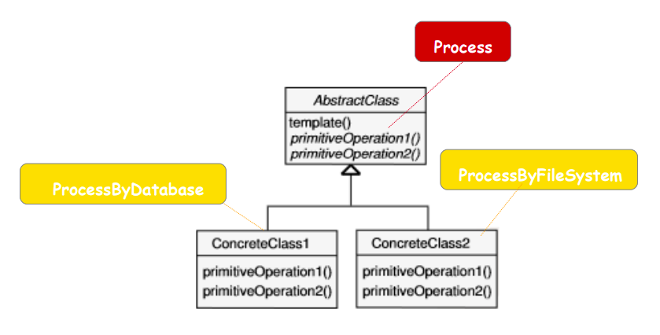
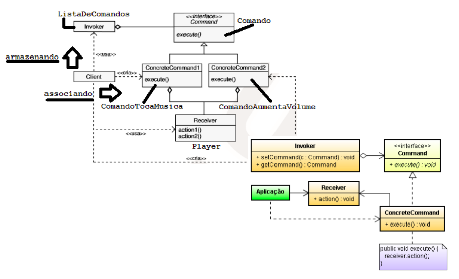
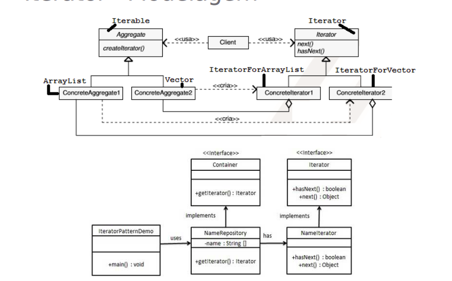
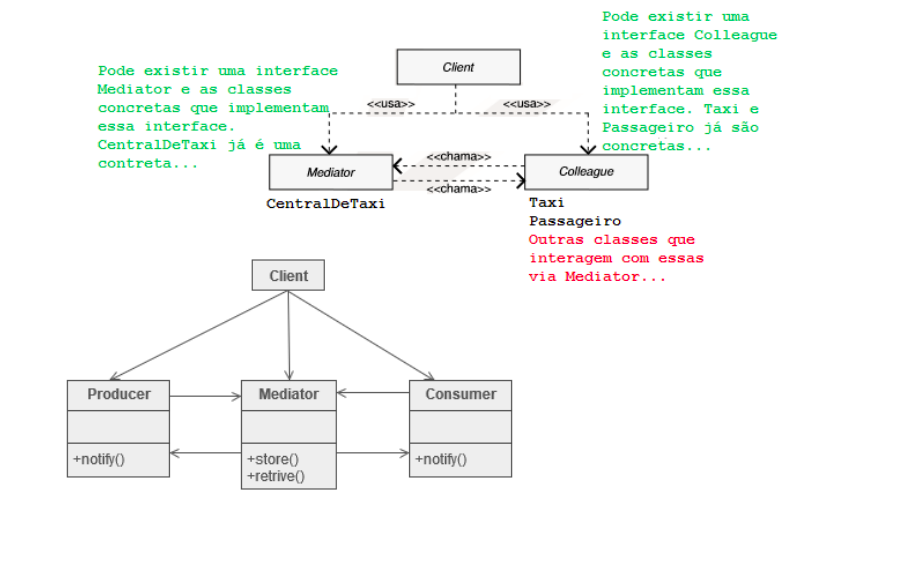
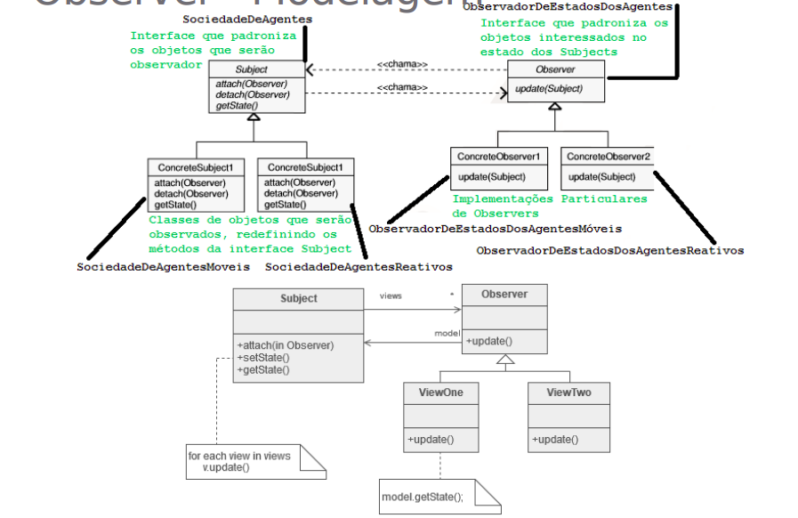
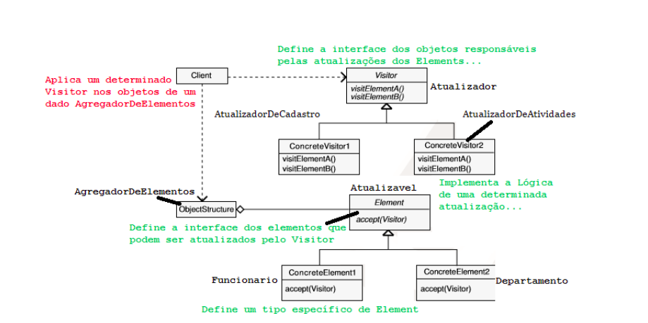
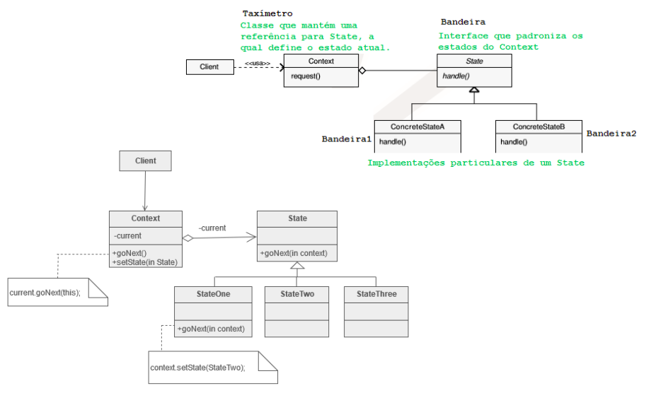
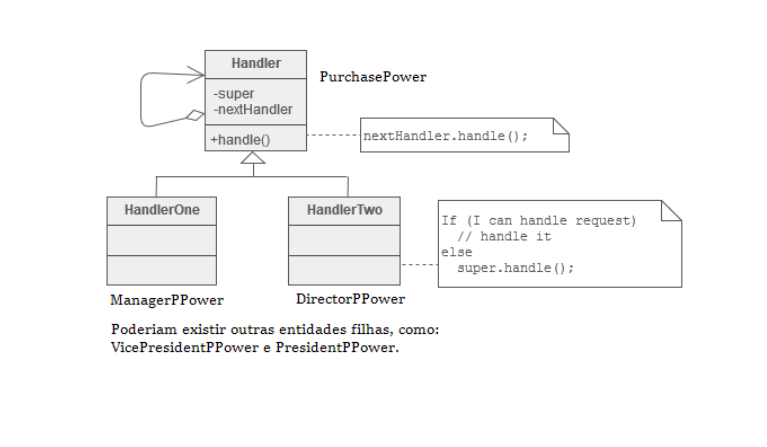

# GoFs Comportamentais

---

## 2. Tipos de GoF Criacional

### 2.1 Padrões de Interação e Comunicação

- Commadn.
- Iterator.
- Mediator.
- Observer.
- Chain of Responsibility

### 2.2 Padrões de Comportamento e Algoritmo

- Strategy.
- Template Method.
- Memento.
- State.
- Visitor.

## 3. Strategy

### 3.1 Definição

Definir uma família de algoritmos, encapsular cada um deles e torná-los intercambiáveis. Permite que o algoritmo varie independentemente dos clientes que o utilizam.

"Algoritmos Trocáveis". Permite que um objeto (o Contexto) use diferentes algoritmos (Estratégias) sem que o cliente precise mudar de código. Exemplo: escolher entre diferentes métodos de pagamento (cartão, boleto, pix) em tempo de execução.

Quando desejamos realizar um pagamento, precisamos
decidir qual forma de pagamento será adequada (ex. via cartão de crédito ou via boleto bancário). Portanto, podem haver diversas formas de pagamento.

Existem alguns recursos que podem ajudar nessa tarefa, como é o caso dos carrinhos de compra, por exemplo. Normalmente, esses recursos permitem que o usuário escolha a forma de pagamento (ex cartão de crédito, boleto bancário, PayPal, dentre outros) que deseja realizar. Essa escolha afeta os passos para se concretizar
o pagamento.

### 3.2 Participantes

**Strategy:** interface para padronizar as diferentes estratégias de um algoritmo. Exemplo: Sorter.

**ConcreteStrategy:** implementação específica de uma Strategy. Exemplo: InsertionSorter, SelectionSorter.

**Context:** mantém uma referência para um objeto Strategy e pode permitir que ele acesse seus dados.
.

  

## 4. Template

### 4.1 Definição

Definir o esqueleto de um algoritmo em uma operação, delegando algumas etapas para as subclasses. Permite que as subclasses redefinam certas etapas sem mudar a estrutura geral do algoritmo.

"Esqueleto de Algoritmo". A superclasse define os passos fixos e a ordem de execução do algoritmo, e as subclasses implementam ou sobrescrevem os passos variáveis ("ganchos"). Útil para frameworks.

Suponha que existam operações bem definidas para
processamento de dados.

Apesar dessas operações serem sempre as mesmas para
qualquer processamento (ex. consultarDados,
processarDados, exibirResultado), seus omportamentos
variam dependendo da abordagem utilizada. Por exemplo, processar dados a partir de uma base de dados difere de processar dados a partir de um sistema de arquivos.

### 4.2 Participantes

**AbstractClass:** classe abstrata que define o template method, estabelecendo a ordem de execução das operações. As operações primárias permanecem como métodos abstratos, sendo implementadas nas ConcreteClasses. Exemplo: Process.

**ConcreteClass:** classes concretas que implementam os métodos abstratos (operações primárias com comportamentos específicos) definidos na AbstractClass. Exemplos: ProcessByDatabase, ProcessByFileSystem.

  

## 5. Complementares

### 5.1 Command

Controlar as chamadas a um determinado componente, modelando cada requisição como um objeto. Permitir que as operações possam ser desfeitas (undo) ou registradas (logs).	

Requisição como Objeto. Transforma uma ação em um objeto. Isso permite que você parametrize clientes com diferentes requisições, coloque requisições em uma fila ou registre-as. É crucial para sistemas com histórico de ações, botões de desfazer/refazer, e processamento de comandos.

 

  

### 5.2 Iterator 

Fornecer uma maneira de acessar, sequencialmente, os elementos de um objeto agregado sem expor sua representação interna.	

Acesso Sequencial Universal. Permite que você percorra (itere) coleções (como listas ou árvores) de diferentes tipos de maneira uniforme, sem que o código cliente precise saber como a coleção está implementada internamente.

 

  

### 5.3 Mediator

Definir um objeto que encapsula a forma como um conjunto de objetos (colegas) interage. Promover o Baixo Acoplamento, evitando que os objetos se referenciem explicitamente.	

"Mediador" ou "Central de Comunicação". Em vez de objetos se comunicarem diretamente (o que gera alto acoplamento), eles se comunicam através de um objeto Mediator. O Mediador gerencia as interações, simplificando o sistema e tornando-o mais fácil de mudar.

 

  

### 5.5 Observer 

Definir uma dependência um-para-muitos entre objetos de forma que, quando um objeto (Assunto/Subject) muda de estado, todos os seus dependentes (Observadores) são notificados e atualizados automaticamente.	

"Publicar-Assinar" (Publish-Subscribe). Útil para manter a consistência de dados relacionados sem acoplar fortemente os componentes. Exemplo: um gráfico (Observer) que é atualizado automaticamente quando os dados de uma planilha (Subject) mudam.

 

  

### 5.5 State 

Permitir que um objeto mude seu comportamento quando seu estado interno muda. O objeto parecerá mudar de classe.	

"Comportamento Sensível ao Estado". Encapsula o comportamento associado a um estado específico em classes separadas. O objeto principal delega seu comportamento para o objeto de estado atual. Exemplo: um pedido pode estar em estado Aberto, Em Processamento ou Enviado, e seu método Pagar() age de forma diferente em cada estado.
 

  

### 5.6 Visitor 

Representar uma operação a ser executada nos elementos de uma estrutura de objeto. Permite definir uma nova operação sem mudar as classes dos elementos sobre os quais ela opera.	

"Adicionar Operação Facilmente". Usado quando você precisa realizar novas operações em uma coleção de objetos (estrutura) sem alterar as classes desses objetos. A nova lógica (Visitor) "visita" cada elemento e executa a operação.

 

  

### 5.7 Memento 

Capturar e externalizar o estado interno de um objeto sem violar o encapsulamento, para que o objeto possa ser restaurado a esse estado mais tarde.	

"Desfazer" (Undo). Cria "snapshots" (cópias) do estado de um objeto, permitindo que o estado anterior seja recuperado. É o mecanismo por trás das operações "undo" em editores.

 

  

### 5.7 Chain of Responsibility 

Evitar acoplar o remetente de uma requisição ao seu destinatário, encadeando os objetos receptores e passando a requisição ao longo da cadeia até que um objeto a manipule.	

"Cadeia de Manipuladores". Uma requisição é passada sequencialmente através de uma cadeia de objetos. Cada objeto na cadeia decide se processa a requisição ou se a passa para o próximo objeto na sequência. Exemplo: processamento de pedidos (cada objeto verifica uma regra, como estoque, pagamento, frete, etc.).

 

  

