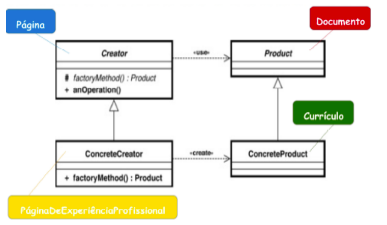
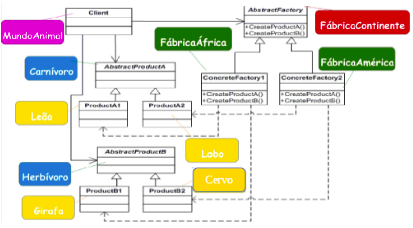
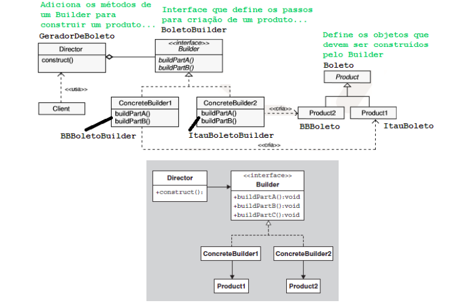
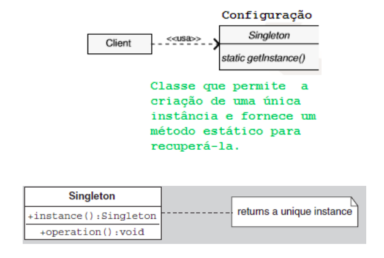
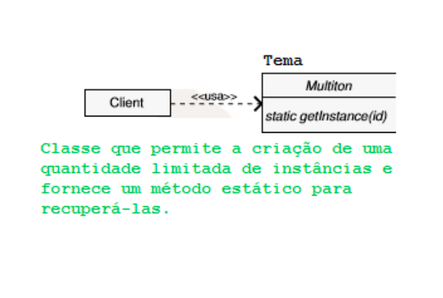
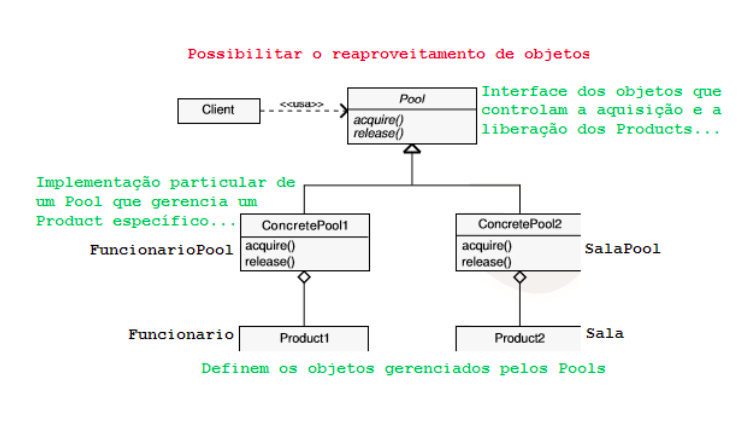

# GoFs Criacionais

---

## 1. O que é Gang of Four?

- Grupo de quatro autores que publicaram o livro Design Patterns: Elements of Reusabe Object-Oriented Software em 1994;
- O livro catalogou 23 padrões de design, formalizadno a linguagem e as soluções para problemas recorrentes no desenvolvimento orientado a objetos.
- São divididos em três categorias principais: Criacionais (focam em como os objetos sao criados), Estruturais (focam em como classes e objetos são compostos para formar estruturas maiores), Comportamentais (focam em como as classes e objetos interagem e distribuem responsabilidades).

## 2. Tipos de GoF Criacional

### 2.1 Padrões de Criação (Creational Design Patterns)

Esses padrões tem como objetivo principal desacoplar o sistema cliente (o código que usa os objetos) da lógica de instanciação, oferecendo maior flexibilidade sobre quais, como e quando os objetos são criados. São eles:

- Factory Method.
- Abstract Factory.
- Builder.
- Prototype

### 2.1 Padrões de Gerenciamento de Instâncias (Variações de Criação)

Esses padrões controlam a quantidade e o ciclo de vida das instâncias. São eles:

- Singleton.
- Multiton.
- Object Pool.

## 3. Factory Method

### 3.1 Definição

Encapsular a escolha da classe concreta a ser utilizada na criação de ojetos de um determinado tipo.

Fábricas de Subclasses. Permite que uma superclasse delegue a instanciação (o new) para suas subclasses. A classe cliente pede um objeto, e a Fábrica decide o tipo concreto a ser retornado, baseado em um parâmetro ou contexto.

Considere uma aplicação que precisa realizar operações
diversas (enviarDocumentos, criarDocumentos,
abrirDocumentos e outras).

Se esse documento for um pdf, existem formas
específicas para viabilizar a abertura, o fechamento bem
como a gravação desse tipo de documento.

Por outro lado, se for doc, novamente, existem formas
específicas para viabilizar a abertura, o fechamento bem
como a gravação desse tipo de documento.

### 3.2 Participantes

**Product:** define atributos e métodos, esse últimos abstratos ou programados de forma mais génerica, para um conjunto de objetos os quais serão criados pelo factory method. Exemplo: Documento.

**ConcreteProduct:** estende Product, especializando o que foi definido na superclasse. Exemplo: Relatório, Currículo.

**Creator:** declara o factory method, o qual
retorna um objeto do “tipo” Product. Creator pode
também definir uma implementação default do factory
method que retorna um objeto ConcreteProduct default.
Creator pode ainda chamar um factory method para criar
um objeto de Product. Exemplo: Página.

**ConcreteCreator:** sobrescreve o factory method para retornar uma
instância de ConcreteProduct. Exemplo: PáginaDeExperiênciaProfissional,
PágnaDeHabilidades, PáginaDeFormaçãoAcadêmica.

  

## 4. Abstract Factory

### 4.1 Definição

Encapsular a escolha das classes concretas a serem utilizadas na criação de objetos de diversas famílias.

Fábrica de Fábricas. Fornece uma interface para criar famílias de objetos relacionados ou dependentes sem especificar suas classes concretas. Útil para sistemas que precisam suportar diferentes "temas" ou "kits" de componentes.

Considere uma aplicação que precisa trabalhar com
interfaces gráficas para diferentes sistemas operacionais bem como cada sistema operacional possui elementos gráficos específicos (botões para Windows e botões para Ubuntu).

Portanto, se o sistema operacional for Windows, a
interface gráfica e seus elementos devem ser compatíveis com esse sistema operacional. O mesmo deve ocorrer, caso o sistema operacional em foco seja o Ubuntu.

### 4.2 Participantes

**AbstractFactory:** declara uma interface para operações de criação de produtos quaisquer. Exemplo: FábricaContinente.

**ConcreteFactory:** implementa as operações que criam objetos de produtos concretos (específicos). Exemplo: FábricaÁfrica, FábricaAmérica.

**AbstractProduct:** declara uma interface para um tipo de objeto produto. Exemplo: Herbívoro, Carnívoro.

**Product:** define um objeto produto a ser criado pela fábrica concreta correspondente, implementando a interface declarada em AbstractProduct. Exemplo: Leão, Lobo.

**Client:** utiliza as interfaces declaradas em AbstractFactory e AbstractProduct. Exemplo: MundoAnimal.

  

## 5. Complementares

### 5.1 Builder

Construção por Etapas. É usado para construir um objeto complexo através de um processo ordenado ou sequencial. O objeto só é finalizado e entregue ao cliente após todos os passos (ou os passos obrigatórios) terem sido concluídos.

 

  

### 5.2 Prototype 

Possibilitar a criação de novos objetos a partir da cópia de objetos existentes.

Clonagem/Cópia de Objetos. Em vez de usar a palavra-chave new (que pode ser custosa), o sistema cria objetos clonando um objeto existente (o protótipo). É ideal para evitar a repetição de lógica de inicialização de objetos complexos.

 

  

### 5.4 Singleton

Permitir a criação de uma única instância de uma classe e fornecer um modo de recuperá-la.

Instância Única Global. Garante que uma classe tenha apenas uma instância durante a execução do programa e fornece um ponto de acesso global controlado a essa instância. Usado tipicamente para loggers ou gerenciadores de configuração.

 

  

### 5.5 Multiton 

Permitir a criação de uma quantidade limitada de instâncias de determinada classe e fornecer um modo para recuperá-las.

Instâncias Múltiplas Nomeadas. Uma extensão do Singleton que gerencia um número finito e controlado de instâncias. Cada instância é identificada por uma chave (como um nome ou um ID).

 

  

### 5.5 Objet Pool 

Possibilitar o reaproveitamento de objetos.

Reutilização Otimizada. Mantém um "estoque" (pool) de objetos que são caros de criar ou destruir (ex: conexões de banco de dados ou threads). Em vez de criar um novo objeto, o cliente "pega" um do estoque e, ao terminar, o "devolve" para ser reutilizado.

 

  

