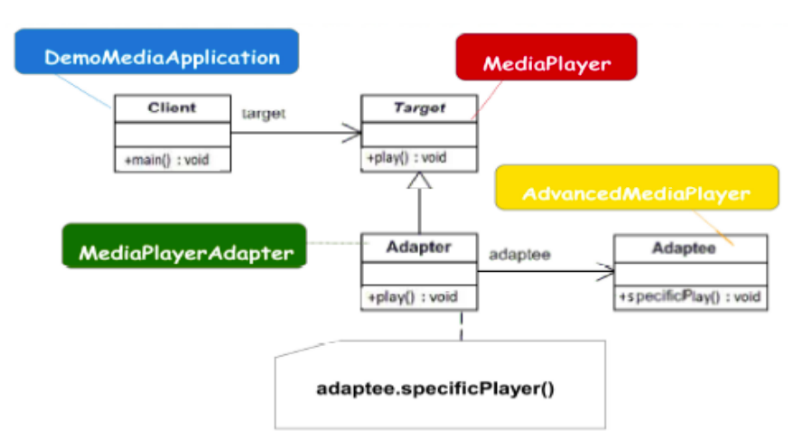
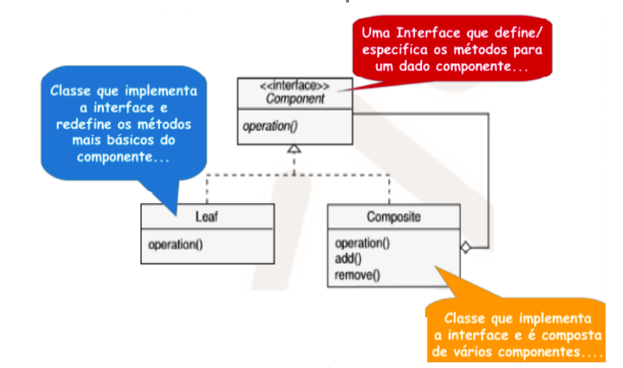
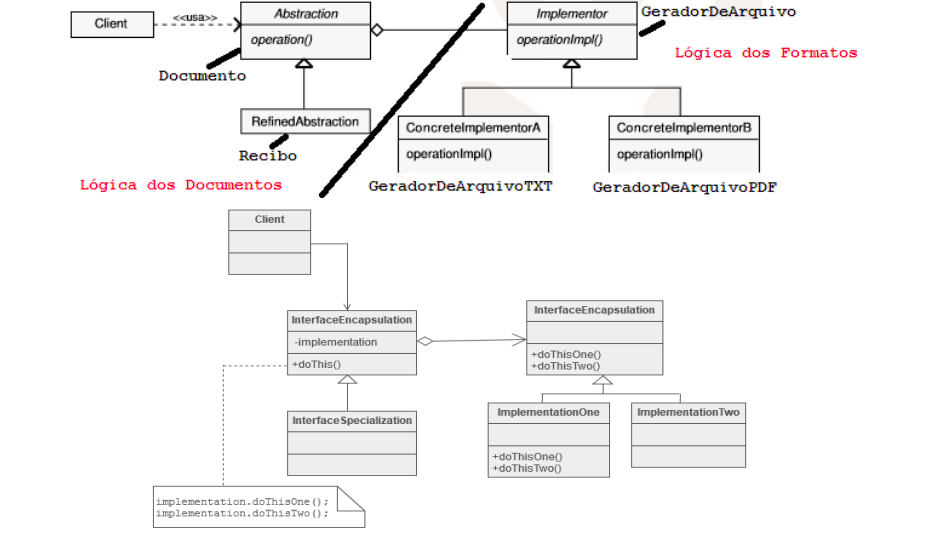
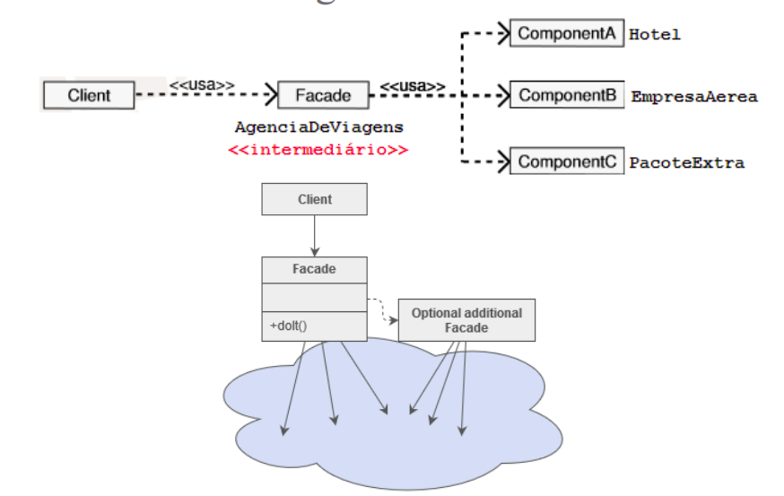
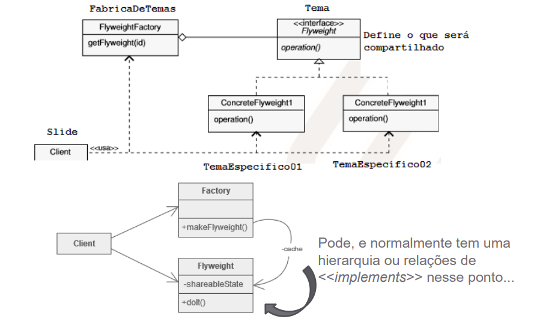
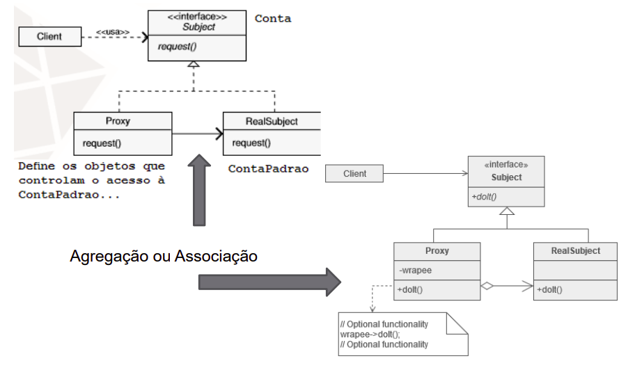

# GoFs Criacionais

---

## 2. Tipos de GoF Criacional

### 2.1 Padrões de Adaptação e Encapsulamento

- Adapter.
- Bridge.
- Decorator.
- Proxy.

### 2.2 Padrões de Agrupamento e Otimização

- Composite.
- Facade.
- Flyweight.

## 3. Adapter

### 3.1 Definição

Permitir que a interface de uma classe existente (Adaptee) seja usada por outra classe (Target), que espera uma interface diferente.

"Tradutor" ou "Capa". É usado para converter a interface de uma classe em outra interface que o cliente espera. Útil para fazer com que classes incompatíveis trabalhem juntas.

Estamos realizando manutenção no sistema de gerenciamento de uma determinada empresa.O controle de ponto desse sistema possui diversas
limitações.Essas limitações causam muitos prejuízos, principalmente,
financeiros.

Uma empresa parceira implementou uma biblioteca Java
para controlar a entrada e a saída de funcionários. 
Essa biblioteca não possui as limitações que existem hoje no sistema que estamos realizando manutenção.

### 3.2 Participantes

**Target:** define uma interface/classe específica de domínio utilizada pelo Client. Exemplo: MediaPlayer.

**Adapter:** adapta a interface/classe Target para permitir o uso da interface/classe Adaptee. Exemplo: MediaAdapter.

**Adaptee:** define uma interface/classe existente que pode complementar a interface/classe Target. Exemplo: AdvancedMediaPlayer.

**Client:** colabora com outros objetos por meio da interface/classe Target. Exemplo: DemoMediaApplication.

  

## 4. Composite

### 4.1 Definição

Compor objetos em estruturas de árvore para representar hierarquias TODO-PARTE. Permite que os clientes tratem objetos individuais e composições de objetos (grupos) de maneira uniforme.a o Ubuntu.

"Estrutura em Árvore". Implementa a ideia de que um componente (Component) pode ser um objeto simples (Leaf) ou um recipiente de outros objetos (Composite). Exemplo: um diretório (Composite) que contém arquivos (Leaf) e outros diretórios.

Suponha que estejamos desenvolvendo um sistema para
calcular um caminho entre quaisquer dois pontos do
mundo.

Um caminho pode ser percorrido de diversas maneiras: a pé, de carro, de ônibus, de trem, de avião, de navio, dentre outras formas.

### 4.2 Participantes

**Component:** interface que define os elementos da composição. Exemplo: Trecho.

**Leaf:** define os elementos básicos da composição, ou seja, aqueles que não são formados por outros Components. Exemplo: TrechoDeCarro, TrechoAndando.

**Composite:** define os Components que são formados por outros Components. Exemplo: Caminho.

  

## 5. Complementares

### 5.1 Bridge

Desacoplar uma abstração de sua implementação para que as duas possam variar independentemente.	"Ponte" ou "Separação de Abstração". 

Útil quando tanto a funcionalidade (abstração) quanto a maneira como ela é feita (implementação) precisam ser estendidas ou alteradas de forma independente. Exemplo: separar Janela (abstração) de ImplementadorJanelaLinux ou ImplementadorJanelaWindows (implementações).

 

  

### 5.2 Decorator 

Adicionar dinamicamente novas responsabilidades a um objeto, envolvendo-o.

"Envelopamento" ou "Adição de Recursos". É uma alternativa flexível à herança para estender funcionalidades. O Decorator envolve o objeto original e adiciona comportamento antes ou depois de chamar o método do objeto envolvido. Exemplo: adicionar bordas e barras de rolagem a um componente de interface.

 

  

### 5.3 Facade

Fornecer uma interface unificada e simplificada para um conjunto de interfaces em um subsistema. 

"Fachada" ou "Porta de Entrada". Cria uma camada de alto nível que esconde a complexidade de um grande conjunto de classes (subsistema). O cliente interage apenas com a Facade, que orquestra as chamadas necessárias internamente.

 

  

### 5.5 Flyweight 

Compartilhar o máximo de dados possível entre objetos similares para reduzir o custo de memória. 

"Peso Leve" ou "Compartilhamento de Estado". É um padrão de otimização. Ele divide o estado do objeto em: Estado Intrínseco (dados compartilhados, imutáveis) e Estado Extrínseco (dados contextuais, únicos). É crucial em sistemas que criam um grande número de objetos.

 

  

### 5.5 Proxy 

Fornecer um substituto ou um "Procurador" para outro objeto, controlando o acesso a ele.

"Representante". O Proxy atua como um intermediário entre o cliente e o objeto real. É usado para: Controle de Acesso (Protection Proxy), Otimização (Virtual Proxy - só cria o objeto real quando ele é necessário) ou Acesso Remoto (Remote Proxy).

 

  

