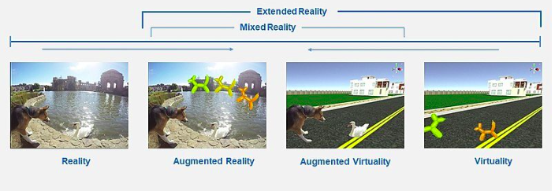

# Introdução 

---

## 1. Definições e Classificações

  

- Ambiente Real: 

- Realidade Extendida: 

- Realidade Aumentadada:
  - Baseada em smartphones e tablets.
  - Óculos de RA.
  - Projeção + Câmera.
  - Headset de MR.

- Realidade Mista:

- Virtualidade Aumentada

- Realidade Virtual:
    - Não-Imersiva: dispositivos convencionais, como monitor e mouse/teclado ou controle. Ex: CS-GO
    - Semi-Imversiva: simuladores, como um simulador de transito.Ex: eurotruck com volante.
    - Imersiva: óculos VR. 
        - Ray-Casting: distância (bom), tremor (ruim), botoes (bom).
        - Toque Direto: naturalidade (bom), distância (ruim), feedback-tátil (ruim), fadiga (ruim).

---

## 2. Triângulo da RV

- Imersão:

- Interação:

- Imaginação: