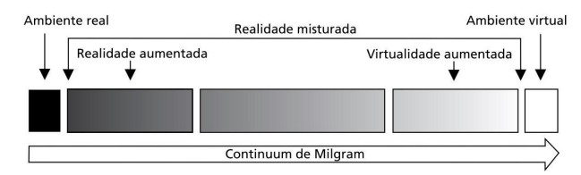

# Introdução 

## 1. Definições e Classificações

  

**1. Real e Virtual:**

Um Elemento Real é um elemento que pertence a sua realidade material.

Um Elemento Virtual é um elemento que tem potencial para se tornar esse mesmo elemento, porém real. Exemplos:
  - Sementes de flores podem ser chamadas flores virtuais.
  - Um arquivo de modelo 3D de um flor pode ser chamada de flor virtual.
  - Uma foto digital de uma pessoa É real.
  - Uma foto digital de uma pessoa NÃO é o virtual dessa pessoa.

**2. Ambiente Real e Ambiente Virtual:**

Ambiente Real é o mundo físico real.

Ambiente Virtual é o mundo, por exemplo, de um video-game (GTA 5).

**3. Realidade Virtual (VR):**

É quando o usuário está situado em um ambiente real porém sua visão está 100% isolada do mundo real. Exemplos:

- MetaQuest.
- PlayStation VR.

**4. Realidade Aumentada (RA):** 

É quando o usuário está situado em um ambiente real e pode interagir com elementos virtuais registrados no espaço físico. Exemplo:
- Pokemon Go.
- Óculos XREAL One.

**5. Virtualidade Aumentada:**

É quanto o usuário é transportado para um ambiente virtual que possui elementos do mundo real. Exemplo:

- Vídeos com Fundo Verde.

**6. Realidade Misturada:**

É quando o usuário está em um ambiente onde os objetos não são do mesmo "mundo" que o próprio ambiente, um deles é virtual e o outro real. Ele inclui:

- Realidade Aumentada.
- Virtualidade Aumentada.

**7. Realidade Estendida:**

É o termo guarda-chuva para tudo que envolve elementos virtuais. Inclui:

- Realidade Aumentada.
- Virtualidade Aumentada.
- Ambiente Virtual.

  

## 2. Tipos de Realidade Virtual

**1. Realidade Virtual Não-Imersiva:**

Usuário não está com sua visão 100% isolada do mundo real e utiliza dispositivos convencionais, como monitor com mouse/teclado, em um simulador. Exemplos:

- Google Street View.
- Simuladores de Voo para Desktop.

**2. Realidade Virtual Semi-Imersiva:**

Usuário não está com sua visão 100% isolada do mundo real e utiliza dispositivos não convencionais em um simulador. Exemplos:

- Eurotruck Simulator utilizando volante.
- Simuladores de Voo Profissionais com cabines e todos os botões reais.

**3. Realidade Virtual Imersiva:**

Usuário está com sua visão 100% isolada do mundo real. Incluem o uso de óculos VR.

        - Ray-Casting: distância (bom), tremor (ruim), botoes (bom).
        - Toque Direto: naturalidade (bom), distância (ruim), feedback-tátil (ruim), fadiga (ruim).

## 2. Triângulo da RV

- Imersão:

- Interação:

- Imaginação: