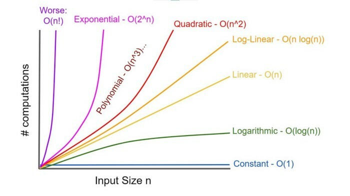

# Introdução aos Algoritmos de Ordenação

---

## 1. Definição

Os **algoritmos de ordenação** são procedimentos sistemáticos para reorganizar elementos de uma coleção em uma ordem específica (crescente, decrescente, alfabética, etc.).

---

## 2. Características dos Algoritmos de Ordenação

### 2.1 Complexidade
- **Espacial**: Quantidade de memória adicional necessária
- **Temporal**: Tempo de execução em função do tamanho da entrada

### 2.2 Estabilidade
Um algoritmo é **estável** se mantém a posição relativa de elementos com chaves iguais. Exemplo: se dois registros têm a mesma chave, sua ordem original é preservada.

### 2.3 Adaptabilidade
Um algoritmo é **adaptativo** se aproveita a ordenação existente no array de entrada. Algoritmos adaptativos performam melhor em arrays parcialmente ordenados.

### 2.4 In-Place
Um algoritmo é **in-place** se não requer memória adicional significativa além dos próprios dados sendo ordenados (geralmente O(1) de espaço extra).

---

## 3. Classificação dos Algoritmos de Ordenação

### 3.1 Por Complexidade
| Tipo | Complexidade | Exemplos |
|------|-------------|----------|
| **Quadráticos** | O(n²) | Bubble Sort, Selection Sort, Insertion Sort |
| **Linearítmicos** | O(n log n) | Quick Sort, Merge Sort, Heap Sort |
| **Lineares** | O(n) | Counting Sort, Radix Sort, Bucket Sort |

### 3.2 Por Método
- **Baseados em comparação**: Quick Sort, Merge Sort, Heap Sort
- **Não baseados em comparação**: Counting Sort, Radix Sort
- **Baseados em troca**: Bubble Sort, Quick Sort  
- **Baseados em seleção**: Selection Sort, Heap Sort
- **Baseados em inserção**: Insertion Sort, Shell Sort

---

## 4. Tabela Comparativa de Algoritmos

| Algoritmo | Complexidade (Pior) | Complexidade (Médio) | Complexidade (Melhor) | Adaptabilidade | Estabilidade | In-Place | Tipo |
|-----------|---------------------|----------------------|-----------------------|----------------|--------------|----------|------|
| **Bubble Sort** | O(n²) | O(n²) | O(n) | Sim | Sim | Sim | Comparação |
| **Selection Sort** | O(n²) | O(n²) | O(n²) | Não | Não | Sim | Comparação |
| **Insertion Sort** | O(n²) | O(n²) | O(n) | Sim | Sim | Sim | Comparação |
| **Quick Sort** | O(n²) | O(n log n) | O(n log n) | Não | Não* | Sim | Comparação |
| **Merge Sort** | O(n log n) | O(n log n) | O(n log n) | Não | Sim | Não | Comparação |
| **Heap Sort** | O(n log n) | O(n log n) | O(n log n) | Não | Não | Sim | Comparação |
| **Shell Sort** | O(n²) | O(n log n) | O(n log n) | Sim | Não | Sim | Comparação |
| **Counting Sort** | O(n + k) | O(n + k) | O(n + k) | Não | Sim | Não | Não-comparação |
| **Radix Sort (LSD)** | O(n × w) | O(n × w) | O(n × w) | Não | Sim | Não | Não-comparação |
| **Radix Sort (MSD)** | O(n × w) | O(n × w) | O(n × w) | Não | Sim | Não | Não-comparação |

*Nota: Quick Sort pode ser implementado como estável com espaço adicional*

---

## 5. Complexidade Linear vs Linearítmica

### 5.1 Algoritmos Linearítmicos (O(n log n))
- **Baseados em comparação** por valor de chave;
- **Mais amplos**: Podem ser aplicados a diversos tipos de dados;
- **Flexíveis**: Funcionam com diferentes tipos de chaves;
- **Exemplos**: Quick Sort, Merge Sort, Heap Sort;

### 5.2 Algoritmos Lineares (O(n))
- **Baseados em estrutura** da chave (unidades, dígitos);
- **Mais restritos**: Dependem da representação dos dados;
- **Específicos**: Funcionam apenas com tipos numéricos ou com chaves específicas;
- **Exemplos**: Counting Sort, Radix Sort;

### 5.3 Trade-offs
| Aspecto | Linearítmicos | Lineares |
|---------|---------------|----------|
| **Aplicabilidade** | ⭐⭐⭐⭐ (Ampla) | ⭐⭐ (Restrita) |
| **Requisitos** | ⭐⭐⭐⭐ (Poucos) | ⭐ (Específicos) |
| **Desempenho** | ⭐⭐⭐ (Bom) | ⭐⭐⭐⭐⭐ (Excelente) |
| **Espaço** | ⭐⭐⭐ (Variável) | ⭐⭐ (Maior consumo) |

---

## 6. Fatores na Escolha do Algoritmo

### 6.1 Tamanho dos Dados
- **Pequenos conjuntos**: Insertion Sort, Selection Sort
- **Médios conjuntos**: Quick Sort, Heap Sort  
- **Grandes conjuntos**: Merge Sort, Radix Sort

### 6.2 Estrutura dos Dados
- **Quase ordenados**: Insertion Sort, Bubble Sort
- **Aleatórios**: Quick Sort, Heap Sort
- **Com duplicatas**: Algoritmos estáveis

### 6.3 Restrições de Memória
- **Memória limitada**: Algoritmos in-place (Quick Sort, Heap Sort)
- **Memória abundante**: Merge Sort, algoritmos não in-place

### 6.4 Tipo de Dados
- **Numéricos**: Counting Sort, Radix Sort
- **Genéricos**: Algoritmos baseados em comparação
- **Estruturas complexas**: Algoritmos estáveis

