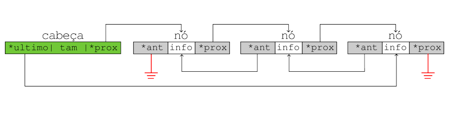
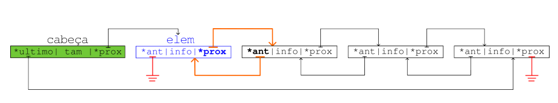
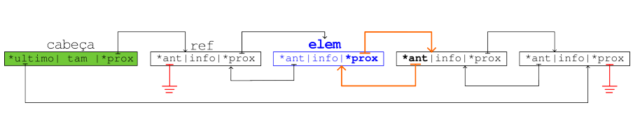

# Listas Duplamente Encadeadas em C

---

## 1. Conceitos Gerais

As **listas duplamente encadeadas** são estruturas de dados onde cada nó armazena:
- A informação do elemento;
- Ponteiro para o nó anterior;
- Ponteiro para o próximo nó;

**Características principais:**

- Útil quando ocorrem muitas inserções e remoções, especialmente de elementos intermediários;
- Permite navegação bidirecional (para frente e para trás);
- O nó anterior do primeiro elemento e o próximo do último elemento são NULL;



---

## 2. Estrutura de Dados

### 2.1 Definição do Nó
```c title="Implementação:"
typedef struct node {
    int info;           // Informação armazenada no nó
    struct node *ant;   // Ponteiro para o nó anterior
    struct node *prox;  // Ponteiro para o próximo nó
} no;
```

### 2.2 Cabeça da Lista
```c title="Implementação:"
typedef struct head {
    int tam;           // Tamanho da lista (número de elementos)
    no *primeiro;      // Ponteiro para o primeiro nó da lista
    no *ultimo;        // Ponteiro para o último nó da lista
} cabeca;
```

---

## 3. Operações Básicas

### 3.1 Inserir no Início


```c title="Implementação:"
void inserir_inicio(cabeca *lista, no *elem) {
    elem->ant = NULL;                // Novo elemento não tem anterior (será o primeiro)
    elem->prox = lista->primeiro;    // Novo elemento aponta para o atual primeiro
    
    if (lista->primeiro != NULL) {
        lista->primeiro->ant = elem; // Atual primeiro agora tem novo elemento como anterior
    } else {
        lista->ultimo = elem;        // Se lista estava vazia, novo elemento também é o último
    }
    
    lista->primeiro = elem;          // Cabeça agora aponta para o novo elemento
    lista->tam++;                    // Incrementa tamanho da lista
}
```

### 3.2 Inserir após um Nó


```c title="Implementação:"
void inserir_depois(cabeca *lista, no *ref, no *elem) {
    elem->ant = ref;                 // Novo nó aponta para referência como anterior
    elem->prox = ref->prox;          // Novo nó aponta para próximo da referência
    
    ref->prox = elem;                // Referência agora aponta para novo nó
    
    if (elem->prox != NULL) {
        elem->prox->ant = elem;      // Atualiza anterior do próximo nó
    } else {
        lista->ultimo = elem;        // Se não há próximo, novo nó é o último
    }
    
    lista->tam++;                    // Incrementa tamanho da lista
}
```

### 3.3 Inserir antes de um Nó
```c title="Implementação:"
void inserir_antes(cabeca *lista, no *ref, no *elem) {
    elem->ant = ref->ant;            // Novo nó aponta para anterior da referência
    elem->prox = ref;                // Novo nó aponta para referência
    
    ref->ant = elem;                 // Referência agora aponta para novo nó como anterior
    
    if (elem->ant != NULL) {
        elem->ant->prox = elem;      // Atualiza próximo do nó anterior
    } else {
        lista->primeiro = elem;      // Se não há anterior, novo nó é o primeiro
    }
    
    lista->tam++;                    // Incrementa tamanho da lista
}
```

### 3.4 Inserir no Fim
```c title="Implementação:"
void inserir_fim(cabeca *lista, no *elem) {
    elem->ant = lista->ultimo;       // Novo nó aponta para último atual
    elem->prox = NULL;               // Novo nó será o último (próximo = NULL)
    
    if (lista->ultimo != NULL) {
        lista->ultimo->prox = elem;  // Último atual aponta para novo nó
    } else {
        lista->primeiro = elem;      // Se lista estava vazia, novo nó é o primeiro
    }
    
    lista->ultimo = elem;            // Atualiza ponteiro para último
    lista->tam++;                    // Incrementa tamanho da lista
}
```

### 3.5 Remover Nó
```c title="Implementação:"
void remover_no(cabeca *lista, no *lixo) {
    // Atualiza ponteiros dos nós vizinhos
    if (lixo->ant != NULL) {
        lixo->ant->prox = lixo->prox; // Anterior aponta para próximo
    } else {
        lista->primeiro = lixo->prox; // Se era primeiro, atualiza cabeça
    }
    
    if (lixo->prox != NULL) {
        lixo->prox->ant = lixo->ant; // Próximo aponta para anterior
    } else {
        lista->ultimo = lixo->ant;   // Se era último, atualiza cabeça
    }
    
    lista->tam--;                    // Decrementa tamanho da lista
    free(lixo);                      // Libera memória do nó removido
}
```

---

## 4. Funções Auxiliares

### 4.1 Criar Lista Vazia
```c title="Implementação:"
cabeca *criar_lista() {
    cabeca *nova_lista = (cabeca *)malloc(sizeof(cabeca));
    nova_lista->tam = 0;
    nova_lista->primeiro = NULL;
    nova_lista->ultimo = NULL;
    return nova_lista;
}
```

### 4.2 Criar Novo Nó
```c title="Implementação:"
no *criar_no(int valor) {
    no *novo_no = (no *)malloc(sizeof(no));
    novo_no->info = valor;
    novo_no->ant = NULL;
    novo_no->prox = NULL;
    return novo_no;
}
```

### 4.3 Imprimir Lista (Frente para Trás)
```c title="Implementação:"
void imprimir_frente(cabeca *lista) {
    no *atual = lista->primeiro;
    printf("Lista (frente): ");
    while (atual != NULL) {
        printf("%d ", atual->info);
        atual = atual->prox;
    }
    printf("\n");
}
```

### 4.4 Imprimir Lista (Trás para Frente)
```c title="Implementação:"
void imprimir_tras(cabeca *lista) {
    no *atual = lista->ultimo;
    printf("Lista (trás): ");
    while (atual != NULL) {
        printf("%d ", atual->info);
        atual = atual->ant;
    }
    printf("\n");
}
```

### 4.5 Buscar Elemento
```c title="Implementação:"
no *buscar_elemento(cabeca *lista, int valor) {
    no *atual = lista->primeiro;
    
    while (atual != NULL) {
        if (atual->info == valor) {
            return atual;
        }
        atual = atual->prox;
    }
    
    return NULL; // Elemento não encontrado
}
```

### 4.6 Liberar Memória da Lista
```c title="Implementação:"
void liberar_lista(cabeca *lista) {
    no *atual = lista->primeiro;
    no *proximo;
    
    while (atual != NULL) {
        proximo = atual->prox;
        free(atual);
        atual = proximo;
    }
    
    free(lista);
}
```

---

## 5. Exemplo de Uso Completo

```c title="Implementação:"
#include <stdio.h>
#include <stdlib.h>

// Estruturas e funções definidas acima...

int main() {
    // Criar lista vazia
    cabeca *minha_lista = criar_lista();
    
    // Inserir elementos
    no *n1 = criar_no(10);
    no *n2 = criar_no(20);
    no *n3 = criar_no(30);
    
    inserir_inicio(minha_lista, n1);
    inserir_fim(minha_lista, n3);
    inserir_depois(minha_lista, n1, n2);
    
    // Imprimir lista
    printf("Tamanho da lista: %d\n", minha_lista->tam);
    imprimir_frente(minha_lista);
    imprimir_tras(minha_lista);
    
    // Buscar e remover elemento
    no *encontrado = buscar_elemento(minha_lista, 20);
    if (encontrado != NULL) {
        printf("Elemento 20 encontrado!\n");
        remover_no(minha_lista, encontrado);
    }
    
    // Imprimir lista após remoção
    printf("Após remoção - Tamanho: %d\n", minha_lista->tam);
    imprimir_frente(minha_lista);
    
    // Liberar memória
    liberar_lista(minha_lista);
    
    return 0;
}
```

---

## 6. Complexidade das Operações

| Operação | Complexidade | Descrição |
|----------|-------------|-----------|
| Inserir no início | O(1) | Inserção constante |
| Inserir no fim | O(1) | Com ponteiro para último |
| Inserir após nó | O(1) | Inserção constante |
| Inserir antes de nó | O(1) | Inserção constante |
| Remover nó | O(1) | Remoção constante |
| Buscar elemento | O(n) | Busca sequencial |
| Acessar por posição | O(n) | Percorre até a posição |
| Navegação bidirecional | O(1) | Acesso imediato a anterior/próximo |

---

## 7. Vantagens e Desvantagens
As listas duplamente encadeadas são ideais para aplicações que requerem navegação bidirecional e operações frequentes de inserção/remoção em qualquer posição da lista.

**Vantagens:**

- Navegação bidirecional eficiente
- Inserções/remoções em qualquer posição com O(1)
- Mais flexível que listas simplesmente encadeadas

**Desvantagens:**

- Consumo maior de memória (dois ponteiros por nó)
- Implementação mais complexa
- Maior overhead nas operações

