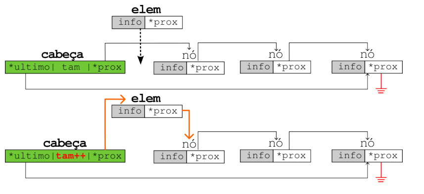
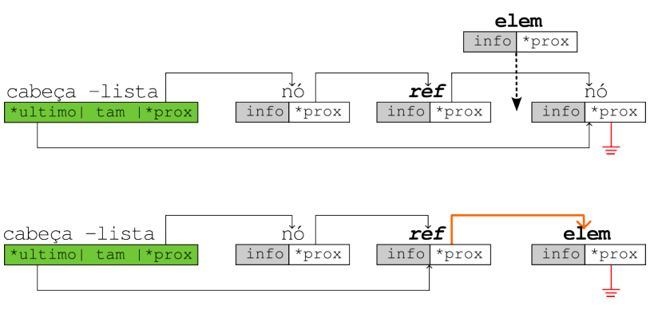
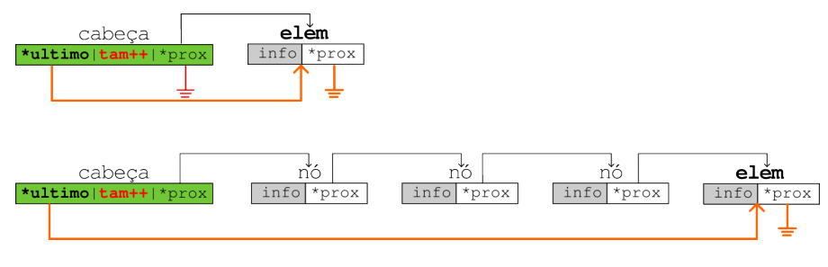
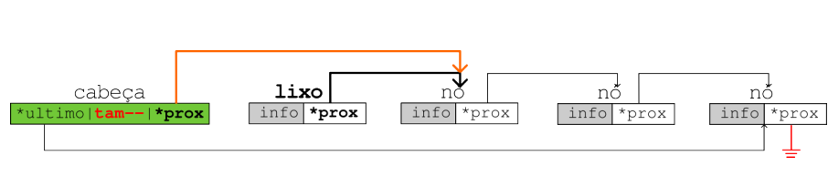

# Listas Simplesmente Encadeadas 

---

## 1. Conceitos Gerais

### 1.1 Listas Estáticas (Arrays)
- **Espaço consecutivo** na memória RAM;
- **Acesso fácil** através de índices;
- **Nome** corresponde ao endereço de memória do primeiro elemento;
- **Vantagem**: Fácil acesso (O(1) para acesso por índice);  
- **Desvantagem**: Difícil manipulação (inserção/remoção requer deslocamento de elementos - O(n));

### 1.2 Listas Simplesmente Encadeadas
É uma sequência de **células** onde cada célula contém:

- O conteúdo armazenado
- O **endereço** da célula seguinte

A sequência termina quando uma célula aponta para **NULL**. 
O endereço de uma lista encadeada é o endereço de sua primeira célula.

---

## 2. Estrutura de Dados

### 2.1 Definição do Nó
```c title="Implementação:"
// Opção 1: Struct básica
struct node {
    int conteudo;              // conteúdo dessa célula
    struct node *proximo;      // endereço da próxima célula
};

// Opção 2: Com typedef
typedef struct node no;
struct node {
    int conteudo;
    no *proximo;
};

// Opção 3: Mais comum
typedef struct node {
    int conteudo;
    struct node *proximo;
} no;
```

### 2.2 Cabeça da Lista
Estrutura que armazena metadados sobre a lista para melhor gerenciamento:

```c title="Implementação:"
typedef struct head {
    int num_itens;    // número de elementos na lista
    no *primeiro;     // ponteiro para o primeiro nó
    no *ultimo;       // ponteiro para o último nó
} cabeca;
```

---

## 3. Operações Básicas

### 3.1 Inserir no Início


```c title="Implementação:"
void inserir_inicio(cabeca *lista, no *novo_no) {
    novo_no->proximo = lista->primeiro;
    lista->primeiro = novo_no;
    
    lista->num_itens++;
    if (novo_no->proximo == NULL) {
        lista->ultimo = novo_no;
    }
}

// Exemplo de uso:
int main() {
    no *item = (no *)malloc(sizeof(no)); 
    item->proximo = NULL;
    item->conteudo = 1;

    cabeca *lista = (cabeca *)malloc(sizeof(cabeca)); 
    lista->primeiro = NULL;
    lista->ultimo = NULL;
    lista->num_itens = 0;

    inserir_inicio(lista, item); 

    printf("Número de itens: %d\n", lista->num_itens);
    printf("Primeiro elemento: %d\n", lista->primeiro->conteudo);

    return 0;
}
```

### 3.2 Inserir após um Nó


```c title="Implementação:"
void inserir_apos(cabeca *lista, no *referencia, no *novo_no) {
    novo_no->proximo = referencia->proximo;
    referencia->proximo = novo_no;
    
    lista->num_itens++;
    if (novo_no->proximo == NULL) {
        lista->ultimo = novo_no;
    }
}
```

### 3.3 Inserir no Fim

```c title="Implementação:"
void inserir_fim(cabeca *lista, no *novo_no) {
    if (lista->primeiro == NULL) {
        lista->primeiro = novo_no;
    } else {
        lista->ultimo->proximo = novo_no;
    }
    
    lista->ultimo = novo_no;
    novo_no->proximo = NULL;
    lista->num_itens++;
}
```

### 3.4 Remover do Início

```c title="Implementação:"
void remover_inicio(cabeca *lista) {
    if (lista->primeiro == NULL) return;
    
    no *lixo = lista->primeiro;
    lista->primeiro = lixo->proximo;
    
    // Atualiza metadados
    lista->num_itens--;
    if (lista->primeiro == NULL) {
        lista->ultimo = NULL;
    }
    
    free(lixo);
}
```

### 3.5 Remover Nó Específico

```c title="Implementação:"
void remover_no(cabeca *lista, no *alvo) {
    if (lista->primeiro == NULL) return;
    
    // Caso especial: remover o primeiro nó
    if (lista->primeiro == alvo) {
        remover_inicio(lista);
        return;
    }
    
    // Encontrar o nó anterior ao alvo
    no *anterior = lista->primeiro;
    while (anterior != NULL && anterior->proximo != alvo) {
        anterior = anterior->proximo;
    }
    
    if (anterior != NULL) {
        anterior->proximo = alvo->proximo;
        lista->num_itens--;
        
        if (alvo->proximo == NULL) {
            lista->ultimo = anterior;
        }
        
        free(alvo);
    }
}
```

---

## 4. Operações de Consulta

### 4.1 Imprimir Todos os Elementos

```c title="Implementação:"
void imprimir_lista(no *inicio) {
    no *atual;
    for (atual = inicio; atual != NULL; atual = atual->proximo) {
        printf("%d -> ", atual->conteudo);
    }
    printf("NULL\n");
}

// Exemplo de uso:
int main() {
    cabeca *lista = criar_lista();
    
    // Adicionar elementos...
    imprimir_lista(lista->primeiro);
    
    return 0;
}
```

### 4.2 Buscar um Elemento

```c title="Implementação:"
no *buscar_elemento(int valor, no *inicio) {
    no *atual = inicio;
    
    while (atual != NULL && atual->conteudo != valor) {
        atual = atual->proximo;
    }
    
    return atual; // Retorna NULL se não encontrou
}

// Exemplo de uso:
int main() {
    cabeca *lista = criar_lista();
    
    // Adicionar elementos...
    no *resultado = buscar_elemento(42, lista->primeiro);
    
    if (resultado != NULL) {
        printf("Elemento encontrado: %d\n", resultado->conteudo);
    } else {
        printf("Elemento não encontrado\n");
    }
    
    return 0;
}
```

---

## 5. Funções Auxiliares

### 5.1 Criar Lista Vazia

```c title="Implementação:"
cabeca *criar_lista() {
    cabeca *nova_lista = (cabeca *)malloc(sizeof(cabeca));
    nova_lista->primeiro = NULL;
    nova_lista->ultimo = NULL;
    nova_lista->num_itens = 0;
    return nova_lista;
}
```

### 5.2 Verificar se Lista está Vazia

```c title="Implementação:"
int lista_vazia(cabeca *lista) {
    return lista->primeiro == NULL;
}
```

### 5.3 Liberar Memória da Lista

```c title="Implementação:"
void liberar_lista(cabeca *lista) {
    no *atual = lista->primeiro;
    no *proximo;
    
    while (atual != NULL) {
        proximo = atual->proximo;
        free(atual);
        atual = proximo;
    }
    
    free(lista);
}
```

---

## 6. Complexidade das Operações

| Operação | Complexidade | Descrição |
|----------|-------------|-----------|
| Inserir no início | O(1) | Inserção constante |
| Inserir no fim | O(1) | Com ponteiro para último |
| Inserir após nó | O(1) | Inserção constante |
| Remover do início | O(1) | Remoção constante |
| Remover nó específico | O(n) | Precisa encontrar nó anterior |
| Buscar elemento | O(n) | Busca sequencial |
| Acessar por índice | O(n) | Percorre até a posição |
| Imprimir lista | O(n) | Percorre todos os elementos |

---

## 7. Vantagens e Desvantagens
As listas simplesmente encadeadas são ideais para situações onde inserções/remoções frequentes são necessárias, especialmente no início da lista, e quando o tamanho total é desconhecido ou variável.

### 7.1 Vantagens
- Inserção/remoção eficiente no início (O(1));
- Tamanho dinâmico (cresce conforme necessidade);
- Não desperdiça memória com capacidade ociosa;

### 7.1 Desvantagens
- Acesso sequencial (não há acesso aleatório);
- Consumo extra de memória para ponteiros;
- Maior complexidade de implementação;

