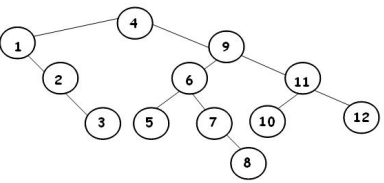

# Árvores Binárias de Busca (ABB)

---
## 1. Conceitos Gerais

Uma **Árvore Binária de Busca (ABB)** é uma estrutura de dados que combina a flexibilidade da inserção em listas encadeadas com a eficiência da busca em vetores ordenados. Ela permite a busca binária a partir da raiz, mantendo os elementos organizados de forma hierárquica.

**Princípio fundamental**: Para qualquer nó:
- Todas as chaves na subárvore esquerda são menores que a chave do nó;
- Todas as chaves na subárvore direita são maiores que a chave do nó;

---

## 2. Estrutura e Propriedades

### 2.1 Características Principais
- Combina flexibilidade de inserção com eficiência de busca;
- Permite busca binária a partir da raiz;
- Todo nó não-terminal tem no máximo 2 filhos;
- Nós folha apontam para NULL (nós externos);
- Chave de cada nó é maior que todas as chaves da sua subárvore esquerda;
- Chave de cada nó é menor que todas as chaves da sua subárvore direita;

### 2.2 Visualização



**Ordem de inserção**: 4, 1, 9, 2, 11, 6, 3, 7, 12, 8, 5, 10

---

## 3. Implementação da ABB

### 3.1 Definições e Macros

```cpp title="Definições básicas para ABB:"
#define info(A) (A.info)
#define key(A) (A.chave)
#define less(A, B) ((A) < (B))
#define eq(A, B) ((A) == (B))
#define exch(A, B) { Item t = A; A = B; B = t; }
#define compexch(A, B) if(less(B, A)) exch(A, B)

typedef int Key;

typedef struct data Item;
struct data {
    Key chave;
    char info[100];
};

typedef struct node STnode;
struct node {
    Item item;
    STnode *esq, *dir;
    STnode *pai;  // Opcional: ponteiro para o pai
};
```

### 3.2 Criação de Nó

```cpp title="Função para criar novo nó:"
STnode *new(Item x, STnode *e, STnode *d) {
    STnode *no = malloc(sizeof(STnode));
    no->esq = e;
    no->dir = d;
    no->item = x;
    no->pai = NULL;  // Inicialmente sem pai
    return no;
}
```

---

## 4. Operações Básicas

### 4.1 Busca em ABB

```cpp title="Busca recursiva em ABB:"
STnode *STsearch(STnode *no, Key v) {
    // Condição de parada: nó nulo ou chave encontrada
    if (no == NULL || eq(v, key(no->item)))
        return no;

    // Buscar na subárvore esquerda se v for menor
    if (less(v, key(no->item)))
        return STsearch(no->esq, v);
    else
        return STsearch(no->dir, v);
}

// Versão iterativa da busca
STnode *STsearch_iterativo(STnode *no, Key v) {
    while (no != NULL && !eq(v, key(no->item))) {
        if (less(v, key(no->item)))
            no = no->esq;
        else
            no = no->dir;
    }
    return no;
}
```

### 4.2 Inserção em ABB

```cpp title="Inserção recursiva em ABB:"
STnode *STinsert(STnode *no, Item item) {
    // Condição de parada: alcançou nó externo
    if (no == NULL)
        return new(item, NULL, NULL);

    Key novo = key(item);
    Key atual = key(no->item);

    // Decidir onde inserir
    if (less(novo, atual)) {
        no->esq = STinsert(no->esq, item);
        if (no->esq != NULL) no->esq->pai = no;
    } else {
        no->dir = STinsert(no->dir, item);
        if (no->dir != NULL) no->dir->pai = no;
    }

    return no;
}

// Exemplo de uso
int main(int argc, char *argv[]) {
    STnode *tree = NULL;
    int n = 10;  // Número de elementos
    
    for (int i = 0; i < n; i++) {
        Item v;
        printf("Digite chave e info: ");
        scanf("%d %s", &v.chave, v.info);
        tree = STinsert(tree, v);
    }
    
    return 0;
}
```

### 4.3 Remoção em ABB

```cpp title="Remoção em ABB:"
STnode *STdelete(STnode *no, Key remove) {
    if (no == NULL) return NULL;  // Chave não encontrada

    Key atual = key(no->item);

    // Procurar o nó a ser removido
    if (less(remove, atual)) {
        no->esq = STdelete(no->esq, remove);
    } else if (less(atual, remove)) {
        no->dir = STdelete(no->dir, remove);
    } else {
        // Nó encontrado - eq(atual, remove)
        
        // Caso 1: Nó com apenas um filho ou nenhum
        if (no->esq == NULL) {
            STnode *temp = no->dir;
            free(no);
            return temp;
        } else if (no->dir == NULL) {
            STnode *temp = no->esq;
            free(no);
            return temp;
        }
        
        // Caso 2: Nó com dois filhos
        // Encontrar sucessor (menor valor na subárvore direita)
        STnode *temp = minimo(no->dir);
        
        // Copiar dados do sucessor para este nó
        no->item = temp->item;
        
        // Remover o sucessor
        no->dir = STdelete(no->dir, key(temp->item));
    }
    
    return no;
}

// Função auxiliar para encontrar o nó mínimo
STnode *minimo(STnode *no) {
    STnode *atual = no;
    while (atual != NULL && atual->esq != NULL)
        atual = atual->esq;
    return atual;
}
```

### 4.4 Operações Auxiliares

```cpp title="Operações auxiliares para ABB:"
// Encontrar nó mínimo (menor chave)
STnode *minimo(STnode *no) {
    if (no == NULL) return NULL;
    while (no->esq != NULL)
        no = no->esq;
    return no;
}

// Encontrar nó máximo (maior chave)
STnode *maximo(STnode *no) {
    if (no == NULL) return NULL;
    while (no->dir != NULL)
        no = no->dir;
    return no;
}

// Encontrar sucessor (próximo nó em ordem)
STnode *sucessor(STnode *no) {
    if (no == NULL) return NULL;
    
    // Se há subárvore direita, sucessor é o mínimo dela
    if (no->dir != NULL)
        return minimo(no->dir);
    
    // Caso contrário, subir até encontrar um ancestral
    // que seja filho esquerdo
    STnode *pai = no->pai;
    while (pai != NULL && no == pai->dir) {
        no = pai;
        pai = pai->pai;
    }
    return pai;
}

// Encontrar predecessor (nó anterior em ordem)
STnode *predecessor(STnode *no) {
    if (no == NULL) return NULL;
    
    // Se há subárvore esquerda, predecessor é o máximo dela
    if (no->esq != NULL)
        return maximo(no->esq);
    
    // Caso contrário, subir até encontrar um ancestral
    // que seja filho direito
    STnode *pai = no->pai;
    while (pai != NULL && no == pai->esq) {
        no = pai;
        pai = pai->pai;
    }
    return pai;
}
```

---

## 5. Análise de Complexidade

### 5.1 Complexidade das Operações
| Operação | Melhor Caso | Caso Médio | Pior Caso |
|----------|------------|------------|-----------|
| **Busca** | O(log n) | O(log n) | O(n) |
| **Inserção** | O(log n) | O(log n) | O(n) |
| **Remoção** | O(log n) | O(log n) | O(n) |
| **Mínimo/Máximo** | O(log n) | O(log n) | O(n) |
| **Sucessor/Predecessor** | O(1) | O(1) | O(n) |

### 5.2 Fatores que Influenciam a Performance
- **Árvore balanceada**: Altura ≈ log₂n, operações O(log n);
- **Árvore degenerada**: Altura = n, operações O(n);
- **Ordem de inserção**: Inserções ordenadas criam árvores degeneradas;

---

## 6. Vantagens e Desvantagens

### 6.1 Vantagens
- **Busca eficiente**: O(log n) em árvores balanceadas;
- **Inserção/Remoção**: Mais eficiente que arrays ordenados;
- **Flexibilidade**: Tamanho dinâmico;
- **Ordenação**: Percursos inordem retornam elementos ordenados;

### 6.2 Desvantagens
- **Desbalanceamento**: Pode degenerar para lista encadeada;
- **Complexidade**: Implementação mais complexa que arrays;
- **Overhead**: Armazenamento de ponteiros;
- **Balanceamento**: Necessidade de algoritmos AVL ou Red-Black;

---

## 7. Aplicações
- **Bancos de dados**: Índices para busca rápida;
- **Compiladores**: Tabelas de símbolos;
- **Sistemas operacionais**: Escalonamento de processos;
- **Redes**: Roteamento de pacotes;

