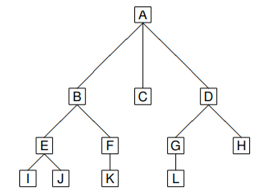
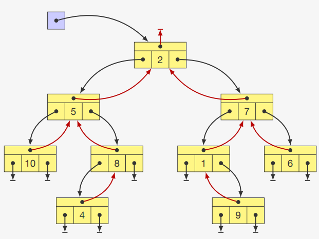
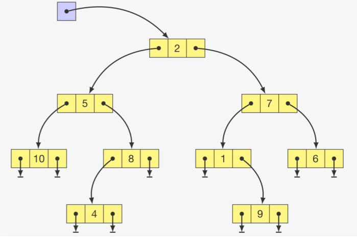

# Árvores


---

## 1. Conceitos Gerais

Uma **Árvore** é uma estrutura de dados não-linear hierárquica composta por nós conectados por arestas. Cada árvore possui um nó raiz (topo) e subárvores formadas pelos filhos do nó raiz.

**Princípio fundamental**: "Um para muitos" - cada nó pode ter zero ou mais filhos, mas apenas um pai (exceto a raiz, que não tem pai).

---

## 2. Terminologia e Genealogia



- **Raiz**: Nó superior sem pai (A);
- **Pai e filho**: B é pai de E e F;
- **Irmãos**: B, C e D são irmãos (mesmo pai);
- **Ancestrais**: G, D, A são os ancestrais de L;
- **Descendentes**: E, F são descendentes de B;
- **Nível**: A tem nível 0; B, C, D têm nível 1; E, F, G, H têm nível 2;
- **Altura**: A árvore do exemplo tem altura 4 (número de níveis);
- **Folha/Nó terminal/Nó externo**: I, J, K, L, H, C são folhas (sem filhos);
- **Nó interno**: Nós com pelo menos um filho (A, B, D, E, F, G);
- **Grau de um nó**: Número de filhos (B tem grau 2);
- **Grau de uma árvore**: Máximo grau entre todos os nós (a árvore do exemplo tem grau 3);

---

## 3. Árvore Binária



### 3.1 Características

- Máximo de 2 filhos por nó (grau máximo = 2);
- Formada por uma raiz e subárvores binárias;
- Ordem dos filhos é importante (esquerda vs direita);

### 3.2 Classificação

- **Árvore Estritamente Binária**: Nós têm 0 ou 2 filhos;
- **Árvore Binária Quase Completa**: Todas as folhas estão no nível d ou d-1;
- **Árvore Binária Completa**: Todas as folhas estão em um mesmo nível;
- **Árvore Binária Cheia**: É uma árvore estritamente binária e completa;

### 3.3 Propriedades

- **Se há N nós internos, então a árvore tem**:
    - N + 1 nós externos/folhas;
- **Se a altura é h, então a árvore tem**:
    - No mínimo h nós internos;
    - No máximo 2^h - 1 nós internos;
- **Número máximo de nós no nível k**: 2^k;

---

## 4. Implementação de Árvores Binárias

### 4.1 Estrutura de Dados

```cpp title="Estrutura de nó para árvore binária:"
typedef int Item;

typedef struct node no;
struct node
{
    Item item;
    no *pai;
    no *esq, *dir;
};
```

### 4.2 Operações Básicas

```cpp title="Criação e operações básicas:"
// Criar uma árvore com raiz x e subárvores esquerda/direita
no *criar_arvore(Item x, no *p, no *e, no *d)
{
    no *raiz = malloc(sizeof(no));
    raiz->pai = p;
    raiz->esq = e;
    raiz->dir = d;
    raiz->item = x;
    return raiz;
}

// Encontrar avô de um nó
no *avo(no *elemento) {
    if ((elemento != NULL) && (elemento->pai != NULL))
        return elemento->pai->pai;
    return NULL;
}

// Encontrar tio de um nó
no *tio(no *elemento) {
    no *vo = avo(elemento);
    if (vo == NULL) return NULL;

    if (elemento->pai == vo->esq)
        return vo->dir;
    return vo->esq;
}

// Encontrar irmão de um nó
no *irmao(no *elemento) {
    if ((elemento != NULL) && (elemento->pai != NULL)) {
        if (elemento == elemento->pai->esq)
            return elemento->pai->dir;
        return elemento->pai->esq;
    }
    return NULL;
}

// Buscar elemento na árvore (busca linear)
no *busca_linear(no *raiz, Item v) {
    if (raiz == NULL) return NULL;
    if (raiz->item == v) return raiz;

    no *encontrado = busca_linear(raiz->esq, v);
    if (encontrado) return encontrado;

    return busca_linear(raiz->dir, v);
}

// Contar número de nós
int numero_nos(no *raiz) {
    if (raiz == NULL) return 0;
    return 1 + numero_nos(raiz->esq) + numero_nos(raiz->dir);
}

// Calcular altura da árvore
int altura(no *raiz) {
    if (raiz == NULL) return 0;
    return 1 + fmax(altura(raiz->esq), altura(raiz->dir));
}
```

---

## 5. Percursos em Árvores Binárias

### 5.1 Percursos em Profundidade (Recursivos)

{ align=center }

- **Pré-ordem:** 2, 5, 3, 8, 4, 7, 1, 9, 6.  
- **In-ordem:** 3, 5, 4, 8, 2, 1, 9, 7, 6.  
- **Pós-ordem:** 3, 4, 8, 5, 9, 1, 6, 7, 2.


```cpp title="Percursos em profundidade (recursivos):"
// Pré-ordem: Raiz → Esquerda → Direita
void preordem(no *raiz) {
    if (raiz != NULL) {
        printf("%d ", raiz->item); // Processa raiz
        preordem(raiz->esq);       // Subárvore esquerda
        preordem(raiz->dir);       // Subárvore direita
    }
}

// Inordem: Esquerda → Raiz → Direita
void inordem(no *raiz) {
    if (raiz != NULL) {
        inordem(raiz->esq);        // Subárvore esquerda
        printf("%d ", raiz->item); // Processa raiz
        inordem(raiz->dir);        // Subárvore direita
    }
}

// Pós-ordem: Esquerda → Direita → Raiz
void posordem(no *raiz) {
    if (raiz != NULL) {
        posordem(raiz->esq);       // Subárvore esquerda
        posordem(raiz->dir);       // Subárvore direita
        printf("%d ", raiz->item); // Processa raiz
    }
}
```

---

### 5.2 Percurso em Largura


- **Ordem**: 2, 5, 7, 3, 8, 1, 6, 4, 9

```cpp title="Percurso em largura usando fila:"
// Estrutura de fila simplificada para o exemplo
typedef struct {
    no **itens;
    int frente, tras, capacidade;
} Fila;

Fila* criar_fila(int capacidade) {
    Fila *f = malloc(sizeof(Fila));
    f->itens = malloc(capacidade * sizeof(no*));
    f->frente = f->tras = 0;
    f->capacidade = capacidade;
    return f;
}

void enfileira(Fila *f, no *item) {
    f->itens[f->tras] = item;
    f->tras = (f->tras + 1) % f->capacidade;
}

no* desenfileira(Fila *f) {
    no *item = f->itens[f->frente];
    f->frente = (f->frente + 1) % f->capacidade;
    return item;
}

int fila_vazia(Fila *f) {
    return f->frente == f->tras;
}

// Percurso em largura (BFS)
void percurso_em_largura(no *raiz) {
    if (raiz == NULL) return;
    
    Fila *f = criar_fila(100);
    enfileira(f, raiz);
    
    while (!fila_vazia(f)) {
        no *atual = desenfileira(f);
        printf("%d ", atual->item);
        
        if (atual->esq != NULL) enfileira(f, atual->esq);
        if (atual->dir != NULL) enfileira(f, atual->dir);
    }
    
    free(f->itens);
    free(f);
}
```

---

## 6. Análise da Estrutura

### 6.1 Características
| Aspecto | Árvore Binária |
|---------|---------------|
| **Organização** | Hierárquica |
| **Acesso** | Eficiente para busca (se balanceada) |
| **Política** | Hierárquica (pai-filho) |
| **Flexibilidade** | Dinâmica, tamanho variável |

### 6.2 Complexidade
| Operação | Árvore Balanceada | Árvore Degenerada |
|----------|------------------|------------------|
| **Busca** | O(log n) | O(n) |
| **Inserção** | O(log n) | O(n) |
| **Remoção** | O(log n) | O(n) |
| **Percursos** | O(n) | O(n) |
| **Espaço** | O(n) | O(n) |

### 6.3 Vantagens
- **Busca eficiente**: O(log n) em árvores balanceadas;
- **Hierarquia natural**: Representa relações hierárquicas;
- **Flexibilidade**: Inserções e remoções eficientes;
- **Ordenação**: Percursos fornecem diferentes ordens;

### 6.4 Desvantagens
- **Complexidade**: Implementação mais complexa que estruturas lineares;
- **Balanceamento**: Necessidade de algoritmos de balanceamento;
- **Overhead**: Ponteiros consomem memória adicional;

### 6.5 Quando Utilizar
- **Busca eficiente**: Quando precisa buscar elementos rapidamente;
- **Dados hierárquicos**: Para representar estruturas organizacionais;
- **Árvores de decisão**: Em algoritmos de machine learning;
- **Indexação**: Em bancos de dados e sistemas de arquivos;

---


## 7. Aplicações Comuns
- **Sistemas de arquivos**: Diretórios e subdiretórios;
- **DOM (Document Object Model)**: Estrutura de documentos HTML/XML;
- **Árvores de decisão**: Em inteligência artificial;
- **Compressão de dados**: Árvores de Huffman;
- **Bancos de dados**: Índices em B-trees;

