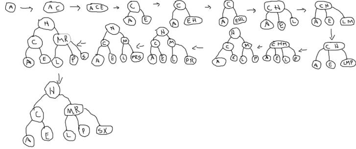

# Árvore 2-3 - Implementação e Análise

---
## 1. Conceitos Gerais

Uma **Árvore 2-3** é uma árvore de busca balanceada que permite nós com 1 ou 2 chaves, garantindo que todas as folhas estejam no mesmo nível.

**Princípio fundamental**: 
- **Nó 2**: 1 chave, 2 filhos (esquerdo e direito)
- **Nó 3**: 2 chaves, 3 filhos (esquerdo, meio e direito)
- **Nós folha** estão sempre no mesmo nível
- **Balanceamento automático** através de operações de divisão durante inserções

---

## 2. Estrutura de Dados

### 2.1 Definições e Macros

```c title="Definições básicas para Árvore 2-3:"
typedef int Key;  // Tipo da chave

// Estrutura do item (chave + dados)
typedef struct {
    Key k;        // Chave
    // data d;    // Dados associados (pode ser expandido)
} Item;

#define NULL_ITEM {0}  // Item nulo
#define NULL_KEY 0     // Chave nula

// Macros para manipulação de itens
#define key(A) ((A).k)
#define less(A, B) (key(A) < key(B))
#define eq(A, B) (key(A) == key(B))
```

### 2.2 Estrutura do Nó

```c title="Estrutura do nó da Árvore 2-3:"
typedef struct TTNode *link;

struct TTNode {
    Item item1;    // Primeiro item (sempre presente)
    Item item2;    // Segundo item (apenas em nós 3)
    link l;        // Ponteiro para filho esquerdo
    link m;        // Ponteiro para filho do meio (apenas em nós 3)
    link r;        // Ponteiro para filho direito
    int n;         // Número de itens no nó (1 ou 2)
};

// Variáveis globais
link h;  // Raiz da árvore
link z;  // Nó sentinela (representa folhas vazias/nulo)
```

---

## 3. Implementação das Operações

### 3.1 Inicialização e Utilidades

```c title="Inicialização e funções auxiliares:"
// Criar um novo nó 2
link NEW2(Item item, link l, link r) {
    link x = malloc(sizeof(struct TTNode));
    x->item1 = item;
    x->item2 = NULL_ITEM;
    x->l = l;
    x->m = z;
    x->r = r;
    x->n = 1;
    return x;
}

// Criar um novo nó 3
link NEW3(Item item1, Item item2, link l, link m, link r) {
    link x = malloc(sizeof(struct TTNode));
    x->item1 = item1;
    x->item2 = item2;
    x->l = l;
    x->m = m;
    x->r = r;
    x->n = 2;
    return x;
}

// Inicializar a árvore
void TT_init() {
    z = NEW2(NULL_ITEM, NULL, NULL);  // Nó sentinela
    h = z;  // Raiz inicial aponta para sentinela
}

// Verifica se a árvore está vazia
int TT_empty() {
    return h == z;
}
```

### 3.2 Busca

```c title="Busca em Árvore 2-3:"
// Função pública de busca
Item TT_search(Key k) {
    return searchR(h, k);
}

// Função recursiva de busca
Item searchR(link r, Key k) {
    if (r == z)  // Não encontrado
        return NULL_ITEM;
    
    if (r->n == 1) {  // Nó 2
        if (eq(k, key(r->item1)))
            return r->item1;
        else if (less(k, key(r->item1)))
            return searchR(r->l, k);
        else
            return searchR(r->r, k);
    } else {  // Nó 3
        if (eq(k, key(r->item1)) || eq(k, key(r->item2)))
            return eq(k, key(r->item1)) ? r->item1 : r->item2;
        else if (less(k, key(r->item1)))
            return searchR(r->l, k);
        else if (less(k, key(r->item2)))
            return searchR(r->m, k);
        else
            return searchR(r->r, k);
    }
}
```

### 3.3 Inserção


- **Exemplo:** ACEHLMPRSX


```c title="Inserção com divisão de nós:"
// Função pública de inserção
void TT_insert(Item item) {
    link temp = z;
    h = insertR(h, item, &temp);
    if (temp != z) {  // Raiz foi dividida
        h = NEW2(temp->item1, h, temp);
    }
}

// Função recursiva de inserção
link insertR(link r, Item item, link *temp) {
    if (r == z) {  // Folha encontrada
        *temp = z;
        return NEW2(item, z, z);
    }
    
    Key k = key(item);
    
    if (r->n == 1) {  // Nó 2
        if (less(k, key(r->item1))) {
            link new_child = insertR(r->l, item, temp);
            if (*temp == z) {
                r->l = new_child;
                return r;
            } else {  // Precisa transformar em nó 3
                return NEW3((*temp)->item1, r->item1, 
                           new_child, (*temp)->r, r->r);
            }
        } else {
            link new_child = insertR(r->r, item, temp);
            if (*temp == z) {
                r->r = new_child;
                return r;
            } else {  // Precisa transformar em nó 3
                return NEW3(r->item1, (*temp)->item1, 
                           r->l, (*temp)->l, new_child);
            }
        }
    } else {  // Nó 3 - tratamento mais complexo
        // Implementação simplificada - divide o nó
        if (less(k, key(r->item1))) {
            // Inserção à esquerda
        } else if (less(k, key(r->item2))) {
            // Inserção no meio
        } else {
            // Inserção à direita
        }
        // Lógica de divisão do nó 3
    }
    return r;
}
```

---

## 4. Análise de Performance

### 4.1 Complexidade das Operações

| Operação | Melhor Caso | Caso Médio | Pior Caso |
|----------|------------|------------|-----------|
| **Busca** | O(1) | O(log n) | O(log n) |
| **Inserção** | O(1) | O(log n) | O(log n) |
| **Remoção** | O(1) | O(log n) | O(log n) |
| **Travessia** | O(n) | O(n) | O(n) |

---

## 5. Considerações Finais

### 5.1 Quando Usar Árvore 2-3
- **Dados dinâmicos com busca frequente**: Garante O(log n) mesmo com inserções/remoções
- **Aplicações críticas**: Onde performance consistente é essencial
- **Dados parcialmente ordenados**: Excelente resistência a dados sequenciais

### 5.2 Alternativas e Evoluções
- **Árvores Red-Black**: Implementação mais eficiente com propriedades similares
- **Árvores B/B+**: Generalização para armazenamento em disco
- **Árvores AVL**: Balanceamento mais rigoroso para aplicações específicas

### 5.3 Aplicações Práticas
- **Sistemas de arquivos**: Estruturas de diretórios
- **Bancos de dados**: Índices balanceados
- **Compiladores**: Tabelas de símbolos
- **Sistemas operacionais**: Gerenciamento de memória
