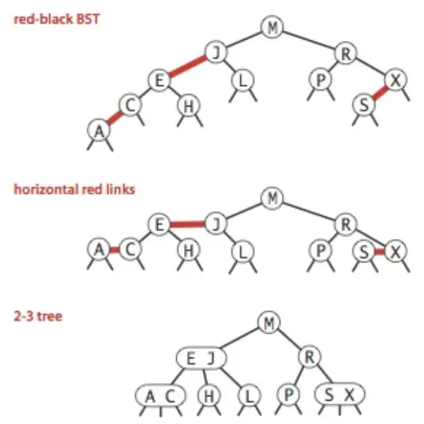
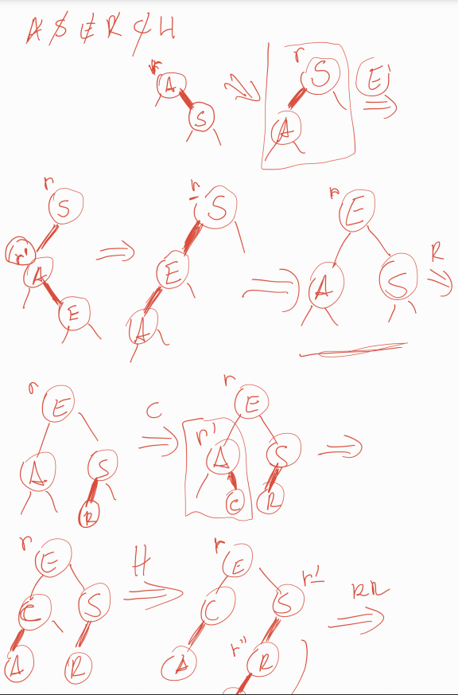

# Árvores Rubro-Negras Esquerdistas (Left-Leaning Red-Black Trees - LLRBT)

---
## 1. Conceitos Gerais

As **Árvores Rubro-Negras Esquerdistas (ARNE)** são uma implementação específica de árvores rubro-negras que mantêm todos os links vermelhos inclinados para a esquerda, simplificando a implementação enquanto mantém as propriedades de balanceamento.

**Princípio fundamental**: Representação de árvores 2-3 usando árvores binárias com links coloridos:
- **Links negros**: Links normais da árvore binária
- **Links vermelhos**: Links "horizontais" que conectam nós do mesmo nível lógico (representando nós 3 da árvore 2-3)


{ align=center }
<br>
*Estrutura de uma BST Red Black*

---

## 2. Estrutura de Dados

### 2.1 Definições e Macros

```c title="Definições básicas para ARNE:"
typedef int Key;  // Tipo da chave

// Estrutura do item (chave + dados)
typedef struct {
    Key k;        // Chave
    // data d;    // Dados associados (pode ser expandido)
} Item;

#define NULL_ITEM {0}  // Item nulo

// Macros para manipulação de itens
#define key(A) ((A).k)
#define less(A, B) (key(A) < key(B))
#define eq(A, B) (key(A) == key(B))

// Cores dos links
#define RED 0
#define BLACK 1
```

### 2.2 Estrutura do Nó

```c title="Estrutura do nó da ARNE:"
typedef struct STNode *link;

struct STNode {
    Item item;    // Item armazenado
    link l;       // Ponteiro para filho esquerdo
    link r;       // Ponteiro para filho direito
    int N;        // Tamanho da subárvore (nó atual + filhos)
    int color;    // Cor do link que aponta para este nó (RED ou BLACK)
};

// Variáveis globais
link h;  // Raiz da árvore
link z;  // Nó sentinela (representa folhas vazias/nulo)
```

---

## 3. Implementação das Operações

### 3.1 Inicialização e Utilidades

```c title="Inicialização e funções auxiliares:"
// Criar um novo nó
link NEW(Item item, link l, link r, int N) {
    link x = malloc(sizeof(struct STNode));
    x->item = item;
    x->l = l;
    x->r = r;
    x->N = N;
    x->color = RED;  // Novos nós começam com link rubro
    return x;
}

// Inicializar a árvore
void ST_init() {
    z = NEW(NULL_ITEM, NULL, NULL, 0);  // Nó sentinela
    z->color = BLACK;  // Sentinela sempre negra
    h = z;  // Raiz inicial aponta para sentinela
}

// Verifica se um link é vermelho
int isRed(link x) {
    if (x == z) return 0;  // Links para sentinela são considerados negros
    return x->color == RED;
}

// Retorna o número de nós da árvore
int ST_count() {
    return h->N;
}

// Verifica se a árvore está vazia
int ST_empty() {
    return h == z;
}
```

### 3.2 Operações de Rotação e Ajuste
- **Rotação Esquerda (Anti-horária):|**
    - Usada quando há um link rubro à direita;
    - Como funciona:
        - Rotação para esquerda da subwarvore
        - Continua vermelho
- **Rotação Direita (Horária):**
    - Usada quando há dois links rubros consecutivos à esquerda;
    - Como funciona:
        - Rotaçao da subarvore para direita
        - No superior fica vermelho
- **Inversão de Cores:**
    - Simula a divisão de um nó triplo temporário em uma árvore 2-3;
    - Remove a cor rubra dos dois filhos de um nó e torna o link que aponta para o nó rubro;
    - Efeito: "Empurra" a cor rubra para cima na árvore;

```c title="Rotações e inversão de cores:"
// Rotação esquerda (anti-horária)
link rotateLeft(link r) {
    link x = r->r;          // Filho direito sobe
    r->r = x->l;           // Adota subárvore esquerda de x
    x->l = r;              // r vira filho esquerdo de x
    x->color = r->color;   // Herda a cor de r
    r->color = RED;        // Novo link para r é rubro
    x->N = r->N;           // Atualiza contagem de nós
    r->N = 1 + r->l->N + r->r->N; // Recalcula N para r
    return x;
}

// Rotação direita (horária)
link rotateRight(link r) {
    link x = r->l;          // Filho esquerdo sobe
    r->l = x->r;           // Adota subárvore direita de x
    x->r = r;              // r vira filho direito de x
    x->color = r->color;   // Herda a cor de r
    r->color = RED;        // Novo link para r é rubro
    x->N = r->N;           // Atualiza contagem de nós
    r->N = 1 + r->l->N + r->r->N; // Recalcula N para r
    return x;
}

// Inversão de cores (split de nó 4)
void flipColors(link r) {
    r->l->color = BLACK;   // Filhos tornam-se negros
    r->r->color = BLACK;
    r->color = RED;        // Link para r torna-se rubro
}
```

### 3.3 Inserção
#### 3.3.1 Funcionamento
- Insere um novo nó com link rubro, simulando a adição em uma árvore 2-3;
- Ajusta a árvore com rotações e inversões de cores para manter as propriedades da ARNE;
- **Casos**:
    1. **Nó simples**: Novo nó é pendurado com link rubro (pode exigir ajustes);
    2. **Nó duplo**: Forma um nó triplo temporário, que é dividido com inversão de cores;
#### 3.3.2 Passo a Passo
- Insere recursivamente como em uma BST, pendurando o novo nó com link rubro;
- Após a inserção, verifica violações das propriedades:
    - **Link rubro à direita**: Rotação esquerda;
    - **Dois links rubros à esquerda**: Rotação direita;
    - **Dois filhos rubros**: Inversão de cores;
- Atualiza a contagem de nós (N);
- Garante que a raiz seja negra;

```c title="Inserção com balanceamento:"
// Função pública de inserção
void ST_insert(Item item) {
    h = insertR(h, item);
    h->color = BLACK;  // Raiz sempre negra
}

// Função recursiva de inserção
link insertR(link r, Item item) {
    if (r == z)  // Encontrou posição de inserção
        return NEW(item, z, z, 1);
    
    Key k = key(item);
    Key t = key(r->item);
    
    // Inserção recursiva
    if (less(k, t)) {
        r->l = insertR(r->l, item);
    } else {
        r->r = insertR(r->r, item);
    }
    
    // Balanceamento pós-inserção
    r = fixUp(r);
    r->N = 1 + r->l->N + r->r->N;  // Atualiza contador
    return r;
}

// Corrige violações das propriedades ARNE
link fixUp(link r) {
    // Corrige link vermelho à direita
    if (isRed(r->r) && !isRed(r->l))
        r = rotateLeft(r);
    
    // Corrige dois links vermelhos consecutivos à esquerda
    if (isRed(r->l) && isRed(r->l->l))
        r = rotateRight(r);
    
    // Corrige dois filhos vermelhos (nó 4)
    if (isRed(r->l) && isRed(r->r))
        flipColors(r);
    
    return r;
}
```
#### 3.3.3 Inserção Manual
{ align=center }
<br>
*Exemplo: ASERCH*

### 3.4 Busca

```c title="Busca recursiva:"
// Função pública de busca
Item ST_search(Key k) {
    return searchR(h, k);
}

// Função recursiva de busca
Item searchR(link r, Key k) {
    if (r == z)  // Não encontrado
        return NULL_ITEM;
    
    Key t = key(r->item);
    
    if (eq(k, t))
        return r->item;
    else if (less(k, t))
        return searchR(r->l, k);
    else
        return searchR(r->r, k);
}
```

### 3.5 Travessia e Ordenação

```c title="Travessia in-order:"
// Função de visita
void visit(Item i) {
    printf("%d ", key(i));
}

// Travessia in-order recursiva
void sortR(link r, void (*visit)(Item)) {
    if (r == z) return;
    
    sortR(r->l, visit);  // Visita subárvore esquerda
    visit(r->item);      // Visita nó atual
    sortR(r->r, visit);  // Visita subárvore direita
}

// Função pública para ordenação
void ST_sort(void (*visit)(Item)) {
    sortR(h, visit);
}
```

### 3.6 Exemplo de Uso

```c title="Exemplo de uso da ARNE:"
int main() {
    ST_init();  // Inicializa árvore
    
    // Insere elementos: A S E R C H
    Item items[] = {{1}, {19}, {5}, {18}, {3}, {8}};
    char labels[] = {'A','S','E','R','C','H'};
    
    for (int i = 0; i < 6; i++) {
        ST_insert(items[i]);
        printf("Inserido: %c (%d)\n", labels[i], key(items[i]));
    }
    
    printf("Número de nós: %d\n", ST_count());
    printf("Elementos em ordem: ");
    ST_sort(visit);  // Imprime em ordem crescente
    
    // Busca por uma chave
    Key busca = 5;
    Item resultado = ST_search(busca);
    if (key(resultado) != 0) {
        printf("\nEncontrado: %d\n", key(resultado));
    } else {
        printf("\nNão encontrado: %d\n", busca);
    }
    
    return 0;
}
```

---

## 4. Análise de Performance

### 4.1 Complexidade das Operações

| Operação | Melhor Caso | Caso Médio | Pior Caso |
|----------|------------|------------|-----------|
| **Busca** | O(1) | O(log n) | O(log n) |
| **Inserção** | O(1) | O(log n) | O(log n) |
| **Remoção** | O(1) | O(log n) | O(log n) |
| **Travessia** | O(n) | O(n) | O(n) |

### 4.2 Propriedades de Balanceamento

- **Altura máxima**: ≤ 2 log₂(n + 1)
- **Balanceamento perfeito**: Todos os caminhos da raiz às folhas têm o mesmo número de links negros
- **Links vermelhos**: Nunca dois links vermelhos consecutivos e sempre inclinados à esquerda

### 4.3 Vantagens sobre BST Comum

- **Balanceamento garantido**: Sempre O(log n) para todas as operações
- **Performance consistente**: Não degrada com dados ordenados
- **Eficiência de memória**: Overhead mínimo (apenas 1 bit por nó para cor)

### 4.4 Comparação com Outras Estruturas

| Característica | BST Simples | Árvore 2-3 | ARNE |
|---------------|------------|------------|------|
| **Balanceamento** | Não garantido | Garantido | Garantido |
| **Altura máxima** | O(n) | O(log n) | O(log n) |
| **Complexidade** | Simples | Complexa | Moderada |
| **Overhead** | Baixo | Alto | Baixo |

---

## 5. Considerações Finais

### 5.1 Quando Usar ARNE
- **Aplicações de alto desempenho**: Onde O(log n) garantido é essencial
- **Dados dinâmicos**: Muitas inserções/remoções com busca frequente
- **Memória limitada**: Overhead menor que árvores 2-3
- **Dados ordenados**: Excelente resistência a sequências ordenadas

### 5.2 Aplicações Práticas
- **Bancos de dados**: Índices primários e secundários
- **Sistemas de arquivos**: Estruturas de diretórios
- **Compiladores**: Tabelas de símbolos eficientes
- **Bibliotecas padrão**: Implementação de mapas e conjuntos ordenados
