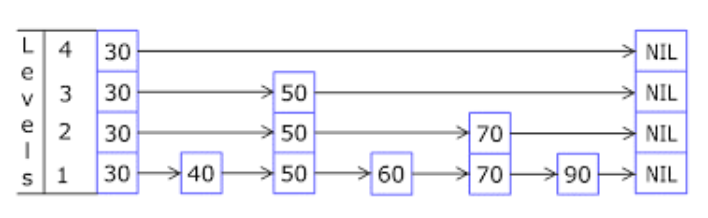

# Skip List - Implementação e Análise

---
## 1. Conceitos Gerais

Uma **Skip List** é uma estrutura de dados probabilística que consiste em múltiplas listas encadeadas ordenadas, permitindo busca eficiente com complexidade média O(log n).

**Princípio fundamental**: Utiliza múltiplos níveis de listas encadeadas, onde:
- **Nível 0**: Contém todos os elementos em ordem
- **Níveis superiores**: Contêm subconjuntos dos elementos, servindo como "pistas expressas" para busca rápida
- **Altura probabilística**: Cada elemento tem uma probabilidade de aparecer em níveis superiores

{ align=center }
<br>
*Estrutura de uma Skip List*


---

## 2. Estrutura de Dados

### 2.1 Definições e Macros

```c title="Definições básicas para Skip List:"
typedef int Key;  // Tipo da chave

// Estrutura do item (chave + dados)
typedef struct {
    Key k;        // Chave
    // data d;    // Dados associados (pode ser expandido)
} Item;

#define NULL_ITEM {0}  // Item nulo

// Macros para manipulação de itens
#define key(A) ((A).k)
#define less(A, B) (key(A) < key(B))
#define eq(A, B) (key(A) == key(B))

// Constantes
#define LG_N_MAX 16     // Número máximo de níveis
#define RAND_MAX 32767  // Valor máximo para rand()
```

### 2.2 Estrutura do Nó

```c title="Estrutura do nó da Skip List:"
typedef struct STNode *link;

struct STNode {
    Item item;       // Item armazenado
    link *links;     // Vetor de ponteiros para próximos nós (um por nível)
    int sz;          // Número de links/níveis do nó
};

// Variáveis globais
link head;  // Nó cabeça (início da lista)
link z;     // Nó sentinela (fim da lista)
int N;      // Número de elementos na lista
int lgN;    // Número atual de níveis
```

---

## 3. Implementação das Operações

### 3.1 Inicialização e Utilidades

```c title="Inicialização e funções auxiliares:"
// Criar um novo nó com k níveis
link NEW(Item item, int k) {
    link x = malloc(sizeof(struct STNode));
    x->item = item;
    x->links = malloc(k * sizeof(link));
    x->sz = k;
    
    // Inicializa todos os links apontando para sentinela
    for (int i = 0; i < k; i++)
        x->links[i] = z;
    
    return x;
}

// Inicializar a Skip List
void ST_init(int max) {
    N = 0;
    lgN = 0;
    z = NEW(NULL_ITEM, 0);  // Nó sentinela (sem links)
    head = NEW(NULL_ITEM, LG_N_MAX + 1);  // Nó cabeça com máximo de níveis
    
    // Inicializa todos os links do cabeça apontando para sentinela
    for (int i = 0; i <= LG_N_MAX; i++)
        head->links[i] = z;
}

// Função para determinar aleatoriamente o número de níveis de um novo nó
int randX() {
    int i, j, t = rand();
    
    // Determina quantos níveis o novo nó terá
    for (i = 1, j = 2; i < LG_N_MAX; i++, j *= 2) {
        if (t > RAND_MAX / j) break;
    }
    
    // Atualiza lgN se necessário
    if (i > lgN) lgN = i;
    
    return i;
}

// Retorna o número de elementos
int ST_count() {
    return N;
}

// Verifica se a lista está vazia
int ST_empty() {
    return N == 0;
}
```

### 3.2 Busca

```c title="Busca recursiva:"
// Função pública de busca
Item ST_search(Key v) {
    return searchR(head, v, lgN);
}

// Função recursiva de busca
Item searchR(link t, Key v, int k) {
    if (t == z)  // Chegou ao fim da lista
        return NULL_ITEM;
    
    Key tk = key(t->links[k]->item);
    
    if (eq(tk, v))  // Encontrou a chave
        return t->links[k]->item;
    
    if (t->links[k] == z) {  // Fim da lista neste nível
        if (k > 0) 
            return searchR(t, v, k - 1);  // Desce um nível
        else 
            return NULL_ITEM;  // Não encontrado
    }
    
    if (less(v, tk)) {  // Chave é menor, desce um nível
        if (k > 0) 
            return searchR(t, v, k - 1);
        else 
            return NULL_ITEM;
    }
    
    return searchR(t->links[k], v, k);  // Continua no mesmo nível
}
```

### 3.3 Inserção

```c title="Inserção recursiva:"
// Função pública de inserção
void ST_insert(Item item) {
    link x = NEW(item, randX());  // Cria novo nó com altura aleatória
    insertR(head, x, lgN);       // Insere recursivamente
    N++;                         // Incrementa contador
}

// Função recursiva de inserção
void insertR(link t, link x, int k) {
    Key v = key(x->item);
    
    if (less(v, key(t->links[k]->item))) {
        // Insere neste nível se o novo nó tem nível suficiente
        if (k < x->sz) {
            x->links[k] = t->links[k];
            t->links[k] = x;
        }
        
        // Continua inserção nos níveis inferiores
        if (k == 0) return;
        insertR(t, x, k - 1);
    } else {
        // Avança para o próximo nó neste nível
        insertR(t->links[k], x, k);
    }
}
```

### 3.4 Travessia e Ordenação

```c title="Travessia em ordem:"
// Função de visita
void visit(Item i) {
    printf("%d ", key(i));
}

// Travessia em ordem (nível 0)
void ST_traverse(void (*visit)(Item)) {
    link current = head->links[0];
    
    while (current != z) {
        visit(current->item);
        current = current->links[0];
    }
}

// Função para imprimir todos os níveis (debug)
void ST_printLevels() {
    for (int level = lgN; level >= 0; level--) {
        printf("Level %d: ", level);
        link current = head->links[level];
        
        while (current != z) {
            printf("%d ", key(current->item));
            current = current->links[level];
        }
        printf("\n");
    }
}
```

### 3.5 Exemplo de Uso

```c title="Exemplo de uso da Skip List:"
int main() {
    ST_init(100);  // Inicializa Skip List com capacidade máxima 100
    
    // Insere elementos: 5, 3, 7, 2, 4, 6, 8
    Item items[] = {{5}, {3}, {7}, {2}, {4}, {6}, {8}};
    
    for (int i = 0; i < 7; i++) {
        ST_insert(items[i]);
        printf("Inserido: %d\n", key(items[i]));
    }
    
    printf("\nNúmero de elementos: %d\n", ST_count());
    printf("Níveis atuais: %d\n", lgN);
    
    printf("\nElementos em ordem: ");
    ST_traverse(visit);
    
    printf("\n\nEstrutura por níveis:\n");
    ST_printLevels();
    
    // Busca por uma chave
    Key busca = 4;
    Item resultado = ST_search(busca);
    if (key(resultado) != 0) {
        printf("\nEncontrado: %d\n", key(resultado));
    } else {
        printf("\nNão encontrado: %d\n", busca);
    }
    
    busca = 10;
    resultado = ST_search(busca);
    if (key(resultado) != 0) {
        printf("Encontrado: %d\n", key(resultado));
    } else {
        printf("Não encontrado: %d\n", busca);
    }
    
    return 0;
}
```

---

## 4. Análise de Performance

### 4.1 Complexidade das Operações

| Operação | Melhor Caso | Caso Médio | Pior Caso |
|----------|------------|------------|-----------|
| **Busca** | O(1) | O(log n) | O(n) |
| **Inserção** | O(1) | O(log n) | O(n) |
| **Remoção** | O(1) | O(log n) | O(n) |
| **Travessia** | O(n) | O(n) | O(n) |

### 4.2 Propriedades Probabilísticas

- **Altura esperada**: O(log n) com alta probabilidade
- **Número esperado de níveis**: ≈ log₂n
- **Espaço esperado**: O(n) (cada elemento aparece em ≈2 níveis em média)

### 4.3 Vantagens

- **Implementação simples**: Mais fácil que árvores balanceadas
- **Balanceamento automático**: Não requer operações complexas de rebalanceamento
- **Performance consistente**: Boa performance média na prática
- **Flexibilidade**: Fácil de modificar e extender

### 4.4 Desvantagens

- **Performance probabilística**: Caso raro de performance O(n)
- **Uso de memória**: Overhead de ponteiros extras
- **Aleatoriedade**: Depende de gerador de números aleatórios

---

## 5. Considerações Finais

### 5.1 Quando Usar Skip List
- **Implementações simples**: Quando complexidade de código é importante
- **Dados dinâmicos**: Muitas inserções/remoções
- **Memória disponível**: Overhead de ponteiros é aceitável
- **Aplicações concorrentes**: Fácil de tornar thread-safe

### 5.2 Aplicações Práticas
- **Bancos de dados**: Índices em memória
- **Sistemas distribuídos**: Tabelas de roteamento
- **Aplicações de rede**: Cache de consultas DNS
- **Editores de texto**: Estruturas de dados para documentos grandes

### 5.3 Comparação com Outras Estruturas

| Característica | BST | Árvore 2-3 | ARNE | Skip List |
|---------------|------|------------|------|-----------|
| **Complexidade** | Média | Alta | Média | Baixa |
| **Balanceamento** | Não | Sim | Sim | Probabilístico |
| **Performance** | Variável | Garantida | Garantida | Média |
| **Memória** | Baixa | Alta | Média | Média-Alta |

