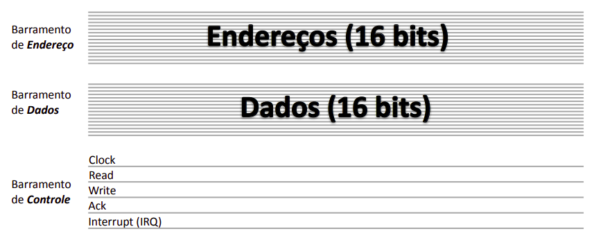
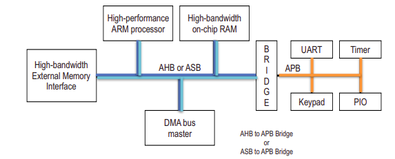

# Arquitetura de Software dos Sistemas Embarcados

---

## 1. O Papel do Kernel Linux em Sistemas Embarcados

### 1.1 Motivos pelo seu uso

**Abstração e Portabilidade:** O Linux funciona como um tradutor universal. Você desenvolve um software que fala com o kernel e o kernel fala com o hardware. Dessa forma, se você mudar o hardware, o seu código não vai para o lixo, você apenas precisa adaptar o kernel.

**Gerenciamento de Recursos (MMU):** O Linux exige uma MMU, um componente de hardware que o Kernel controla para criar uma memória virtual. Assim, cada programa acredita que tem toda a memória RAM só para ele, isolando os processos, de modo que se um programa travar, o kernel mata esse programa e mantém o resto do sistema vivo (importante em sistemas críticos).

**Pilha de Protocolos:** O Linux já vem com protocolos prontos para diferentes redes, arquivos e drivers. Assim, a empresa foca no seu produto final, em vez de perder tempo programando comunicações.

**Escalonamento:** Permite distribuir o tempo de CPU entre centenas de tarefas baseando-se em prioridades.

**Ecossistema e Open Source:** 

- Sem Licenciamento: Você não paga royalties por dispositivo vendido com Linux.
- Segurança Comunitária: Se alguma falha de segurança é descoberta, milhares de desenvolvedores ao redo do mundo corrigem em horas.
- Customização Extrema: Você pode remover todas as partes que você não usa, deixando-o minúsculo e rápido.

### 1.2 Responsabilidades

- Controlar dispositivos de I/O.
- Fazer o escalonamento de processos.
- Gerenciar compartilhamento de memória e os sinais de sistema.

---

## 2. Estrutura da Arquitetura de Software com Linux

O diagrama abaixo a estrutura completa de como a inteligência do sistema é organizada, indo desde o que o usuário vê (o aplicativo) até o que o hardware realmente faz (os circuitos).

{align=center }

### 2.1 User Space

**Applications (Aplicações):** É o topo da pirâmide. É o seu código final (ex: o painel de controle de um carro, o app de streaming da TV). Ela não sabe como o hardware funciona, ela apenas pede "serviços".

**Libraries (Bibliotecas) e Daemons**: São coleções de códigos prontos (como a glibc). Elas servem como tradutoras para que a aplicação possa falar com o Kernel de forma simples. Já os daemons (como o udev) são serviços que rodam em segundo plano.

### 2.2 Kernel Linux

 O Linux Kernel é dividido em camadas rigorosas para manter a segurança e a organização.

#### 2.2.1 Interfaces de Baixo Nível (Low-Level Interfaces)

**Definição:** É o código que conversa diretamente com os componentes eletrônicos.

**Como funciona:** Ele controla diretamente os registradores da CPU e a paginação de memória. São específicas para cada arquitetura de processador. Assim, o restante do sistema não precisa saber qual é o processador físico, pois essa camada cria uma tradução padrão.

#### 2.2.2 Componentes de Alto-nível (High-level Components)

**Definição:** São componentes que utilizam as APIs de baixo nível para criar serviços úteis. Como dependem da camada inferior padronizada, o código aqui é praticamente igual, independente de qual seja o processador.

**Sistemas de Arquivos:** Organiza logicamente como os dados são salvos fisicamente em discos ou memórias Flash.

**Protocolos de Rede:** Regras de comunicação para a internet ou redes locais, como TCP/IP (IPv4/IPv6), conexões seriais PPP, etc.

**Abstração de Alto Nível (High-Level Abstraction):** Se refere a outras facilidades que o kernel provê e que não são nem arquivo, nem rede, como por exemplo:

- IPC (Inter-Process Communication): Como dois programas conversam entre si dentro da memória.
- Gerenciamento de Terminais: Como o texto aparece no console.
- Abstração de dispositivos de entrada: Como transformar o clique físico em uma coordenada X/Y na tela.

---

## 3. O Processo de Inicialização (Boot)

Ligar um sistema embarcado é um processo feito em etapas sequenciais.

**Bootloader:** É o primeiro código a rodar. Ele é altamente dependente do hardware e faz as configurações primárias. Ele pode estar na memória física, em um disco, ou ser carregado via rede. Pode existir em múltiplos estágios (um bootloader primário simples chama um secundário mais complexo). Sua função final é apontar para onde o Kernel está e iniciá-lo.

**Kernel:** Uma vez chamado, ele inicializa as configurações de baixo nível e sobe o sistema de arquivos.

**Init Process:** É o primeiro processo de "modo usuário" a ser executado, responsável por iniciar todos os outros serviços do sistema.

---

## 4. Entrada e Saída

**Comunicação Serial (UART / RS232):** Usada para transmitir dados bit a bit. O padrão RS232 utiliza tensões de ±12V, o que permite transmitir dados por distâncias maiores sem perder o sinal. No Linux, são representadas por arquivos como /dev/ttyS0.

**Displays e Multimídia:** O kernel do Linux não possui suporte nativo pesado para gráficos além do terminal de texto; o desenho de interfaces gráficas e processamento de som ocorrem no espaço do usuário (modo usuário).

## 5. Barramentos

Um barramento é um componente condutor usado para distribuir energia elétrica de forma organizada em quadros de disjuntos, substituindo fios soltos.

Deste modo, eles são as artérias do sistema, responsáveis por transportar dados e comandos entre todos os componentes.

### 5.1 Arquitetura de um Barramento

#### 5.1.1 Anatomia Padrão
Para que a comunicação exista, um barramento clássico é dividido em três "vias" principais que operam em conjunto:

**Barramento de Endereço (Address Bus):** Usado pelo processador para avisar com qual componente ou com qual posição de memória ele quer falar.

**Barramento de Dados (Data Bus):** A via por onde a informação útil (os zeros e uns) realmente viaja, tanto na leitura quanto na escrita.

**Barramento de Controle (Control Bus):** : Linhas que coordenam a transação. Elas carregam o sinal de Clock (o ritmo da conversa), avisam se a operação é de Read (Leitura) ou Write (Escrita), e recebem pedidos de Interrupt (IRQ) dos periféricos.

{align=center }

#### 5.1.2 Componentes de Suporte

Para que os sinais cheguem ao destino certo sem bagunça, o barramento precisa de "agentes de trânsito":

**Árbitros:** Decidem quem pode falar quando múltiplos componentes tentam usar a linha de dados ao mesmo tempo.

**Decodificadores de Endereço:** Escutam o Barramento de Endereço e "acordam" apenas o chip específico (slave) que foi chamado.

**Bridges (Pontes):** Conectam barramentos muito rápidos a barramentos mais lentos, servindo como tradutores para que um não "atropele" o outro com excesso de dados.

### 5.2 Modos de Transmissão

#### 5.2.1 Transmissão Paralela

**O que é:** Vários bits de dados viajam simultaneamente ao lado do outro, cada um em um fio diferente.

**Vantagem:** Teoricamente, transfere muito mais informação por ciclo de clock.

**O Problema (Clock Skew):** Em frequências muito altas, a eletricidade nos fios paralelos começa a sofrer micro-atrasos devido à resistência do metal e à interferência eletromagnética entre os fios vizinhos. Alguns bits chegam "antes" dos outros, bagunçando a informação. Isso inviabiliza conexões paralelas muito longas ou extremamente rápidas.

**Uso atual:** Restrita principalmente à comunicação interna entre o processador e as memórias (RAM), onde a distância física é minúscula.

#### 5.2.1 Transmissão Serial

**O que é:** Os bits trafegam em "fila indiana" (um atrás do outro) por um único fio ou par de fios.

**Vantagem:** Como só há uma "pista" para o dado, o problema de Clock Skew desaparece, permitindo que o sinal de clock seja acelerado a níveis altíssimos (GHz).

**Uso atual:** Tornou-se o padrão dominante. É usado tanto em conexões externas (USB, SATA) quanto nas conexões internas modernas e nos barramentos de chip.

### 5.3 Tipos de barramento

**Barramentos Intrachip (SoC):** Conecta módulo internos do chip, como núcleo da CPU e controladores de memória cache. Exemplo: AMBA.

**Barramentos Internos:**

- De Chip: Conecta o processador a sensores e memórias vizinhas na mesma placa. Exemplo: I2C, SPI, UART
- De PC: Conectar a placa principal a módulos de expansão, como plas de vídeo e memória RAM. Exemplo: PCI, PCIe, PC/104

**Barramentos Externos:** Saem da placa principal para conectar periféricos, como mouse e teclado. Exemplo: USB.

### 5.4 Padrão AMBA

O ecossistema ARM (o processador mais usado em embarcados) desenvolveu seu próprio padrão aberto para interligar as partes internas de seus SoCs e FPGAs. Esse padrão chama-se AMBA (Advanced Microcontroller Bus Architecture) e é dividido em sub-barramentos, criando uma hierarquia interna no processador:

**AHB (Advanced High-performance Bus):** É o barramento principal, o "espinha dorsal" (backbone) de alta velocidade do sistema. Conecta a CPU, os controladores de memória (RAM on-chip) e os dispositivos DMA (Direct Memory Access).

**APB (Advanced Peripheral Bus):** É o barramento secundário, focado em baixo consumo e simplicidade para periféricos lentos (como botões, teclados ou timers). Conecta a maior parte dos periféricos que usam registradores mapeados em memória (UART, PIO).

**AXI (Advanced eXtensible Interface)** É a versão mais moderna das especificações AMBA (introduzida a partir do AMBA 3 e 4), focada em comunicação por canais separados e altíssimo rendimento para sistemas multicore (MPSoC).

{align=center }

