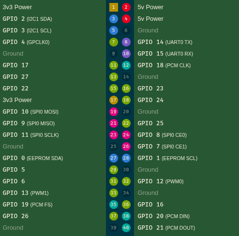

# Raspberry Pi

## 1. Configuração Inicial
Com base no passo a passo do [GitLab](https://gitlab.com/fse_fga/raspberry-pi/roteiro-de-configuracao-incial)

### 1.1 Baixar o Raspberry Pi Imager
Fazer o download a partir do [repositório da Raspberry Pi](https://github.com/raspberrypi/rpi-imager/releases/tag/v1.9.6)

### 1.1 Baixar o Sistema Rasoberry Pi OS
Fazer o download a partir do [site da Raspberry Pi](https://downloads.raspberrypi.com/raspios_armhf/images/raspios_armhf-2025-12-04/2025-12-04-raspios-trixie-armhf.img.xz)


### 1.2 Configuração da Imagem

1. Abrir o Raspberry Pi Imager

2. Tele Inicial:
- Dispositivo: Raspberry Pi 3.
- Sistema Operacional: clicar em `Use Custom` e escolher o baixado.
- Armazenamento: inserir o cartão de memória no computador e selecioná-lo em `Escolher Armazenamento`.
- Clicar no botão `Seguinte` e clicar em **Editar Definições`.

3. Aba Geral:

    3.1. Configurar usuário e senha como:
    - username: pi
    - password: raspberry

    3.2 Configurar as credenciais de 
    - SSID: FSE-WIFI
    - Senha:

    3.3 Definir o idioma e região
    - Fuso horário: America/São Paulo
    - Disposição de teclado: us

4. Aba Serviços: ativar SSH com autentificação por senha.

5. Gravação de imagem: confirmar as modificações e clicar no botão `Sim`

6. Iniciar e fazer acesso remoto à RaspBerry Pi

1. Insira o SDCard na Raspberry Pi.
2. Connecte o cabo de energia (Micro USB) para ligar a placa.
3. Realizar o acesso remoto via SSH

```bash
# Para realizar o acesso remoto via SSH
ssh pi@rasp<NUMERO_DA_PLACA>.local

# Para desligar a placa
sudo poweroff

```
## 2. Funcionamento do GPIO
A `GPIO` (General Purpose Input/Output) é formada pelos pinos que conectam o processador da Raspberry Pi com o mundo real.

- `Output:` O software envia um sinal elétrico para o pino. Isso serve para acender um LED, ligar um motor ou ativar um relé.
- `Input:` O software "lê" se há eletricidade chegando no pino. Isso serve para saber se alguém apertou um botão ou se um sensor de presença foi ativado.

A Raspberry Pi tem 40 pinos físicos, cuja numeração pode ser conferida no esquema abaixo:

<div style="text-align: center;">
  
  <p><em>Detalhamento <a href="https://pinout.xyz/">aqui</a></em></p>
</div>

## 3. Exercícios
Os exercícios foram retiradas [daqui](https://gitlab.com/fse_fga/raspberry-pi/exercicios/exercicio-gpio)

### 3.1 Ligar/Desligar LEDs

Neste exercício a porta GPIO deve ser ativada como saída digital. Para isso deve-se conectar os pinos:
- **GND (Terra):** Deve ir em qualquer pino da RPI marcado como Ground.
- **Pinos de LEDs:** Cada um dos outros fios vai em um pino GPIO.

#### `A) Acionar um dos 3 LEDs ligando e desligando.`
<details>
<summary> Código utilizado </summary>

```python
   import RPi.GPIO as GPIO

    GPIO.setmode(GPIO.BCM)
    pino_led = 13 
    GPIO.setup(pino_led, GPIO.OUT)

    try:
        print("Ligando o LED... (Pressione Ctrl+C para parar)")
        GPIO.output(pino_led, GPIO.HIGH) 
        while True:
            pass 
    except KeyboardInterrupt:
        GPIO.cleanup() 
```
</details>


#### `B) Acionar um dos LEDs em modo liga/desliga temporizado.`

<details>
<summary> Código utilizado </summary>

```python
    import RPi.GPIO as GPIO
from time import sleep

GPIO.setmode(GPIO.BCM)
pino_led = 13
GPIO.setup(pino_led, GPIO.OUT)

try:
  import RPi.GPIO as GPIO
    from time import sleep

    GPIO.setmode(GPIO.BCM)
    pino_led = 13
    GPIO.setup(pino_led, GPIO.OUT)

    try:
        print("LED Piscando...")
        while True:
            GPIO.output(pino_led, GPIO.HIGH) # Liga
            sleep(1)                         # Espera 1 segundo
            GPIO.output(pino_led, GPIO.LOW)  # Desliga
            sleep(1)                         # Espera 1 segundo
    except KeyboardInterrupt:
        GPIO.cleanup()
```
</details>

#### `C) Acionar os 3 LEDs em sequência.`

<details>
<summary> Código utilizado </summary>

```python
   import RPi.GPIO as GPIO
    from time import sleep

    GPIO.setmode(GPIO.BCM)
    # Lista de pinos baseada no seu código de aula
    leds = [13, 19, 26] 
    GPIO.setup(leds, GPIO.OUT)

    try:
        print("Iniciando sequência...")
        while True:
            for pino in leds:
                GPIO.output(pino, GPIO.HIGH) # Liga o LED atual
                print(f"LED no pino {pino} ACESO")
                sleep(0.5)                   # Tempo dele aceso
                GPIO.output(pino, GPIO.LOW)  # Desliga para ir para o próximo
    except KeyboardInterrupt:
        GPIO.cleanup()
```
</details>

### 3.2 Leitura do Encoder

O encoder tem um disco interno com fendas. Quando você gira, ele abre e fecha o contato elétrico em dois pinos CLK e DT.
- Sentido Horário: O pino CLK muda de estado antes do pino DT.
- Sentido Anti-horário: O pino DT muda de estado antes do pino CLK.
- O Botão (SW): O eixo do encoder também é um botão. Quando você aperta o "pauzinho" do encoder para baixo, ele fecha o contato do pino SW com o Ground.


##### `A) Realizar a montagem da protoboard com um encoder KY-040.`

O encoder tem 5 pinos, deve-se conectar da seguinte forma:

| Pino do Encoder | Função | Sugestão de Pino (BCM) | Pino Físico na Pi |
| :--- | :--- | :--- | :--- |
| **GND** | Terra | Ground | 6 |
| **+** | Alimentação | 3.3V | 1 |
| **SW** | Botão | GPIO 27 | 13 |
| **DT** | Direção | GPIO 18 | 12 |
| **CLK** | Pulso | GPIO 17 | 11 |

##### `B) Realizar a leitura do botão SW do encoder.`


<details>
<summary> Código utilizado </summary>

```python
   import RPi.GPIO as GPIO

    PINO_SW = 27
    GPIO.setmode(GPIO.BCM)
    # Usamos PUD_UP porque o encoder geralmente não tem resistor no SW
    GPIO.setup(PINO_SW, GPIO.IN, pull_up_down=GPIO.PUD_UP)

    def botao_pressionado(channel):
        print("Botão do Encoder pressionado!")

    # Detecta quando o pino vai para LOW (apertado)
    GPIO.add_event_detect(PINO_SW, GPIO.FALLING, callback=botao_pressionado, bouncetime=200)

    try:
        while True:
            pass
    except KeyboardInterrupt:
        GPIO.cleanup()
```

</details>


##### `C) Realizar a leitura dos valores do encoder e imprimir em tela (printf) a posição atual sem perda de passos.`


<details>
<summary> Código utilizado </summary>

```python
    import RPi.GPIO as GPIO

    # Definição dos pinos
    CLK = 17
    DT = 18

    GPIO.setmode(GPIO.BCM)
    GPIO.setup(CLK, GPIO.IN, pull_up_down=GPIO.PUD_UP)
    GPIO.setup(DT, GPIO.IN, pull_up_down=GPIO.PUD_UP)

    posicao = 0
    ultimo_estado_clk = GPIO.input(CLK)

    try:
        print(f"Posição Inicial: {posicao}")
        while True:
            estado_clk = GPIO.input(CLK)
            
            # Se o estado do CLK mudou, houve movimento
            if estado_clk != ultimo_estado_clk:
                # Se o estado do DT for diferente do CLK, girou horário
                if GPIO.input(DT) != estado_clk:
                    posicao += 1
                else:
                    posicao -= 1
                
                print(f"Posição atual: {posicao}")
                
            ultimo_estado_clk = estado_clk
    except KeyboardInterrupt:
        GPIO.cleanup()
```
</details>
