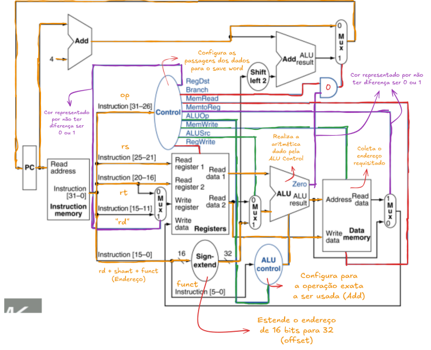
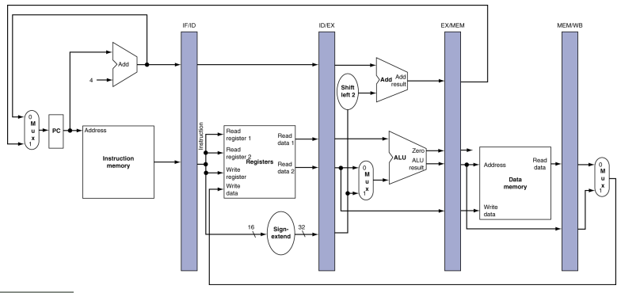
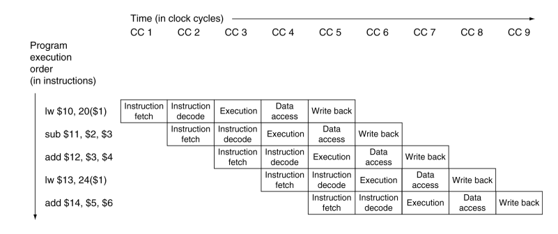

# Arquitetura de um processador MIPS

## 1. Funcionamento Geral

### Componentes

* **RAM**: contém blocos de instruções dos programas executados e seus endereços.
* **CPU**: lê e executa instruções sequencialmente.
* **PC (Program Counter)**: registrador que aponta para o endereço da próxima instrução. No MIPS, ele é sempre incrementado em 4 bytes, pois cada instrução ocupa 4 bytes.
* **Sistema Operacional (SO)**: gerencia múltiplos programas em execução realizando **troca de contexto**, salvando o estado de um programa e restaurando o de outro.

### Fluxo de execução

1. O código fonte é compilado e convertido em linguagem de máquina.
2. O SO carrega essas instruções na memória RAM.
3. O PC aponta para a primeira instrução.
4. A CPU busca a instrução da RAM e a coloca no **IR (Instruction Register)**.
5. A instrução é decodificada e executada.
6. O PC é atualizado até o fim do programa.

### Ciclo de Busca (Fetch)

1. O **PC** contém o endereço da próxima instrução.
2. Esse endereço é usado para buscar a instrução na **Memória de Instruções**.
3. O endereço é incrementado em 4 (instrução seguinte).
4. A instrução é carregada no **IR (Instruction Register)**.

---

## 2. Caminho de uma instrução Tipo-R

### Formato R-type

```
opcode | rs | rt | rd | shamt | funct
add $rd, $rs, $rt
```

* **Opcode (6 bits)**: identifica o tipo de operação (para R-type geralmente é 0).
* **rs (5 bits)**: registrador fonte 1.
* **rt (5 bits)**: registrador fonte 2.
* **rd (5 bits)**: registrador destino.
* **shamt (5 bits)**: valor de deslocamento (usado em shifts).
* **funct (6 bits)**: especifica a operação exata (ex: `add` = `100000`).

### Ciclo de Execução

<p align="center">
  
</p>

1. **Fetch**: PC busca a instrução.
2. **Decode**: separa opcode, registradores e funct. Registradores `rs` e `rt` são lidos, `rd` é reservado. Opcode e funct vão para a Unidade de Controle.
3. **Execute**: a ULA realiza a operação (ex: soma, subtração).
4. **Write Back**: resultado escrito em `rd`.


---

## 3. Caminho de uma instrução Load/Store

### Formato Tipo-I

```
opcode | rs | rt | offset
lw rt, offset(rs)
sw rt, offset(rs)
```

* **Opcode (6 bits)**: identifica operação (load/store).
* **rs (5 bits)**: registrador base (endereço de memória).
* **rt (5 bits)**: registrador destino (lw) ou origem (sw).
* **Offset (16 bits)**: deslocamento aplicado ao registrador base.

### Ciclo de Execução – `lw`

<p align="center">
  
</p>

1. **Fetch**: busca da instrução.
2. **Decode**: separa opcode, registradores e offset (sign-extended para 32 bits).
3. **Execute**: ULA soma `rs + offset` → endereço efetivo.
4. **Memory Access**: lê valor da memória.
5. **Write Back**: escreve no registrador `rt`.

### Ciclo de Execução – `sw`

<p align="center">
  
</p>


1. **Fetch**: busca da instrução.
2. **Decode**: separa opcode, registradores e offset.
3. **Execute**: ULA soma `rs + offset` → endereço efetivo.
4. **Memory Access**: escreve o valor de `rt` no endereço.
5. **Write**: nenhuma escrita em registradores ocorre.

---

## 4. Caminho de uma instrução de Desvio Condicional

### Formato Tipo-I

```
opcode | rs | rt | offset
beq rs, rt, offset
```

* **Opcode (6 bits)**: identifica o desvio.
* **rs, rt (5 bits)**: registradores comparados.
* **Offset (16 bits)**: deslocamento do endereço de destino.

### Ciclo de Execução

<p align="center">
  
</p>


1. **Fetch**: busca da instrução.
2. **Decode**: lê registradores `rs` e `rt`, offset é sign-extended e deslocado 2 bits à esquerda.
3. **Execute**: ULA compara `rs` e `rt`. Se iguais, ativa sinal de branch.
4. **Decision**: se branch é tomado, o PC recebe o endereço de destino (`PC + 4 + offset`). Se não, continua sequencialmente.

---

## 5. Sinais de Controle

| Sinal    | Tipo-R  | Lw  | Sw  | Beq |
| -------- | ------- | --- | --- | --- |
| RegDst   | 1       | 0   | X   | X   |
| Branch   | 0       | 0   | 0   | 1   |
| MemRead  | 0       | 1   | 0   | 0   |
| MemWrite | 0       | 0   | 1   | 0   |
| MemtoReg | 0       | 1   | X   | X   |
| ALUOp    | depende | dep | dep | dep |
| ALUSrc   | 0       | 1   | 1   | 0   |
| RegWrite | 1       | 1   | 0   | 0   |

---

## 6. Pipeline

Técnica que permite processar múltiplas instruções simultaneamente.

Divide a execução em **5 estágios principais**:

  1. **IF (Instruction Fetch)**: busca instrução.
  2. **ID (Instruction Decode)**: decodifica instrução e lê registradores.
  3. **EX (Execute)**: executa operação/endereçamento.
  4. **MEM (Memory Access)**: acessa memória de dados.
  5. **WB (Write Back)**: escreve resultado nos registradores.

<p align="center">
  
</p>


<p align="center">
  
</p>


---

## 7. Hazard

Problemas que ocorrem no pipeline:

* **Hazard Estrutural**: conflito de hardware (ex: memória única sendo usada por `lw` e `sw`).
* **Hazard de Dados**: instrução depende do resultado de outra ainda não concluída.

  * Exemplo: `add $s0, $t0, $t1` seguido de `sub $t2, $s0, $t3`.
* **Hazard de Controle**: ocorre em desvios (`beq`, `j`). O processador não sabe qual instrução buscar até que a comparação termine.

---

## 8. Hierarquia de Memória

### Níveis

* **Registradores**: mais rápidos, menor capacidade.
* **Cache**: próxima ao processador, reduz tempo de acesso.
* **Memória RAM**: volátil, armazena programas em execução.
* **Armazenamento Secundário**: discos/SSD, persistente e mais lento.
* **Memória Virtual (Swap)**: parte do disco usada como RAM estendida.

### Princípio da Localidade

* **Temporal**: se um dado foi acessado, provavelmente será usado novamente em breve.
* **Espacial**: se um dado foi acessado, endereços próximos também serão usados.

### Cache

* Dados organizados em blocos (linha x coluna).
* Fórmulas:

  * `i = (K/M) % n`
  * `j = K % M`
  * `K = M * i + j`
  * Onde:

    * `K`: endereço do bloco na memória principal.
    * `M`: tamanho do conjunto.
    * `n`: número total de linhas da cache.
