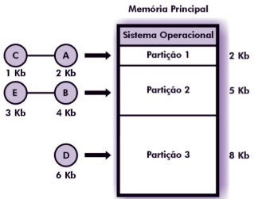

# Gerência de Memória

---

## 1. Hierarquia de Memória

* **Registradores:** manipulados diretamente pela CPU.
* **Cache:** controlada pelo hardware, armazena dados frequentemente acessados.
* **Memória Principal (RAM):** onde os programas são carregados e executados.
* **Memória Secundária (Disco):** armazenamento persistente, abundante e barato, mas com acesso muito mais lento.

**Observações:**

* O SO transfere programas da memória secundária para a memória principal para execução,com o objetivo de:
* Maximizar o número de processos residentes.
* Compartilhar recursos de forma eficiente.

---

## 2. Alocação Contígua Simples

- Utilizada em **sistemas monoprogramáveis**.

- Memória principal dividida em duas áreas:
    - Área do SO.
    - Área para programas do usuário.

- O programador precisava apenas garantir que não ultrapassaria o espaço disponível.

- **Proteção:** um registrador delimita a área do usuário, evitando acesso ao SO.

- **Desvantagens:**
    - Sempre haverá algum espaço de memória livre desperdiçado.
    - Apenas um usuário/programa pode usar os recursos por vez.

  

---

## 3. Técnica de Overlay

* Programa dividido em módulos.
* Um módulo **comum** permanece durante toda a execução.
* Outros módulos são carregados sob demanda em uma **área de overlay** (mesmo espaço de memória).

- **Vantagem:** Permite executar programas maiores do que a memória disponível.

- **Desvantagem:** Exige cuidados extras do programador e difícil manutenção.

  

---

## 4. Alocação Particionada

Permite que **diversos programas** residam na memória principal ao mesmo tempo.

### 4.1 Alocação Particionada Estática

* Memória dividida em **partições fixas**.
* Se fosse necessário mudar o tamanho, o sistema precisava ser reiniciado.

**1. Absoluta:**
Programas só podiam ser carregados em uma partição específica.

  

**2. Relocável:** 
código adaptado para ser carregado em qualquer partição.

  * Usa tabela com endereço inicial, tamanho e status (livre/ocupada).
  * Proteção com dois registradores (limite inferior e superior).

  

### 4.2 Alocação Particionada Dinâmica

* Partições criadas sob demanda, conforme o tamanho dos programas.
* **Problema:** fragmentação externa.

  * Espaços livres espalhados pela memória.
  * **Soluções:**

    1. Combinar espaços adjacentes quando liberados.
    2. Relocar programas, compactando a memória.

### 4.3 Estratégias de Alocação

**Best-fit:** 

- Escolhe a menor partição possível.
- Desvantagem: tende a gerar muitas áreas pequenas.

**Worst-fit:** 

- Escolhe a maior partição.
- Vantagem: mantém áreas livres maiores.

**First-fit:** 

- Escolhe a primeira partição suficiente.
- Mais rápida, mas pode deixar grandes fragmentos no fim da memória.

  

---

## 5. Swapping

* Técnica para contornar a **insuficiência de memória**.
* Antes: um processo permanecia na memória até terminar.
* Com swapping: um processo pode ser temporariamente movido para o disco (memória secundária) e substituído por outro.

### 5.1 Características

* Escolha de processos para swap prioriza aqueles **menos prováveis de serem escalonados**.
* Loader com **registrador de relocação** garante retomada correta.

### 5.2 Problemas

* Alto custo de operações de entrada/saída.
* **Thrashing:** ocorre quando o sistema passa mais tempo trocando processos entre RAM e disco do que executando instruções.

---

## 6. Considerações Finais

* A gerência de memória busca equilibrar **uso eficiente da RAM**, **velocidade de acesso** e **compartilhamento entre processos**.
* As técnicas evoluíram de modelos simples (monoprogramação) até sistemas mais complexos (multiprogramação com swapping e estratégias avançadas).
