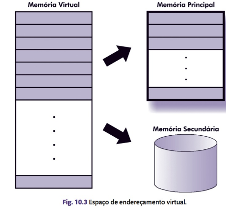
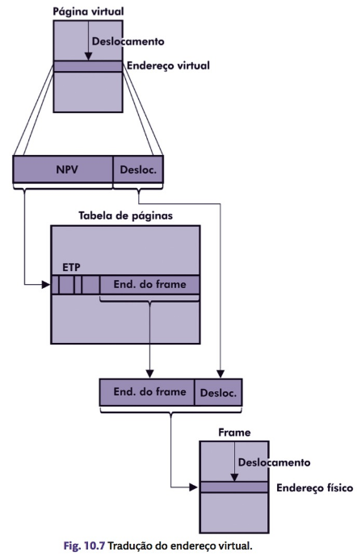
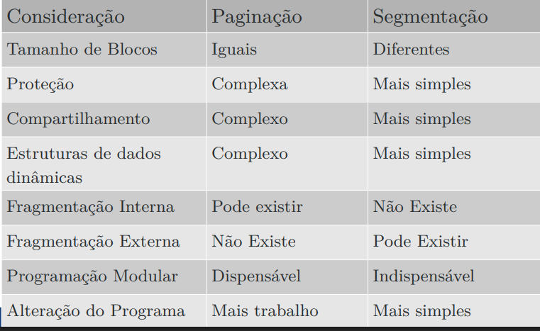

# Memória Virtual

---

## 1. Introdução

**Problema das partições variáveis:**

  * Fragmentação externa constante, necessitando de intervenção do SO.
* **Solução:** memória virtual.

**Características da Memória Virtual**

- Presente em sistemas operacionais modernos.
- Funciona como um **overlay**, mas implementado pelo SO (não pelo programador).
- Combina Memória Secundária (MS) e Memória Principal (MP):
    - A memória secundária é usada como extensão da memória principal.
    - Quando o programa é executado, apenas uma parte dele permanece na memória principal.
    -  Dá a ilusão de existir uma memória muito maior.
    - Os processos referenciam **endereços virtuais**, não físicos.

    - O programador não precisa se preocupar com os endereços físicos.
    - Responsáveis pelo mapeamento:

        - **Compilador:** cria instruções com endereços virtuais.
        - **SO:** traduz os endereços virtuais para endereços reais.

**Exemplo:**

Em máquinas de 32 bits, o processo pode referenciar 2^{32}-1 endereços virtuais, independentemente do tamanho da memória física.

**Vantagens:**

  * Maior número de processos residentes na memória principal.
  * Uso mais eficiente do processador.
  * Minimiza problemas de fragmentação da memória principal.

---

## 2. Implementação

* Implementada diretamente no hardware.
* Depende da arquitetura do processador.
* **Desvantagem:** requer mecanismos de tradução de endereços virtuais para físicos.

  

---

## 3. Mapeamento de Endereços

O processador só executa instruções em endereços reais.

**MMU (Memory Management Unit)**

  * Traduz endereços virtuais para físicos.
  * Atua sempre que um endereço virtual é referenciado.
  * Localizada no hardware.

**Tabela de mapeamento (uma por processo)**

  * Contém relação entre endereços virtuais e reais.
  * Alterada a cada troca de contexto.

**Registrador de base**

  * Aponta para a tabela do processo corrente.
* Tabela dividida em **blocos**:

  * Facilita o gerenciamento de processos com endereços virtuais grandes.
  * Quanto maior o bloco, menor o número de entradas na tabela.

**TLB (Translation Lookaside Buffer)**

  * Cache da MMU para endereços virtuais.
  * Se o endereço não estiver na TLB, acessa a memória.

---

## 4. Paginação

**Paginação:** divisão do espaço de endereçamento em blocos de tamanho fixo.

**Páginas virtuais:** na memória virtual.

**Frames (ou páginas reais):** na memória principal.

**Tabela de Páginas (ETP):**

  * Cada processo possui uma.
  * Cada página virtual tem uma entrada.
  * **NPV (Número da Página Virtual):** índice para localização.

**Execução de um programa:**

  * Páginas virtuais são transferidas da MS para MP quando necessário.
  * Endereço físico obtido a partir do frame e deslocamento na página.

  

---

### 4.1 Bit de Validade

* Indica se a página está na memória principal.
* Se não estiver, ocorre **page fault**:

  * O processo passa de execução para espera.
  * O SO transfere a página da MS para MP (**page in**).

### 4.2 Taxa de Paginação

* Número de page faults gerados por processo em um intervalo de tempo.

### 4.3 Políticas de Busca de Páginas

1. **Por demanda:** carrega a página apenas quando referenciada.
2. **Antecipada (pre-paging):** carrega páginas adjacentes que podem ser usadas.

### 4.4 Práticas de Alocação de Páginas

**Alocação fixa:** número fixo de frames por processo.

**Alocação variável:** número de frames pode mudar conforme a taxa de page faults.

### 4.5 Políticas de Substituição de Páginas

**Page out:**
 
  * Libera páginas quando atingido o limite de frames.
  * Verifica se a página foi modificada antes de salvar.

**Page file:** 

  * Arquivo onde páginas modificadas são armazenadas.

**Tipos:**

  * Local: apenas páginas do processo que gerou o page fault.
  * Global: qualquer página da memória principal.

**Working set:** 

  * Conjunto de páginas referenciadas recentemente pelo processo.

  * Leva em conta **localidade espacial** e **temporal**.

**Algoritmos de substituição:**

  * **Ótimo:**baseado em previsão futura (teórico).
  * **Aleatório:** escolhe qualquer página.
  * **FIFO:** remove a página mais antiga.
  * **LFU:** remove a menos referenciada.
  * **LRU:** remove a menos recentemente usada.
  * **NRU:**utiliza bit de referência.
  * **Clock:** variação do FIFO com bit de uso.

### 4.6 Tamanho de Páginas

**Páginas pequenas:** resultam em tabelas maiores, mais page faults, mas melhor uso da MP.

**Páginas grandes:** resulam em tabelas menores e maior fragmentação interna.

**Paginação em múltiplos níveis:** evita tabelas gigantes, organiza em camadas.

---

## 5. Proteção de Memória

Impede que programas alterem páginas não autorizadas e usa bits de permissão na tabela de páginas:

  * 00: sem acesso.
  * 10: leitura.
  * 11: leitura e gravação.

**Segmentação:** Divide memória em segmentos lógicos e facilita modularidade e organização.

**Segmentação com Paginação:** Grandes segmentos divididos em páginas para melhor gerenciamento.

  

