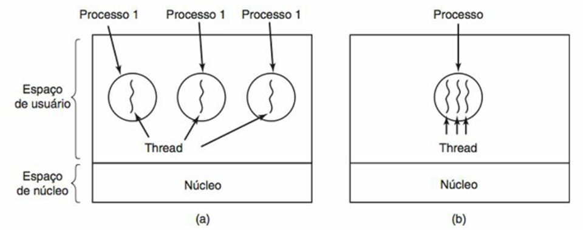

# Threads

---

## 1. Definições Gerais

### Processos

* Agrupam recursos relacionados.
* Cada processo possui seu **próprio espaço de endereçamento**, incluindo:

  * Código (texto)
  * Dados
  * Arquivos abertos
  * Variáveis globais
  * Processos filhos
  * Rotinas de tratamento
* Gerenciamento mais simples e isolado.

### Threads

* Fluxos de execução independentes dentro de um mesmo processo.
* Compartilham o espaço de endereçamento do processo.
* Cada thread possui:

  * Contador de programa
  * Registradores
  * Pilha
  * Estado
* **Contexto de hardware próprio**, mas compartilham o **contexto de software**.

{ align=center }

* **Imagem A:** três processos, cada um com seu próprio espaço de endereçamento e uma thread.
* **Imagem B:** um processo com três threads que compartilham o mesmo espaço de endereçamento.

### Vantagens das Threads

* Mais rápidas (compartilham memória, comunicação eficiente).
* Compartilham recursos como arquivos abertos, temporizadores, sinais.
* Melhor aproveitamento de periféricos (CPU, disco, rede).
* Usadas em:

  * Aplicações interativas (editores de texto, planilhas, processadores de imagens).
  * Cliente-servidor.
  * Núcleo do sistema operacional.
* Mais fáceis de criar e destruir que processos.

### Desvantagens das Threads

* Compartilham variáveis globais → risco de sobrescrita.
* Requerem **sincronização** para evitar inconsistências.

---

## 2. Multiprogramação e Threads

* Multiprogramação pode gerar problemas quando threads compartilham recursos.
* Exemplos de riscos:

  * Fechar arquivo ainda em uso por outra thread.
  * Depuração complexa.
  * Condições de corrida.

---

## 3. Implementação de Threads

### 3.1 Em Modo Usuário

* Threads gerenciadas pela aplicação, não pelo SO.
* Requer biblioteca de rotinas para:

  * Criação/eliminação de threads.
  * Comunicação entre threads.
  * Políticas de escalonamento.
* **Vantagens:**

  * Funciona mesmo em SO sem suporte nativo.
  * Mais rápidas.
* **Desvantagens:**

  * SO enxerga apenas um processo.
  * Se uma thread é bloqueada em chamada de sistema, todas ficam bloqueadas.
  * Tratamento de sinais é complexo.

### 3.2 Em Modo Kernel

* Threads implementadas diretamente pelo kernel.
* SO conhece e gerencia cada thread individualmente.
* Permite escalonamento separado para cada thread.

### 3.3 Modelo Híbrido

* Combina os dois modelos.
* Cada **Thread em Modo Kernel (TMK)** pode gerenciar várias **Threads em Modo Usuário (TMU)**.
* **Vantagens:** flexibilidade.
* **Desvantagens:** desempenho menor devido a mudanças frequentes de modo.

---

## 4. Modelo de Execução de Threads

* **Threads dinâmicas:** criadas sob demanda, uma para cada requisição.
* **Threads estáticas:** número fixo de threads definido previamente.

---

## 5. Padrões de Projeto com Threads

### 5.1 Dispatcher/Worker (Despachante/Trabalhador)

* Uma thread despachante recebe tarefas e as distribui para threads trabalhadoras.
* **Exemplo:** servidor web.
* **Vantagens:** balanceamento eficiente, consumo rápido de requisições.
* **Desvantagem:** risco de sobrecarga na thread despachante.

### 5.2 Thread Pool (Time de Threads)

* Conjunto fixo de threads que retiram tarefas de um repositório/pool.
* **Vantagens:**

  * Boa distribuição de carga.
  * Não há necessidade de criar/destruir threads constantemente.
  * Flexibilidade para ajustar o número de threads.
* **Desvantagem:** implementação cuidadosa necessária.

### 5.3 Pipeline

* Cada thread executa uma etapa de um processo sequencial.
* A saída de uma é a entrada da próxima.
* **Desvantagens:**

  * Gargalo se uma etapa for lenta.
  * Nem sempre é fácil dividir tarefas em pipeline.

---

## 6. Considerações Finais

* Threads permitem **concorrência dentro de processos**, otimizando recursos.
* Reduzem custo de criação/gerenciamento em comparação com processos.
* Demandam **sincronização robusta** para evitar erros como condições de corrida.
* Diferentes modelos de implementação (usuário, kernel, híbrido) trazem vantagens e limitações.
