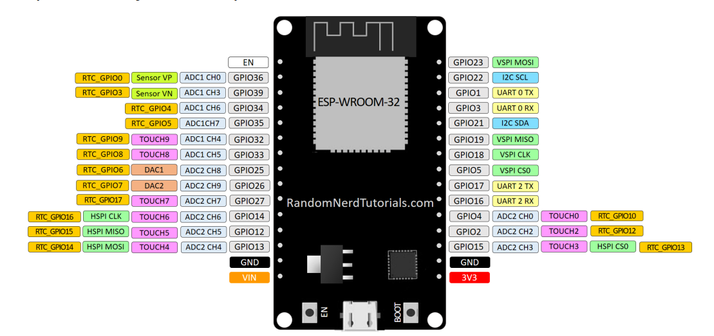

# ESP32

## 1. Introdução

A ESP32 é uma MCU (Microcontroller Unit) dual-core de alta performance fabricada pela Espressif Systems. Ela é classificada como um microcontrolador porque integra, em uma única pastilha de silício, o processador, a memória (RAM/Flash) e os periféricos de entrada e saída. 

Diferentemente de microcomputadores como a Raspberry Pi (que executam sistemas operacionais pesados como Linux), a ESP32 possui recursos mais limitados e foi projetada especificamente para aplicações embarcadas e IoT, operando em Bare-metal ou com um RTOS.

## 2. Arquitetura de Hardware

A ESP32 possui:

### 2.1 Processador Dual-Core:

Possui dois núcleos independentes, ambos de 32 bits, baseados na arquitetura Xtensa LX6 e que operam com frequências de até 240 MHz:

**1. Core 0:** Dedicado ao processamento de infraestrutura de rede, gerindo as stacks do Wi-Fi, Bluetooth e tarefas críticas de sistema de baixo nível.

**2. Core 1:** Livre para rodar a aplicação principal desenvolvida pelo usuário (leituras de sensores, algoritmos e lógica de negócio).

### 2.2 Barramentos AMBA:

Faz a comunicação direta entre a CPU, as memórias (RAM e Flash), os controladores de periféricos e o módulo DMA (Direct Memory Access), permitindo que periféricos troquem dados direto com a memória sem sobrecarregar a CPU.

### 2.3 Memória:

Organizada da seguinte forma:

**1. Memória RAM:**

É a memória volátil, apagada ao desligar a ESP. Dividida em:

- DRAM (Data RAM): Armazena variáveis globais, variáveis estáticas, Heap, e Stacks de cada Task.
- IRAM (Instruction RAM): Armazena instruções que devem ser executadas em velocidade máxima, como as Rotinas de Interrupção (ISR).

**2. Memória Flash:**

É a memória não volátil, se mantém ao desligar a ESP. Dividida em:

- NSV (Non-Volatile Storage): Banco Chave/Valor para credenciais de rede, endereços de servidores, estados de calibração de sensores e etc.
- SPIFFS (SPI Flash File System): 

## 3. Arquitetura de Software

**1. ESP-IDF (Espressif IoT Development Framework):**

A ESP-IDF é o framework de desenvolvimento oficial da fabricante. Ela atua como uma ponte intermediária entre o seu código e o hardware do chip. A ESP-IDF não é apenas uma biblioteca, mas sim um conjunto de ferramentas que engloba:

- Drivers Nativos: APIs escritas em C/C++ que abstraem os registradores do chip para controlar GPIO, ADC, DAC, I2C, etc.
- Pilhas de Rede (Stacks): Bibliotecas integradas para protocolos de conectividade, como a stack LwIP para Wi-Fi e a biblioteca esp-mqtt.
- FreeRTOS: Sistema Operacional embutido e configurado como o núcleo do framework.

**2. FreeRTOS:** 

Como dito, a ESP-IDF oferece um Sistema FreeRTOS que substitui o modelo clássico de loop infinito, como o do Arduino, por um ambiente Multi-tasking com:

- Tarefas (Tasks): O programa principal é fatiado em funções independentes chamadas Tasks, que são executadas de forma concorrente e assíncrona.
- Escalonador por Prioridade: O FreeRTOS gerencia os dois núcleos da ESP32, garantindo que as tarefas com maior prioridade configurada assumam o processamento imediatamente quando necessário, suspendendo as tarefas de menor prioridade.

**3. Menuconfig e Customização:** 

O framework utiliza uma ferramenta chamada Menuconfig (idf.py menuconfig) para configurar variáveis de ambiente e parâmetros de hardware graficamente antes da compilação.

- O resultado dessa configuração é salvo em um arquivo chamado sdkconfig na raiz do projeto.
- Durante a compilação, o sistema gera o arquivo sdkconfig.h, que é referenciado pelas bibliotecas para moldar o comportamento do firmware.
- É possível criar menus personalizados inserindo um arquivo chamado Kconfig.projbuild na pasta main.

## 3. GPIO

  

## 3. Subsistema de Memória 

### 3.1 Memória Volátil 
Dividida logicamente em barramentos de dados e instruções:

**1. DRAM (Data RAM):** Usada para alocação de dados, variáveis globais, heap e stack. Possui um limite de 160 KB para alocação estática no início da inicialização.

**2. IRAM (Instruction RAM):** Usada para armazenar código/instruções de execução rápida.

### 3.2 Memória Não-Volátil 

É dividida principalmente em:

**1. Factory (App):** Onde fica gravado o binário principal do código compilado.

**2. NVS (Non-Volatile Storage)**: Armazenamento em formato Chave/Valor organizada por Namespaces (limite de 15 caracteres para nomes e chaves). Ideal para guardar dados pequenos e configurações (ex: Chave "wifi" = Valor 1).

**3. SPIFFS (SPI Flash File System):** Sistema de arquivos real gravado na Flash. Suporta organização em pastas, arquivos de texto, páginas HTML ou logs complexos. Possui mecanismo de controle de desgaste (wear leveling) da memória Flash.