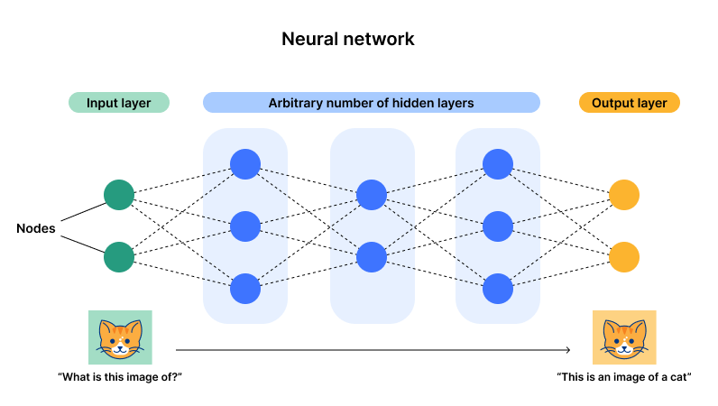
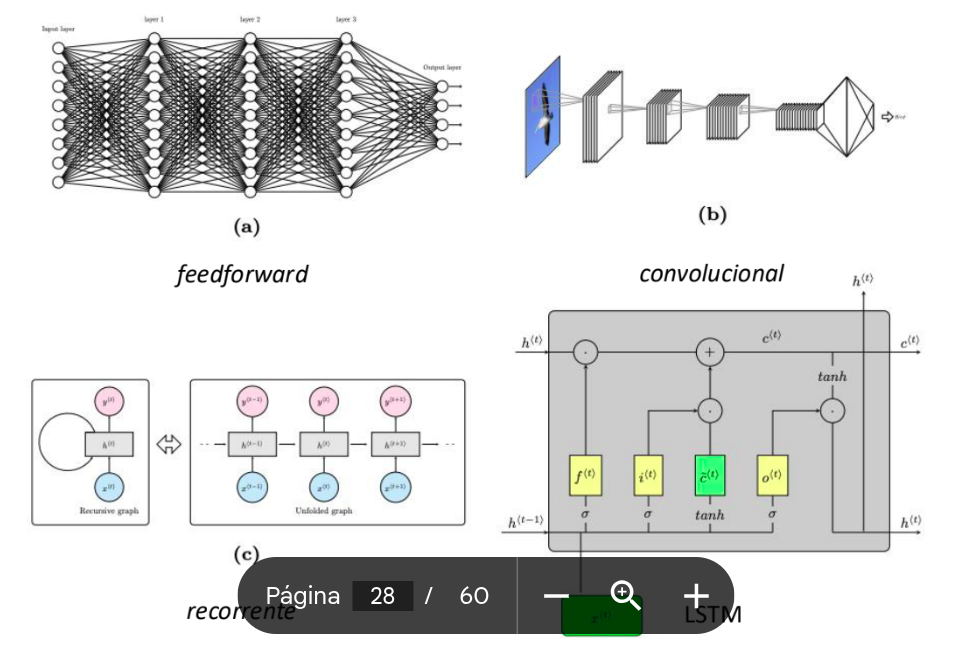
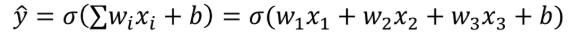
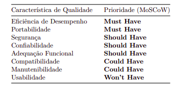

# Redes Neurais

---

## 1. Origem Biológica

- Inspiradas no cérebro humano, composto por 85 bilhões de neurônios;
- o neurônio artificial (perceptron) abstrai esse comportamento: recebe entrada, pondera, soma e aplica uma função de ativação/

---

## 2. Camadas de uma rede neural

São grupos de neuronios que atuam em paralelo, elas são: 

- Entrada (input layer): recebe os dados;
- Escondidas (hidden layers): fazem transformações intermediárias;
- Saída (output layers): gera a previsão final;

  

---

## 3. Arquitetura comuns

- **Feedforward (DNN):** reconhecimento de padrões, compressão de dados;
- **Convolucional (CNN):** análise de imagens e visão computacional;
- **Recorrente (RNN):** modelagem de linguagem e reconhecimento de fala;
- **LSTM:** modelagem de linguagem e reconhecimento de fala;

  

---

## 4. Estrutura de um neurônio

Os neurônios recebem uma linha de base de dados ou a sáida dos neurónios anteriores (x1, x2 ,x3, xi) e realizam duas etapas:

**Combinação linear das entradas:** através da fómula a seguir que considera:
    - Pesos (w): ajustam a importância de cada entrada;
    - Viés (b): deslocada a função de ativação;

  

**Aplicação da função de ativação:** introduzem não-linearidade na rede ao resultado da camada anterior. O resultado é enviado aos neurónios da próxima camada;

  

---

## 5. Funções de ativação

| Função        | Fórmula                 | Intervalo | Característica                                                |
| ------------- | ----------------------- | --------- | ------------------------------------------------------------- |
| **Sigmóide**  | 1 / (1 + e⁻ᶻ)           | (0,1)     | Saturação em extremos; usada em saídas binárias               |
| **Tanh**      | (eᶻ - e⁻ᶻ) / (eᶻ + e⁻ᶻ) | (-1,1)    | Zero-centrada                                                 |
| **ReLU**      | max(0, z)               | [0,∞)     | Simples e eficiente                                           |
| **LeakyReLU** | max(αz, z)              | —         | Evita “neurônios mortos”                                      |
| **Softmax**   | eᶻᵢ / Σeᶻⱼ              | (0,1)     | Converte saídas em probabilidades (classificação multiclasse) |

---

## 6. Funções de perda

Cada neurônio faz a sua combinação linear das entradas e depois aplica a sua função de ativação. Na ultima camada o mesmo processo acontece e é aplicada a função de ativação da camada de saída, dando origem a saída prevista da rede.

Em seguida, a função de perda compara essa saída prevista com o valor real esperado, que vem do conjunto de dados de treinamento. A partir dessa comparação, calcula-se o erro da rede, que será usado no processo de aprendizado para ajustar os pesos e melhorar as próximas previsões. As duas principais funções de perda são:

**Função Erro Quadrático Médio (MSE):**
$$
J(\theta) = \frac{1}{2}(g(x) - f_{\theta}(x))^2
$$

- Usado em problemas de regressão ;
- Vantagem: derivável e fácil de tratar;
- Desvantagem: muito sensível aos outliers;

**Função Entropia Cruzada (Cross-Entropy)**
$$
K(\theta) = -\sum_i p_i \ln(q_i)
$$

- Usado em problemas de classificação;
- Calcula a probabilidade do objeto ter rotulação desejada. 

---

  
## 7. Convergência e treinamento

**Método do Gradiente (Gradient Descent):**

- Busca o mínimo da função de perda ajustando os parâmetros

**Backpropagation**

- Algoritmo que calcula o gradiente de forma eficiente;
- Usa a regra da cadeia para propagar o erro da saída até as camadas anteriores;
- Atualiza pesos e vieses com base nesses gradientes.

**Teorema da Aproximação Universal (1989)**

- Diz que qualquer função contínua pode ser aproximada por uma rede neural com uma camada escondida (com neurônios suficientes);
- Isso explica o poder expressivo das redes neurais.

**Kolmogorov-Arnold Networks (KAN)**

- Havia alguns problemas das redes neurais: necessidade de muitos dados, custo alto de treinamento, pouca interŕetabildiade, muitos parâmetros;
- Surgiu essa abordagem recente: tenta reduzir a complexidade das DNN;
- Baseada no teorema de representação de Kolmogorov-Arnold, que diz que qualquer função multivariada pode ser escrita como soma de funções univariadas.
- Vantagens:
  - Reduz a maldição da dimensionalidade.
  - Funções de ativação treináveis (B-splines) → mais interpretáveis.
  - Pode alcançar maior precisão em alguns casos.