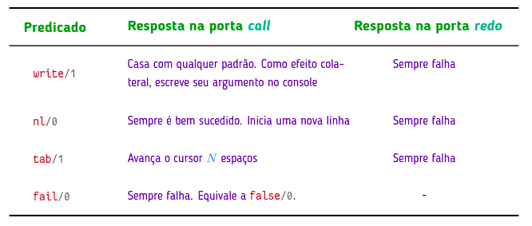

# Prolog

## 1. Instalação

### 1.1 Download
<pre>
# Adiciona o repositório oficial
sudo add-apt-repository ppa:swi-prolog/stable

# Atualiza a lista de pacotes
sudo apt update

# Instala o SWI-Prolog
sudo apt install swi-prolog
</pre>

### 1.2 Editar Arquivo

**Exemplo 1:**
```bash 
    # Cria um arquivo vazio chamado con.pl
    touch con.pl

    # Editar Arquivo
    gedit con.pl &

    #Exemplo

    % Tabela verdade do AND (and/2)
    and(true, true).

    # Dar control + s 
```
 
### 1.3 Rodar o Prolog
```prolog 
    # Abrir o prolog
    swipl -s con.pl

    # Testar 
    ?- and(true, true).
    ?- true

    ?- and(true, false).
    ?- false

    # Sair
    ?- halt.
```

### 1.4 Consultar e Reconsultar.

Para consultar ou reconsultar um arquivo podemos usar:

```prolog 
    // carrega um arquivo
    ?- consult('con.pl').

    //recarregar o arquivo caso você tenha feito alterações
    ?- reconsult('con.pl').
```


## 2. Cláusulas

uma cláusula é a menor unidade de um programa. Ela é uma instrução que termina obrigatoriamente com um ponto finas, podendo ser um **fato** ou uma **regra**.

Exemplo

```prolog
   % Fato
   cidade('Brasília', df).

   % Regra
   unb(X) :- fcte(X) ; darcy(X).

   % Esse exemplo abaixo possui 6 cláusulas e 3 predicados
    pai(adao, cain).
    pai(adao, abel).

    homem(adao).
    homem(cain).
    homem(abel).

    filho(X, Y) :- pai(Y, X).
```

### 2.1 Sintaxe

- Todo fato deve terminar com um ponto.
- Deve se declarar somente os fatos verdadeiros, todo o resto é considerado falso.
- Predicados devem começar com letra minúscula.
- Átomos devem começar com letra minúsculas. No caso de estarem delimitadas por áspas simples podem ter maiúsculas e espaços.
- Variáveis devem iniciar ou letra maiúscula ou underline.

### 2.2 Preposições de Controle

Separam os argumentos

| Símbolo | Nome Técnico | Aridade | Descrição | Exemplo Prático |
| :---: | :--- | :---: | :--- | :--- |
| `,` | Conjunção | `/2` | Operador **E**. O Prolog só avança se o termo da esquerda **e** o da direita tiverem sucesso. | `?- cidade(X, mt), capital(X).` |
| `;` | Disjunção | `/2` | Operador **OU**. Tenta o sucesso no primeiro termo; se falhar, faz o **Backtracking** para o segundo. | `?- fcte(ana) ; darcy(ana).` |
| `\+` | Negação por Falha | `/1` | Operador **NÃO**. Tem sucesso apenas se o Prolog **não conseguir provar** o que está dentro. | `?- \+ capital('Gama').` |
| `true` | Sucesso | `/0` | Predicado que **sempre tem sucesso**. Útil para "forçar" uma regra a ser verdadeira. | `?- fcte(ana), true.` |
| `fail` | Falha | `/0` | Predicado que **sempre falha**. Força o Prolog a interromper o caminho atual ou buscar alternativas. | `?- cidade(X, df), fail.` |


### 2.3 Fatos
Um fato é a implementação prática de uma preposição lógica afirmativa em prolog. 

Ele é formado por um **predicado** e **argumentos/termos**. O formato pred/N indica a quantidade de termos que o fato possui. Exemplo:

```prolog
    pred(arg1, arg2, ... argN). pred/N

    and(true, true). and/2
    or(true, false)  or/2
    or(false, true)  or/2
```

#### 2.3.1 Preposições Compostas:
Uma preposição composta é a união de duas preposições simples através de conectivos lógicos. Em prolog, temos duas opções para representar uma preposição composta:

**Primeira:** Criar fatos no banco de dados e passar um fato como argumento de outro fato. Exemplo: preposição (F ∨ V ) ∧ V

```prolog
    % Banco de Dados
    and(true, true).
    or(true, false).
    or(false, true).  


    % Terminal
    ?- and(or(true, false), true).
```

**Segunda:** Não utilizar banco de dados e usar predicados de controle como operadores.

```prolog
    % Terminal
    ?- (false ; true), true.
    true.
```

### 2.4 Termos
São os argumentos de um fato, podem ser:

**Átomos:** Nomes de propósito geral. 

**Números:** Inteiros ou flutuantes (termos primitivos).

**Variáveis:** Substituem argumentos no objetivo.


### 2.5 Regras

Regra é um tipo de cláusula que representam uma consulta armazenada. Sua sintaxe se da por:

- **Head:** é um predicado
- **Pescoço:** neck-symbol (:-), lido como "se".
- **Body:** composto por uma consulta.


**Exemplo 1:**
```prolog 
    cidade('Brasília', df).
    cidade('Gama', df).
    cidade('Cuiabá', mt).
    cidade('Barra dos Bugres', mt).
    cidade('Tangará da Serra', mt).
    cidade('Belo Horizonte', mg).
    cidade('Governador Valadares', mg).
    capital('Brasília').
    capital('Cuiabá').
    capital('Belo Horizonte').
    regiao(centro_oeste, df).
    regiao(centro_oeste, mt).
    regiao(sudeste, mg).

    capitais(X, Y) :- regiao(Y, Z), cidade(X, Z), capital(X).

    % Consultas possiveis
    ?- capitais(X, centro_oeste).
    X = 'Brasília' ;
    X = 'Cuiabá' ;
```

**Exemplo 2:**
```prolog 
    % Banco de Dados
    fcte(ana).
    fcte(paulo).
    fcte(pedro).

    darcy(joao).
    darcy(carlos).

    iesb(carla).
    iesb(mateus).

    unb(X) :- fcte(X) ; darcy(X).

    % Consultas no terminal
    ?- unb(carla).
    false.

    ?- unb(ana).
    true .

    ?- unb(joao).
    true.
```


## 3. Consultas

Uma vez que a base de dados do interpretador foi alimentado com fatos, podemos através do console realizar consultas(queries) sobre os fatos.

**Unificação**: Processo onde ocorre um casamento de **padrões** (objetivos/goals) na base de dados. Se algum fato atingir o objetivo o interpretador responde com **true**, caso contrário com **false**.

> ### 3.1 Consultas simples

Nele a unificação percore o banco de dados e é bem sucedida se o obejtivo e a base de dados:
- Possuirem mesmo predicado.
- Possuirem mesma aridade.
- Possuirem mesmos argumentos.

**Exemplo 1:**
```prolog
    % Banco de Dados
    f(1, 2).
    f(1, 3).
    f(2, 3).
    
    g(1).
    g(2).

    % Consultas no terminal
    ?- f(1, 2).
    true.
    
    ?- f(2, 1).
    false.
    
    ?- f(1).
    false.
    
    ?- g(1, 2).
    false
```

**Exemplo 2:**
```prolog
    % Banco de Dados
    fcte(ana).
    fcte(paulo).
    fcte(pedro).
    darcy(joao).
    darcy(carlos).

    % Consultas no terminal
    ?- fcte(ana).
    true.

    ?- fcte(joao).
    false.

    ?- darcy(joao).
    true.
```

### 3.2 Consultas com Variáveis

É utilizado uma variável no lugar de um argumento no objetivo. Nele a unificação percorre o banco de dados e busca a claúsula que bate positivamente com qualquer termo que:
- Possua mesmo predicado.
- Possua mesma aridade.
- Possua mesmos argumentos.

Quando você digita fcte(X)., você está dizendo: "Prolog, existe alguém que satisfaça fcte? Quem?" Se sim, irá retornar os valores batidos, podendo navegar utlizando ponto-e-vírgula. Caso contrário, retornará ERROR.

Quando você digita fcte(_)., você está dizendo: "Prolog, existe qualquer fato no banco de dados que corresponda a fcte?" Após isso, irá retornar true, caso existir, ou false, caso não existir.

**Exemplo 1:**
```prolog 
    % Banco de Dados
    fcte(ana).
    fcte(paulo).
    fcte(pedro).
    :- dynamic fgv/1.
    fgv(pedro).
    
    % Consultas no terminal
    ?- fcte(X).
    X = ana ; X = paulo ; X = pedro.

    ?- fcte(_).
    true .

    ?- retract(fgv(pedro)).
    true.
    
    ?- fgv(_).
    false.
```

**Exemplo 2:**
```prolog 
    % Banco de Dados
    algoritmo(grafos, kruskall).
    algoritmo(grafos, bellman-ford).
    algoritmo(strings, kmp).
    algoritmo(strings, z-function).
    algoritmo(strings, lcs).
    algoritmo(gulosos, kruskall).


    % Consultas no terminal

    ?- algoritmo(strings, X).
    X = kmp ; X = z-function ; X = lcs.

    ?- algoritmo(Area, kruskall).
    Area = grafos ; Area = gulosos.

    ?- algoritmo(X,Y).
    X = grafos,  Y = kruskall ;
    X = grafos,  Y = bellman-ford ;
    X = strings, Y = kmp ;
    X = strings, Y = z-function ;
    X = strings, Y = lcs ;
    X = gulosos, Y = kruskall.

    ?- algoritmo(X,_).
    X = grafos ;  X = grafos ;
    X = strings ; X = strings ;  X = strings ;
    X = gulosos.

    ?- algoritmo(_,_).
    true .
```

### 3.3 Consultas Compostas

Nele a unificação também percore o banco de dados e também é bem sucedida se o obejtivo e a base de dados casarem, porém possui mais de uma claúsula e deve obedecer o predicado de controle fornecido.

**Exemplo:**
```prolog 
    cidade('Brasília', df).
    cidade('Gama', df).
    cidade('Cuiabá', mt).
    cidade('Barra dos Bugres', mt).
    cidade('Tangará da Serra', mt).
    cidade('Belo Horizonte', mg).
    cidade('Governador Valadares', mg).
    cidade('Santo Ângelo', rs).
    capital('Brasília').
    capital('Cuiabá').
    capital('Belo Horizonte').
    regiao(centro_oeste, df).
    regiao(centro_oeste, mt).
    regiao(sudeste, mg).

    % Exemplos de consultas:
    ?- cidade(X, mt), capital(X).
    X = 'Cuiabá' ;

    ?- cidade(X, _), capital(X).
    X = 'Brasília' ; X = 'Cuiabá' ; X = 'Belo Horizonte' ;

    ?- cidade(X, Y), regiao(centro_oeste, Y), capital(X).
    X = 'Brasília', Y = df ;
    X = 'Cuiabá',   Y = mt ;
```


## 4. Manipulação da base de dados

**Fatos dinâmicos** são fatos que podem ser adicionados ou removidos através do terminal. Para isso devem ser marcados como **dynamic**. Assim, a manipulação de dados se da por meio dos comandos:

- **asserta(pre(X)):** adiciona uma cláusula X como primeira cláusula para seu predicado.
- **assertz(pre(X)):** igual a anterior, mas adiciona como última cláusula do predicado.
- **retract(pre(X)):** remove a cláusula X da base de dados.

**Exemplo:**

```prolog
    % Banco de Dados
    :- dynamic produto/1.
    produto(arroz).
    produto(feijao).

    % Consultas no terminal
    ?- assertz(produto(macarrao)).
    true.

    ?- produto(X).
    X = arroz ; X = feijao ; X = macarrao.

    ?- retract(produto(macarrao)).
    true.

    ?- produto(X).
    X = arroz ; X = feijao.

    ?- asserta(produto(macarrao)).
    true.

    ?- produto(X).
    X = macarrao ; X = arroz ; X = feijao.

```


## 5. Mecanismos

### 5.1 Unificação
Processo responsável pelas consultas onde ocorre um casamento de padrões **(objetivos/goals)** na base de dados. Se algum fato atingir o objetivo o interpretador responde com **true**, caso contrário com **false**. Para unificação ser bem sucedida, as três condições seguintes devem ser satisfeitas:

- O predicado presente no objetivo e na base de dados é o mesmo.
- Ambos tem mesma aridade.
- Todos os argumentos são os mesmos.


generalização recursão rastreamento

### 5.2 Generalizações

São utilizadas para definir geenralizações universais. Na lógica formal dizemos  $\forall x, P(x)$ para significar "Para todo $x$, a propriedade $P$ é verdadeira". Já em prolog usamos uma variável livre.

```prolog

    % Banco de Dados
    is_term(x).

    % Consultas no terminal
    ?- is_term(1). 
    true.
    ?- is_term(abc). 
    true.
    ?- is_term(A). 
    true.
    ?- is_term(A, B).
    Error
```
### 5.3 Backtracking (Box Model)
É a estratégia de busca em profundidade que o Prolog usa para navegar entre as cláusulas definidas no banco de dados. Se um caminho falha, ou se você pede outra solução com ponto-e-vírgula, o Prolog volta para a marcação do último ponto de escolha, desfaz as unificações e tenta próxima cláusula disponível.

**Portas:** um objetivo tem quatro portas que representam o fluxo de controle de sua avaliação.

- **Call:** Onde a avaliação começa.
- **Exit:** Se alguma cláusula unifica com o objetivo a avaliação termina, atando as avariáveis com os devidos elementos dos conjunto universais.
- **Fail:** Caso contraário, a avaliação falha.
- **Redo:** Se for bem sucedida e seguida de um ';', a avaliação é retomada (redo) a aprtir do ponto que parou, após desatar as variáveis.

No caso de consultas compostas ele encerra com sucesso apenas se sai pela porta exit do último predicado da consulta (mais à direita).

{ align=center }


### 5.3.1 Modo Trace
Trace é o modo de debug/rastreamento do Prolog. Invez de nos mesmos colocar breakpoints (como em python), no Prolog ele próprio faz isso, porém com uma visualização baseado no Box Model. Para utilizar esse modo é necessário utilizar o comando **trace.** no terminal.

Exemplo:
```prolog
    % Banco de Dados
    algoritmo(grafos, kruskall).
    algoritmo(grafos, bellman_ford). 
    algoritmo(strings, kmp).
    algoritmo(strings, z_function).
    algoritmo(strings, lcs).
    algoritmo(gulosos, kruskall).

    listar_todos :-
        algoritmo(Area, Nome),
        format('Area: ~w | Algoritmo: ~w~n', [Area, Nome]),
        fail.
    listar_todos.

    % Terminal
    ?- trace.
    [trace] 86 ?- algoritmo(X, kruskall).
        Call: (12) algoritmo(_2166, kruskall) ? creep
        Exit: (12) algoritmo(grafos, kruskall) ? creep
    X = grafos x

```


 
## 6. Predicados extra-lógicos



**Exemplo:**

```prolog

    % Banco de Dados
    fcte(ana).
    fcte(beto).
    fcte(carlos).
    darcy(diana).
    darcy(esther).
    ifb(fernando).
    unb(X):- (fcte(X) ; darcy(X)).
    unb_report :- 
        write('Estudantes da UnB: '), nl, 
        unb(X), 
        tab(2), write(X), nl,	
        write('proximo '), nl, 
        fail.
    unb_report. 
    
    
    % Consultas no terminal
    82 ?- unb_report.
    Estudantes da UnB: 
    ana
    proximo 
    beto
    proximo 
    carlos
    proximo 
    diana
    proximo 
    esther
    proximo 
    true.

```


## 7. Condicionais

Os condicionais em Prolog são habilitados através do predicado meta_predicate, onde N indica o número de parâmetros da função. Após ele é necessário declarar a função que irá ter a sintaxe **(If -> Then)**. ou **(If -> Then ;  Else)**. 

```prolog
    % Banco de Dados 
    soma(A, B, R) :- R is A + B.
    sub(A, B, R)  :- R is A - B.
    mult(A, B, R) :- R is A * B.

    :- meta_predicate executar(3).

    executar(Op, N1, N2, N) :-
        ( call(Op, N1, N2, N) -> 
        
            write('certo') 
        ;   
            write('erro')
        ).

    % Terminal
    ?- executar(mult, 2, 4, 8).
    certo

    ?- executar(sub, 10, 5, 100).
    erro
    
```

