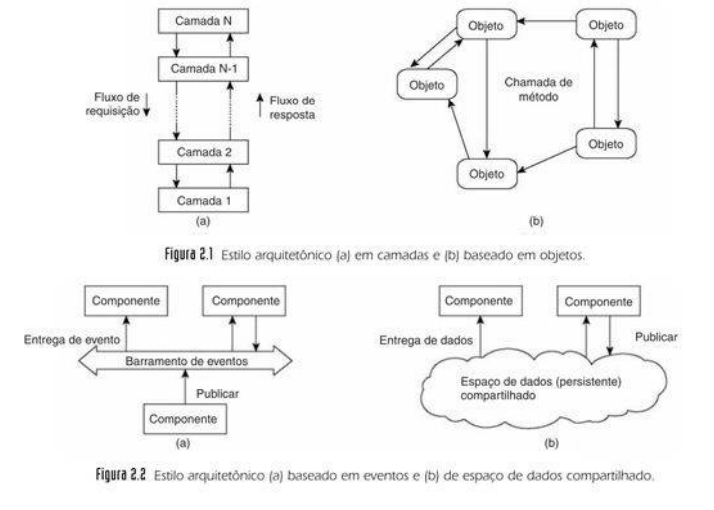

# Tipos e Arquiteturas

---

## 1. Introdução

Tanembaum faz a distinção clara entre dois conceitos sobre a organização do software com a organização da rede.

**Estilos Arquitetônicos:** Refere-se à organização lógica do software. É o "desenho" de como os componentes interagem entre si, independentemente de onde eles serão instalados. O foco aqui são os Componentes (unidades de software) e os Conectores (mecanismos de comunicação).

**Arquiteturas de Sistemas:** Refere-se à organização física. É a maneira como colocamos os componentes de software em máquinas reais e como essas máquinas se relacionam. É aqui que decidimos se o sistema será centralizado ou se todos os nós terão o mesmo peso.

---

## 2. Estilos Arquitetônicos

Os sistemas distribuídos muitas vezes são complexas peças de software cujos componentes estão, por definição, espalhados por várias máquinas. Logo, o **estilo arquitetônico** dos componentes de software conectam é de extrema importância em sistemas distribuídos. 

> **Componente de Software:** É uma unidade de software modular com interfaces requeridas e fornecidas bem definidas e que pode falhar e é substituível dentro de seu ambiente.

> **Estilo Arquitetônico:** É o modo como os componentes são organizados e conectados uns aos outros e como os dados são trocados entre eles.

> **Conector:** Um mecanismo que serve de mediator da comunicação da cooperação entre componentes. Ex: conexão de rede, passagem de mensagens.

Os principais estilos de arquitetura são:

1. Arquitetura em Camadas.

2. Arquitetura Baseada em Serviços
- 2.1 Arquitetura Baseada em Objetos.
- 2.2 Arquitetura Baseada em Microsserviços.
- 2.3 Arquitetura Baseada em Recursos.

3. Arquitetura Baseadas Publicar-Subscrever
- 3.1 Baseada em Eventos
- 3.2 Espaço de Dados Compartilhados

{ align=center }

### 2.1 Arquitetura em Camada

Nela os componentes são organizados em camadas onde cada camada estabelece uma interface e provê um serviço. Por padrão, as camadas superiores (clientes) fazem requisições e chamam as inferiores, que por sua vez respondem para cima. Porém, dependendo da necessidade do sistema, esse fluxo pode ser invertido.

#### 2.2.1 Arquitetura Cliente-Servidor

É a implementação mais simples do estilo em camadas. Ela se baseia em Servidor e Cliente.

##### 2.2.1.1 Papéis e Comportamentos

**Servidor (Processo Ativo):** Ele é como um "garçom" que nunca vai embora. Ele roda continuamente (como um daemon no Linux) esperando alguém pedir algo. Pode ser um servidor web, um banco de dados ou um servidor de arquivos.

**Cliente (Processo Ativo):** É quem toma a iniciativa. Ele envia uma requisição e fica parado esperando a resposta.

Um processo não está preso a um único rótulo. Quase sempre ocorre um troca-troca de papéis.

**Exemplo:** Quando você acessa um site, o Servidor Web da empresa é o "Servidor" para você. Mas, se esse servidor precisar descobrir o IP de um banco de dados, ele envia um pedido para um servidor DNS. Nesse momento, o Servidor Web virou um Cliente.

##### 2.2.1.2 Divisão Lógica X Divisão Física

**Divisão Lógica:** Divisão por o que o sistema faz.

- Nível de Interface: O que o usuário vê. 
- Nível de Processamento: Onde está a inteligencia e as regras de negócio.
- Nível de Dados: Onde as informações são guardadas permanentemente.

**Divisão Física:** É a divisão de em quais máquinas cada uma das camadas lógicas vai morar. É aqui onde entra os clientes magros e os clientes gordos.

##### 2.2.1.3 Espectro de Clientes

**Clientes Magros:** Nela a máquina do usuário é preguiçosa, só cuida interface e todo o processamento e dados ficam no servidor.

- Exemplo: O seu Navegador Web (Chrome/Firefox). Ele não sabe calcular o seu saldo bancário; ele apenas desenha na tela o que o servidor do banco mandou.

- Vantagem: Muito fácil de gerenciar. Se você atualizar o código no servidor, todos os usuários recebem a atualização na hora.

**Clientes Gordos:** A máquina do usuário faz o trabalho pesado. Ele cuida da interface e de boa parte do Processamento.

- Exemplo: Um jogo instalado no PC ou um software pesado de ERP. O processamento gráfico e as regras acontecem no seu computador, e ele só fala com o servidor para buscar ou salvar dados.

- Desvantagem: É um pesadelo de gestão. Se você tiver 1.000 clientes, terá que garantir que os 1.000 instalaram a versão correta, têm o hardware compatível e estão protegidos contra vírus que podem afetar o processamento local.

**Tendência Atual:** Existe um abandono dos Fat Clients. Hoje, quase tudo está migrando para o modelo Thin Client (SaaS/Web) porque é muito mais barato, seguro e confiável manter tudo centralizado no servidor do que espalhado nas máquinas dos usuários.

##### 2.2.2 Arquitetura de Múltiplas Camadas

A arquitetura Multi-Tier surge como a solução para o esgotamento do modelo cliente-servidor tradicional (2-Tier). Quando a demanda cresce, um servidor único que tenta fazer tudo acaba "brigando" por recursos: a lógica de negócio consome a CPU, enquanto as consultas ao banco de dados saturam o Disco (I/O).

**Modelo 3-Camadas (3-Tier)**

Nesta evolução, a divisão física é levada ao limite das responsabilidades, separando o sistema em três máquinas (ou grupos de máquinas) independentes:

- **Nível de Interface de Aplicação:** Responsável
pela interação direta, como janelas gráficas ou
terminais de texto ou lidando com uma aplicação
externa.

- **Nível de Dados:** Gerencia as informações persistentes, geralmente em um banco de dados ou sistema de arquivos.

- **Nível de Processamento:** Camada posicionada entre as outras duas, reside a lógica da aplicação. 

**Exemplo:** Sistema de busca na Web.

- **Nível de Interface:** A página onde o usuário digita a pesquisa ou um website encontrado.
- **Nível de Dados**: O banco de dados que contém todas as páginas.
- **Nível de Processamento:** Lógica de negócio e gerador de consultas, como por exemplo a transformação das palavras da busca do usuário em consultar formais ao BD.

### 2.3 Arquiteturas Baseadas em Serviços

Inicialmente as arquiteturas eram muito acopladas e existia uma forte dependência/acoplamento entre os componentes, Assim, para reduzir essa dependência os sistemas se organizaram genericamente em entidades independentes e reutilizáveis, que encapsulam um determinado serviço, que pode ser um objeto, recurso ou microsserviço. 

A adaptação web da arquitetura baseada em serviço se chama Representational State Transfer (REST). Quando uma aplicação segue os padrões REST, ela é chamada de RESTful

#### 2.3.1 Arquitetura Baseada em Objetos

Cada objeto, que correspondem a um componente, encapsula seus dados e as operações são feitas vias métodos. O que torna essa arquitetura distribuída é que, para um cliente, parece que ele está chamando uma função local, porém na verdade ele está invocando um função de um objeto que pode estar fisicamente em outra máquina, através das Chamadas de Procedimento Remoto (RPC). Para usar esse objeto, há dois mecanismos envolvidos:

**1. Vinculação**
Para utilizar do objeto, é necessário primeiro encontrá-lo.

- **Bind (Vinculação):** É o processo de localizar o objeto remoto na rede e conectar-se a ele. É como procurar um contato na agenda e clicar em ligar.

- **Proxy:** No lado do cliente, surge um representante. Quando você chama um método no objeto você não está falando com o objeto real, mas com esse Proxy, que tem a mesma interface do original.

imagem 102

**2. Tradução**
Mecanismo de como os dados viajam:

- **Client Stub:** É um código local que serve de "dublê". Quando o seu programa chama objeto.calcular(), o Stub pega esse comando, transforma os parâmetros em um formato que pode viajar pela rede (processo chamado de Marshaling) e envia para o servidor.

- **Server-side Stub/Skeleton:** No servidor, o "Esqueleto" recebe esse pacote de rede, transforma de volta em um comando que o objeto real entende (Unmarshaling) e executa a função. O resultado faz o caminho inverso.

imagem 103 

#### 2.3.2 Arquitetura de Microsserviços

Arquitetura dividida em pequenas tarefas independentes, não existe uma definição formal de quão pequeno precisa ser. Para que esses serviços funcionem de maneira independente, outros componentes podem ser necessários:

- **API Gateway:** Lida como um único ponto de entrada, distribuindo as requisições dos clientes.
- **Orquestração:** Um software de controle pode agir como coordenador, indicando direções e o fluxo de dados Arquiteturas de Microsserviços.
- **Gerência de Dados Não-Centralizada:** Cada serviço é
responsável pelos seus dados e manter a consistência e gerência dos dados pode ser um desafio.
- **Descoberta de serviços:** Um mecanismo para que os
serviços encontrem automaticamente, conectem-se
para permitir a escalabilidade.

#### 2.3.3 Arquitetura Baseada em Recursos

Onde recursos são acessados de forma remota. Há quatro características obrigatórias:

- Identificação Única: Cada recurso é identificado por um
esquema de nomes único, geralmente URIs (como URLs).

- Interface Uniforme: Todos os serviços usam conjunto
restrito de operações padrão: GET, PUT, POST e DELETE.

- Mensagens Auto-Descritivas: As mensagens enviadas contêm todas as informações necessárias ao processamento.

- Stateless: O servidor não guarda informações sobre o
cliente entre as requisições, facilita a escalabilidade.

### 2.4 Arquiteturas Publicar-Subscrever (Pub-Sub)**
Este modelo representa uma mudança de paradigma: saímos da comunicação direta (onde o emissor conhece o receptor) para a comunicação indireta, mediada por um middleware. O objetivo central é o Desacoplamento, que Tanenbaum divide em duas dimensões fundamentais:

**Desacoplamento no Espaço:** Os processos são anônimos, remetente não sabe quem é o destinatário, e vice-versa.Ele apenas grita a mensagem, não sabe se existem 0 ou 100 pessoas ouvindo, nem quem são elas.

**Desacoplamento no Tempo:**  O remetente e o destinatário não precisam estar rodando ao mesmo tempo. Eu posso enviar uma mensagem agora, e você lê-la apenas quando ligar seu computador amanhã.

#### 2.4.1. Arquitetura Baseada em Eventos 
Nesta arquitetura, o sistema é visto como uma coleção de processos autônomos que coordenam suas ações através de um Barramento de Eventos (Event Bus).

**Dinâmica:** Um processo Publicador emite uma notificação de evento. O barramento verifica quais processos Subscritores manifestaram interesse prévio naquele tipo de dado e realiza a entrega.

**Desacoplamento no Espaço:** Total. O publicador apenas "anuncia" o fato ao barramento.

**Acoplamento no Tempo:** Na definição clássica, é acoplado. A comunicação é efêmera: se o subscritor não estiver "ouvindo" no exato momento do disparo, ele perde o evento.

**Exemplo:** Um sistema de monitoramento de trânsito em tempo real. O sensor publica "Acidente na via X". Apenas os motoristas com o GPS ligado e sintonizados naquela área recebem o alerta instantâneo.

#### 2.4.2 Espaço de Dados Compartilhados 

Este modelo, também conhecido como Sistemas de Tuplas ou Comunicação Generativa, eleva o desacoplamento ao seu nível máximo, removendo a dependência temporal.

**Dinâmica:** Existe um repositório persistente (o "Espaço de Dados").

- O Publicador insere um dado (uma Tupla, como ["projeto_X", "status", "concluido"]) e o dado permanece lá independentemente do estado do processo.
- O Subscritor realiza buscas no espaço usando modelos (templates) para encontrar os dados que lhe interessam.

**Desacoplamento no Espaço:** Total. Não há endereçamento direto.

**Desacoplamento no Tempo:** Total. O publicador pode postar o dado pela manhã e encerrar sua execução; o subscritor pode ligar seu sistema à noite, consultar o espaço e processar a informação que ficou "esperando".

**Exemplo:** Um sistema de submissão de tarefas (Job Queue). Um servidor mestre coloca as tarefas no espaço de dados. Diferentes máquinas trabalhadoras (que podem entrar e sair da rede a qualquer momento) buscam essas tarefas, executam e devolvem o resultado ao quadro.

---

## 3. Arquiteturas de Sistemas

### 3.1 Arquiteturas Centralizadas

Está é a implementação física mais comum do estilo em camadas. 

**Assimetria:** Os papéis são bem definidos e diferentes. O Servidor é passivo (espera requisições) e o Cliente é ativo (inicia requisições).

**Distribuição Vertical:** É a técnica usada para escalar sistemas centralizados. Consiste em pegar a divisão lógica (Interface, Processamento, Dados) e colocar cada "pedaço" em uma máquina ou nível diferente. Exemplo: Multicamadas.

### 3.2 Arquiteturas Descentralizadas 

Nos sistemas descentralizados, não há um único ponto de controle. A responsabilidade é distribuída entre vários nós, reduzindo gargalos e aumentando a tolerância a falhas. O principal representante dessa arquitetura são as Arquiteturas Peer-to-Peer.

#### 3.2.1 Arquiteturas Peer-to-Peer

#### 3.2.1.1 Princípios Fundamentais

**Simetria (Servents):** Todos os nós (processos) na rede são iguais. Eles agem simultaneamente como clientes e servidores (servents). Não existe um controle central; cada nó contribui com recursos (banda, armazenamento, processamento) para a rede.

**Distribuição Horizontal:** Enquanto a distribuição vertical divide o sistema em níveis funcionais (Interface/Lógica/Dados), a distribuição horizontal replica o sistema completo em múltiplos nós. Cada nó cuida de uma "fatia" do conjunto total de dados ou tarefas.

**Rede de Sobreposição (Overlay Network):** Como existe um limite físico e lógico para gerenciar conexões (memória para armazenar IPs e portas de comunicação), um nó não consegue estar conectado a todos os outros simultaneamente. Por isso, a rede P2P cria uma topologia virtual onde cada nó conhece apenas uma lista restrita de 'vizinhos'. As mensagens e buscas navegam por essa rede 'pulando' de vizinho em vizinho até encontrar o destino, utilizando a internet física apenas como o meio de transporte.

As arquiteturas P2P são classificadas pela forma como organizam essa rede de sobreposição e como localizam os dados:

#### 3.2.1.2 Redes P2P Estruturadas

Neste modelo, a rede segue uma topologia (desenho) matemática rígida, como um Anel ou uma Árvore. Tudo é previsível e determinístico.

**Tabela de Hash Distribuída (DHT):** É o mecanismo que faz a rede funcionar. O sistema usa uma função matemática (Hash) para dar um ID único para cada arquivo e também um ID único para cada máquina (nó) na rede. O arquivo é sempre guardado na máquina cujo ID seja mais próximo ou correspondente ao ID do arquivo.

imagem 104

#### 3.2.1.2 Redes P2P Não-Estruturadas

Aqui não há regras matemáticas rígidas. Os nós se conectam de forma praticamente aleatória. Quando você entra na rede, pede uma lista de vizinhos para um nó conhecido e se conecta a eles.

Existem dois algoritmos de buscar para achar um arquivo ou computador:

**Flooding:** O nó grita para todos os seus vizinhos: "Alguém tem o arquivo X?". Os vizinhos repassam a pergunta para os vizinhos deles, e assim por diante.

- Desvantagem: Gera um tráfego absurdo na rede. Para a internet não travar, usa-se um Contador TTL (Time to Live), que faz a busca morrer depois de pular alguns nós.

**Caminhada Aleatória (Random Walk):** O nó escolhe apenas um vizinho aleatório e pergunta. Se ele não tem, a pergunta vai para outro vizinho aleatório, até achar o arquivo.

- Vantagem/Desvantagem: Reduz muito o tráfego de rede, mas pode demorar demais. A estratégia prática é lançar várias caminhadas ao mesmo tempo para achar mais rápido.

### 3.2.2 BitTorrent

Como a busca no P2P Não-Estruturado é ineficiente quando a rede fica gigante, a solução pragmática foi criar "atalhos", quebrando um pouco a simetria total.

**Superpares (Superpeers):** Alguns nós da rede que têm máquinas mais potentes e internet mais rápida são promovidos a "Superpares". Eles funcionam como índices: não guardam todos os arquivos, mas sabem exatamente em qual nó comum está guardando. Se um Superpar sair do ar, a rede usa algoritmos para eleger um novo.

**BitTorrent:**

- O BitTorrent é uma rede P2P não-estruturada, mas que usa um elemento centralizador: o Tracker (Rastreador).
- O arquivo .torrent não contém o filme que você quer baixar, ele contém o endereço do Tracker.
- O Tracker age de forma similar a um Superpar: ele te entrega uma lista com os IPs dos computadores que estão baixando/enviando aquele arquivo (os pares ativos).
- A partir daí, a centralização acaba e você começa a baixar partes do arquivo diretamente dos outros computadores.
- Política de Colaboração: O BitTorrent força a simetria. Se você tentar só baixar sem enviar dados para os outros, a rede "pune" sua conexão e deixa seu download lento.

imagem 105

## 4. Arquiteturas Híbridas

Até aqui, vimos os modelos puros (Camadas, Pub-Sub, P2P). No mundo real, as empresas raramente usam um modelo só; elas criam Arquiteturas Híbridas, misturando tudo isso para resolver problemas complexos.

### 4.1 Definição da Computação em Nuvem

A ideia central do cloud computing é tirar o servidor físico de dentro da empresa e coloca-lo em Data Centers gigantes gerenciados por terceiros. 

Nela, temos um modelo de acesso rápido, sempre que necessário e sem a necessidade de interação com o provedor dos serviços, a um conjunto compartilhado de recursos computacionais configuráveis,tais como, redes, servidores, armazenamento, aplicações e serviços.

Assim, para o Tanenbaum, a Nuvem transforma a computação em uma "Utilitária" (como água ou energia elétrica): você abre a torneira, consome o que precisa e paga a conta no final do mês.

### 4.2 Pilares da Nuvem

**Serviço Sob Demanda (Self-Service):** Você não liga para um vendedor para pedir um servidor. Você entra num painel web, clica em um botão e o servidor sobe na mesma hora, de forma 100% automatizada.

**Acesso Amplo pela Rede:** Os recursos estão disponíveis de forma padronizada para qualquer dispositivo (PC, celular, tablet).

**Pooling de Recursos (Multilocação):** O provedor (Google, AWS) tem milhares de servidores físicos. Ele "fatia" esses servidores e aluga pedaços para milhares de clientes ao mesmo tempo. Aqui entra a Transparência de Localização: você não sabe (nem se importa) em qual rack ou país exato o seu dado está.

**Elasticidade Rápida:** É a escalabilidade no seu estado da arte. Seu site bombou na Black Friday? A nuvem aloca mais 10 servidores em segundos. O movimento caiu? Ela devolve os servidores.

**Serviço Mensurado:** Você paga exatamente pelo que usa (por gigabyte armazenado, por hora de processamento ou por requisição feita).

### 4.3 A Pirâmide de Serviços da Nuvem (XaaS)
O "X as a Service" (Tudo como Serviço) define o nível de controle que o desenvolvedor terá sobre a arquitetura.

**IaaS (Infraestrutura como Serviço):** O provedor te dá o "hardware virtual". Você recebe uma Máquina Virtual (VM) em branco.

- O que você gerencia: O Sistema Operacional (Linux/Windows), as linguagens, o banco de dados e a aplicação.
- Exemplo: Amazon EC2. É ideal para quem quer controle total do sistema distribuído.

**PaaS (Plataforma como Serviço):** O provedor te dá o ambiente de desenvolvimento pronto.

- O que você gerencia: Apenas o código da sua aplicação. O provedor cuida do servidor, de atualizar o sistema operacional e de proteger a rede.
- Exemplo: Google App Engine. A promessa é: "Apenas escreva seu código e nós fazemos ele rodar e escalar".

**SaaS (Software como Serviço):** O produto final está pronto para uso pelo cliente.

- O que você gerencia: Nada tecnicamente. Você só cria uma conta, faz login e usa pelo navegador.
- Exemplo: Google Docs, Netflix, Dropbox. Todo o processamento, armazenamento e arquitetura estão ocultos do usuário.

### 4.4 Computação em Borda e Névoa

O principal desafio da computação em nuvem é a latência, ou seja o tempo de viagem do dado. Em sistemas de Internet das Coisas (IoT), com milhões de sensores (câmeras, carros autônomos, termômetros), enviar todo e qualquer dado pela internet até um Data Center nos EUA para ser processado e voltar demora muito e entope a banda da internet. A solução para isso foi trazer o processamento para perto do cliente.

#### 4.4.1 Computação de Borda (Edge Computing)

Em vez de enviar o dado para a Nuvem, nós colocamos processamento na "borda" da rede, ou seja, exatamente onde o dado nasce.

**Como funciona:** A câmera de segurança não manda o vídeo bruto para a nuvem. Ela mesma tem um chip inteligente que processa a imagem, detecta se há um invasor e envia apenas o alerta de texto para a nuvem.

**Pragmatismo:** Economiza uma largura de banda colossal e a resposta é imediata (baixa latência).

#### 4.4.2 Computação em Névoa (Fog Computing)

A "Névoa" é o meio-termo entre a Borda (perto do chão) e a Nuvem.

**O Problema:** Às vezes, o dispositivo na borda (um sensor de temperatura) é muito fraco para processar dados complexos, mas a Nuvem ainda está muito longe.

**A Solução:** Coloca-se um mini-servidor local (o nó da névoa) no mesmo prédio ou bairro dos sensores. Os sensores mandam os dados rapidamente para esse mini-servidor, ele faz o processamento pesado e sincroniza com a Nuvem maior depois.

**Exemplo Prático:** Uma fábrica cheia de sensores fracos enviando dados para um servidor robusto instalado dentro da própria fábrica, antes de mandar relatórios para a AWS.

## 5. Middleware e Sistemas Distribuídos

O middleware é uma camada de software posicionada entra as aplicações e os sistemas operacionais. Seu principal objetivo é ocultar a complexidade/heterogeneidade do hardware e redes de modo a fornecer uma transparência do sistema para o usuário.

Além disso, ele também gerencia recursos e oferece serviços comuns — como protocolos de comunicação, segurança e persistência — que podem ser reutilizados por qualquer computador da rede. Isso evita que cada desenvolvedor tenha que "reinventar a roda" ao criar uma nova aplicação distribuída.

### 2.1 Sistemas Abertos e IDL

Um sistema distribuído bom é um sistema distribuído que pode ser expandido facilmente. Para isso, é necessário que ele tenha Interfaces Publicadas. 

Isso significa que o que o sistema faz e como ele funciona deve ser especificado e documentado em portais ou repositórios públicos onde qualquer desenvolvedor pode ter acesso.

Com as regras públicas, isso dá a liberdade de estender o sistema (colocar funções novas) ou até reimplementar partes dele de um jeito diferente, sem quebrar o resto.

Nessas interfaces públicas, para descrever a sintaxe e a semântica do sistema, é utilizado uma linguagem chamada IDL (Linguagem de Definição de Interface).

A IDL é uma linguagem neutra que defini uma ponte comum entre entre as outra linguagens, de modo a fornecer:

- Interoperabilidade: IDL define uma "ponte" comum,de modo que um componente escrito em Java pode interagir perfeitamente com um componente escrito em C++, pois ambos concordam com o contrato definido pela IDL.

- Extensibilidade: Qualquer novo componente que respeite a IDL pode ser integrado ao sistema existente sem esforço adicional de reescrita.

### 2.2 Integração de Sistemas

O problema: um componente legado (um sistema antigo que ainda funciona) de um sistema que já existe e que não pode, ou que seria inconveniente, ser reescrito para o IDL. Nesse sentido, surgem os:

**Wrappers/Adaptadores:** É uma casca que envolve o componente antigo. ELe traduz as chamadas da aplicação moderna para linguagem que o sistema antigo entende.

Novo problema: se você tiver 10 aplicações e 10 sistemas legados, você precisará de muitos adaptadores individuais. Para isso:

**Broker/Corretor:** É um mediador central. Todas as aplicações falam com o Broker, e o Broker, que é conectado aos wrappers, sabe como falar com cada sistema legado.

### 2.3 Interceptadores

O interceptador é um pedaço de código, geralmente dentro dos Stubs, que "entra no meio" do fluxo normal para fazer algo extra sem que a aplicação perceba.

**Como funciona:** Quando o cliente chama uma função, o interceptador "pausa" a execução, faz algo (como verificar se o usuário tem permissão ou criptografar o dado) e depois deixa a chamada seguir para a rede.

**Exemplo Prático:** Imagine um sistema bancário. Toda vez que você pede o saldo, um interceptador é disparado automaticamente para registrar um log (histórico) dessa consulta por motivos de segurança, sem que o programador precise escrever "salvar log" em cada função do app.

### 2.4 Problema da Transparência Absoluta

Esconder tudo nem sempre é bom. Se o middleware esconde totalmente que um servidor está em outro país, a aplicação pode tentar fazer milhares de chamadas rápidas, e o sistema ficará lento por causa da latência da rede. Se o usuário/desenvolvedor souber que o componente é remoto, ele pode otimizar o uso.

**Adaptabilidade Dinâmica (Hot-swapping):** Um bom middleware deve permitir que você troque uma "peça" (componente) enquanto ele está funcionando.

**Pragmatismo:** É como trocar o pneu de um carro com ele em movimento. Você "carrega" um novo interceptador de segurança ou "descarrega" um wrapper antigo sem precisar reiniciar o servidor principal. Isso garante a disponibilidade do sistema.

---
