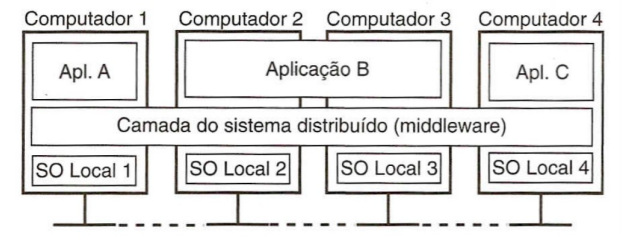
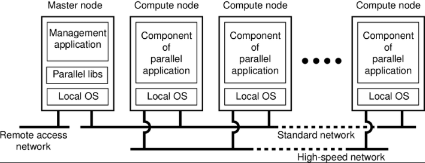
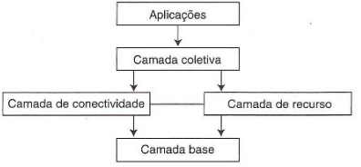

# Introdução Sistemas Distribuídos

## 1. Introdução

Até meados dos anos 80, o cenário da computação era dominado pelos Mainframes: máquinas gigantescas (do tamanho de salas inteiras) que exigiam infraestruturas complexas de refrigeração e orçamentos milionários. Por serem tão caros e raros, esses computadores operavam de forma isolada; as organizações possuíam apenas algumas unidades que não "conversavam" entre si.

Essa lógica foi quebrada por dois avanços fundamentais: a dos microprocessadores e das redes de alta velocidade

Até então, limitados a tarefas simples (como calculadoras), os microprocessadores deram um salto de potência graças à Lei de Moore. A miniaturização dos componentes permitiu colocar milhões de transistores em um único chip, reduzindo o tamanho físico e o consumo de energia, enquanto a velocidade de processamento disparava.

Assim, tornou-se muito mais eficiente e barato comprar 1.000 microcomputadores de mil dólares cada do que investir em um único Mainframe de milhões de dólares. Embora o Mainframe fosse potente, um conjunto de mil máquinas menores oferecia um poder de processamento somado muito maior por uma fração do preço.

Diante disso, o desafio deixou de ser o hardware e passou a ser o software: como fazer mil máquinas independentes trabalharem juntas? Foi dessa necessidade que nasceram as redes e, principalmente, os Sistemas Distribuídos.

Embora ja existissem protótipos de redes desde os anos 60, foi nessa época que as LANs e WANs atingiram maturidade técnica e comercial para suprir a necessidade da conexão entre microcomputadores.

O resultados dessas tecnologias foi a viabilidade ao decorrer dos anos de montar uma rede sistemas de sistemas de computação, ou sistemas distribuídos, com vários computadores conectados por uma rede de alta velocidade, que substituiu os sistemas centralizados/monoprocessadores anteriores, que eram centralizados em um único computador e seus periféricos.

**Nota:** Apesar disso tudo, os Mainframes não morreram. Eles evoluíram, encolheram para o tamanho de uma geladeira e hoje são máquinas altamente especializadas para processamento de transações críticas (como as de grandes bancos), onde a centralização ainda é uma vantagem de segurança.

## 1. Definições

**Tanenbaum:** Um conjunto de computadores independentes conectados entre sí via rede. Esse conjunto compartilha processos e recursos e se apresenta a seus usuários como um sistema único e coerente.

- Consiste em componentes autônomos.
- Usuários acham que estão tratando de um único sistema.

**Colouris:** Sistema no qual componentes localizados em
computadores interligados em rede se comunicam e coordenam suas ações apenas passando mensagens

- Não há visão do usuário nessa definição.

## 4. Metas/Desafios/Design Goals

### 4.1 Homogeneidade
A realidade física é heterogênea, ou seja, compostas por uma variedade de hardwares, sistemas operacionais, redes e linguagens de programação. O SDs oculta que seus recursos estão distribuídos em várias máquinas. Assim, o usuário não percebe sua organização interna, nem que se trata de vários sistemas. Exemplo: Quando você acessa o Google, não sabe (e não precisa saber) em qual servidor ou país sua busca está sendo processada.

**Middleware:** Uma camada de software, situada entre uma camada de nível mais alto (usuários e aplicações) e uma subjacente (sistemas operacionais), que oferece um modelo computacional de sistema único, responsável por disfarçar essa bagunça.

  

### 4.2 Abertura do Sistema

**Interfaces publicadas:**
Um sistema aberto é um sistema que possui sua especificação e documentação (as "regras do jogo", o que o sistema faz, como ele faz) de suas interfaces publicadas e disponíveis para os desenvolvedores através de portais ou repositórios. Isso garante a ele a capacidade de ser estendido e reimplementado de diferentes maneiras.

Um sistema distribuído deve ser aberto, deve oferecer fácil acesso a seus recursos e pode ser expandido.

**Interoperabilidade:** Diferentes sistemas (de marcas diferentes) conseguem trabalhar juntos. 

**Portabilidade:** Você pode pegar o seu código e rodá-lo em outro sistema operacional ou hardware que siga as mesmas regras, sem precisar reescrever tudo.

**Separação entre Mecanismo e Política:** A clara separação gera flexibilidade. Mecanismo é "como" algo é feito (ex: técnica de criptografia usada). Política é "o que" deve ser feito (ex: qual nível de segurança o usuário precisa ter).

**Uniformidade e Extensibilidade:** Um sistema aberto nunca esta "pronto", ele sempre permite que você adicione novos serviços sem precisar desligar o sistema inteiro ou mexer no que já esta funcionando.

### 4.3 Segurança:

Muitos dados e recursos em sistemas distribuídos tem alto valor intrínseco e devem ser protegidos Essa segurança abrange três componentes: **confidencialidade** (proteção da exposição do conteúdo para pessoas não autorizadas), **integridade** (proteção contra alteração ou dano) e **disponibilidade** (acessíveis quando necessários).

### 4.4 Escalabilidade
Escalabilidade é a capacidade de um sistema continuar operando de formar eficiente mesmo com um aumento significativo no número de usuários e recursos. Principais desafios: controlar o custo dos recursos físicos, controlar a perda e gargalos de desempenho e impedir que os recursos de software se esgotem.

Á medida que a demanda por um recurso aumenta, deve ser possível, a um custo razoável, ampliar o sistema para atendê-la. Para isso deve-se evitar a centralização: sistemas com um único servidor, dados centralizados ou algoritmos que dependem de informações globais tornam-se gargalos de desempenho à medida que crescem.

Para que um sistema seja escalável, o custo dos recursos físicos deve ser, no máximo, proporcional ao número de usuários ou recursos presentes no sistema e a perda de desempenho deve ser manter em uma complexidade logarítmica em relação ao volume de dados.

### 4.5 Tratamento de Falhas
Em sistema distribuído as falhas são parciais e independentes, ou seja, alguns componentes falham enquanto outros continuam funcionando. Portanto, o tratamento de falhas é particularmente difícil.

**Detecção de Falhas:** Algumas falhas podem ser detectadas, por exemplo, com somas de verificação, outras são mais difíceis, ou mesmo impossíveis.

**Mascaramento de falhas:** É o processo de ocultar ou tornar falhas menos sérias.Dois exemplos são:retransmitir mensagens que não chegam e gravar dados de arquivos em dois discos.

Além isso, diferente dos sistemas centralizados, onde há um único relógio global, em sistemas distribuídos, **cada máquina tem seu próprio tempo interno**, resultando em limitações na sincronização exata do tempo.

### 4.6 Concorrência:
Em um sistema distribuído, tanto os serviços quanto os aplicativos fornecem recursos que podem ser compartilhados pelos clientes. Para uma organização, por exemplo, é muito mais eficiente compartilhar uma única impressora de alta performance ou um banco de dados central do que equipar cada estação individualmente.

Contudo, o compartilhamento introduz o desafio da **concorrência**: a possibilidade de que múltiplos clientes tentem acessar ou modificar o mesmo recurso simultaneamente. Sem o devido controle, as operações podem se "entrelaçar", gerando **riscos de inconsistência** e **condições de corrida** (onde o resultado final depende da ordem imprevisível de chegada das requisições). 

Para evitar que o estado do recurso seja corrompido, a integridade deve ser garantida no nível do **objeto**:
- **Responsabilidade do Objeto:** Não basta o servidor estar online; cada recurso compartilhado deve ser projetado para gerenciar seus próprios acessos concorrentes.
- **Mecanismos de Sincronização:** O uso de técnicas padrão, como **semáforos** ou travas (locks), é essencial para garantir que apenas um processo manipule dados sensíveis por vez, mantendo a coerência de todo o sistema distribuído.
Por

### 4.7 Transparência:

É definida como a ocultação, para um usuário final ou para um programador de aplicativo, da separação dos componentes em um sistema distribuído, de modo que o sistema seja percebido como um todo, em vez de como uma coleção de componentes independentes. Há oito formas de transparência:

**Transparência de Acesso:** Oculta diferenças na representação de dados e no modo de acesso a um recurso

**Transparência de Localização:** Oculta o lugar onde um recurso está localizado fisicamente.

**Transparência de Migração:** Oculta que um recurso pode ser movido para outra localização física.

**Transparência de Realocação:** Oculta que um recurso pode ser movido para outra localização enquanto está em uso.

**Transparência de Replicação:** Oculta a existência de múltiplas cópias de um recurso para aumentar a disponibilidade.

**Transparência de Concorrência:** Oculta que um recurso pode ser compartilhado por vários usuários concorrentes sem interferência mútua.

**Transparência de Falha:** Oculta a falha e a posterior recuperação de um recurso, permitindo que a tarefa seja concluída.

**Transparência de Desempenho:** Permite que o sistema seja reconfigurado para melhorar o desempenho conforme a carga varia.

**Transparência de Escalabilidade:** O sistema pode expandir em escala sem alterar sua estrutura ou algoritmos.

**Transparência de Rede:** Engloba a transparência de acesso e localização.

### 4.8 Qualidade de Serviço:
Uma vez que a funcionalidade do sistema é atendida, devemos observar as **propriedades não funcionais** que determinam a experiência do usuário.

* **Confiabilidade e segurança:** fundamentos básicos para a integridade do sistema e dos dados.
* **Desempenho (Performance):** definido pela velocidade de resposta, rendimento computacional e, principalmente, pela capacidade de cumprir prazos finais (**pontualidade**).
* **Adaptabilidade:** capacidade do sistema de se ajustar a variações de configuração e disponibilidade de recursos.
* **Garantia de recursos:** para serviços críticos (como streaming de vídeo), o sistema deve ser capaz de reservar recursos de computação e rede para garantir que as tarefas sejam terminadas no tempo correto.

## 5. Sistema de Computação Distribuídos de Alta Performance

### 5.1 Sistemas de Computação Distribuídos de Alta Performance

Focada em força bruta computacional, Podem ser:

#### 5.1.1 Sistemas de Computação de Cluster:

Formado por um conjunto de nós de computadores simples e semelhantes (homogêneos) que são conectados por meio de uma rede local de alta velocidade e controlados e acessados por meio de um único nó mestre.

**Características:**

- Cada nó possui o mesmo SO, geralmente Linux
- O nó mestre distribui as tarefas para os "nós de processamento" e proporciona uma interface para os usuários.
- Atrativo: construir supercomputadores usando computadores simples.
- Usado em programação paralela, onde o um único programa é executado em várias máquinas.
- Exemplo: cluster Beowulf.

  

#### 5.1.2 Sistemas de Computação em Grade:

Formado por máquinas totalmente heterogêneas de diferentes domínios administrativos ao redor do mundo que são conectadas criando um supercomputador virtual.

**Características:**

- Permite a colaboração de pessoas e instituições.
- Compartilhamento de recursos, facilidade de armazenamento e banco de dados.
- Exemplo: CERN e F@h.

**Arquitetura em Quatro Camadas:**

- **Camada Base:** Fornece interfaces para as camadas acima consultarem estados e recursos locais de hardware.
- **Camada Conectividade:** Consiste em protocolos de comunicação e segurança para suportar transações entre máquinas diferentes do Grid.
- **Camada Recursos:**  Responsável pelo gerenciamento de um único recurso. Usa a conectividade para enviar comandos para base.
- **Camada Coletiva:** Manipula o acesso a múltiplos recursos e normalmente consiste em serviços para  alocação e escalonamento de tarefas.
- **Camada Aplicação:** Roda as aplicações para o usuário final.

*Obs: o middleware é formado pelas camadas de conectividade, recursos e coletiva.

  

### 5.2 Sistemas de Informação Distribuídos

No inícios as aplicações era monolíticas, havia um único servidor central que guardava o banco de dados e processava toda a lógica, de modo que os clientes (computadores dos usuários) eram burros, serviam apenas como um terminal e não realizavam nenhum cálculo, e congelavam até a resposta chegar.

Atualmente, com as Transações RPC/RMI, as operações começaram a ser agrupadas (regra do tudo ou nada) e separadas do banco de dados. Além disso, grande parte da lógica acontece em segundo plano e no próprio dispositivo do usuário

Assim, o Sistemas de Informação Distribuídos são focadas em dados e processos de negócios, invés de cálculo e velocidade. Eles são divididos em:

#### 5.2.1 Sistemas de Processamento de Transações

Possuem como foco a integridade. Aplicações de banco de dados realizam operações sob a forma de transações, que por sua vez requer o uso de primitivas especiais, como BEGIN_TRANSACTION, END_TRANSACTION, READ e WRITE.

**Características (ACID):**

- Atômicas: Para o mundo exterior, a transação acontece como se fosse indivisível (tudo ou nada).
- Consistentes: A transação não viola invariantes de sistema: se eles forem válidos antes da transação, terão que continuar sendo após.
- Isoladas: Transações concorrentes não interferem umas com as outras.
- Duráveis: Uma vez comprometida uma transação, as alterações são permanentes.

**Subtransações:**

Uma transação, nesse caso chamada de transação aninhada,pode ser dividida em subtransações que são executadas em paralelo e que, por sua vez, também podem ser redivididas. Exemplo: Imagine que você está reservando uma viagem. A "Transação Pai" é a Viagem. As "Subtransações" (filhas) são: 1. Reservar Voo, 2. Reservar Hotel, 3. Alugar Carro.

**Rollback:** Se a transação pai der errado, ou seja, se qualquer uma das subtransações der errado, todas as subtransações devem ser desfeitas. Nesse sentido, enquanto as subtransações estão rodando, os resultados delas são provisório e só se tornam permanentes/duráveis no banco de dados quando a transação pai termina com sucesso total.

**Monitor de Processamento de Transações (TP):** Como há vários servidores envolvidos, no exemplo anterior um para o voo, outro para o hotel, o Monitor TP permite acessar esses diferentes bancos de dados e coordenar o êxito das subtransações.

  

#### 5.2.2 Integração de Aplicações Empresariais (EAI)

Possuem como foco a comunicação e surgiram quando as empresas perceberam que tinham vários sistemas independentes prontos (um de RH, um de Vendas, um de Estoque) que precisavam conversar entre si, mas não "falavam a mesma língua". 

Deste modo, em vez de forçar todos os sistemas a usarem o mesmo banco de dados, o EAI cria uma camada que permite que eles troquem mensagens e chamem funções uns dos outros. Essa camada utiliza de duas tecnologias:

**Chamadas de Procedimento Remoto (RPC):** Envia uma requisição de forma que um ambiente externo execute uma determinada função.

**Invocação de Procedimento Remoto (IPC):** É o mesmo que uma RPC, porém funciona com objetos remotos em vez de com aplicações.

Como ambos possuem a desvantagem de possuírem um forte acoplamento, onde o chamador e o chamado precisam estar ligados e em funcionamento no momento da comunicação, as tecnologias acabaram migrando para um Middleware orientado e Mensagem (MOM), onde o invocador não precisa de conhecimento do executador.

### 5.3 Sistemas Distribuídos Ubíquos e Pervasivos

Enquanto as categorias de Informação ou Alta Performance focam em integridade de dados e poder de cálculo, esta categoria busca a invisibilidade. Nela, o processamento não está em um gabinete central, mas espalhado por diversos pequenos nós (sensores, smartwatches, celulares e servidores na nuvem).

Esses dispositivos são, em geral, sistemas embarcados que funcionam como "peças" de um quebra-cabeça que, quando se conectam e colaboram entre si, formam um grande sistema distribuído. Aqui temos duas definições principais:

**Sistemas Distribuídos Pervasivos:** São discretos e integrados organicamente ao ambiente, tornando-se difíceis de serem notados durante o uso.

**Sistemas Distribuídos Ubíquos:** São a evolução dos pervasivos. Além de serem invisíveis, estão continuamente disponíveis em qualquer lugar e a qualquer momento, adaptando-se ao contexto do usuário.

#### 5.3.1 Os Cinco Pilares do Sistema Ubíquo:

**Distribuição:** Ele precisa estar na rede para acessar recursos e outros dispositivos.

**Interação Discreta:** Você não deveria ter que "operar" o sistema o tempo todo; ele deve agir em segundo plano.

**Sensibilidade ao Contexto:** O sistema sabe onde você está, quem está com você e o que você está fazendo (ex: o GPS do carro que sugere o caminho de casa no horário que você costuma sair do trabalho).

**Autonomia:** Ele se autogerencia. Se precisar de uma atualização, ele faz sozinho. Se o IP mudar, ele se vira.

**Inteligência:** Usa IA para entender comandos incompletos ou mudanças bruscas no ambiente (ex: um sensor de queda em um idoso que sabe diferenciar um tropeço de um desmaio).

O mecanismo que permite esses pilares é o de **Composição Ad Hoc**, que diz que o sistema dever autoconfigurável, permitindo que dispositivos se juntem ou saiam de forma espontânea e sem controle administrativo centralizado. Para exemplificar isso temos que seu celular se conecta ao Wi-Fi da faculdade, depois ao Bluetooth do carro e depois à rede da sua casa, tudo sem você precisar configurar manualmente os IPs ou as rotas cada vez que muda de lugar.

#### 5.3.2 Tipos

**Sistemas Domésticos (Smart Homes):** Lâmpadas que acendem sozinhas, fechaduras digitais e termostatos. O foco é a facilidade para o usuário leigo.

**Saúde Eletrônica (e-Health):** Wearables como smartwatches que medem batimentos ou sensores de glicose. Eles processam dados ali mesmo (na "borda" da rede) para serem rápidos.

**Redes de Sensores:** Milhares de mini-sensores espalhados (em uma floresta para detectar fogo, por exemplo). Eles colaboram entre si para economizar bateria e só enviam o sinal principal quando algo importante acontece.

**Computação Móvel:** Sistemas em carros ou dispositivos com GPS. A premissa aqui é que o equipamento muda de lugar o tempo todo, então ele precisa lidar com conexões que caem e voltam.

## 6. Tipos de Falhas em Sistemas Distribuídos

### 6.1. Falha por Parada (Crash Failure)
O processo simplesmente para de funcionar.

- Não responde mais
- Não envia mensagens
Exemplo: servidor cai ou processo encerra

### 6.2. Falha por Omissão (Omission Failure)
O processo falha ao enviar ou receber mensagens.

Tipos:
- Omissão de envio → não envia mensagem
- Omissão de recebimento → não recebe mensagem
- Exemplo: pacote perdido na rede

### 6.3 Falha de Tempo (Timing Failure)
O sistema responde fora do tempo esperado.

- Resposta atrasada (timeout)
- Resposta fora do limite de tempo
- Exemplo: chamada RPC demora demais

### 6.4 Falha de Resposta (Response Failure)
O sistema responde, mas com erro.

- Valor incorreto
- Execução incorreta da operação
- Exemplo: função retorna resultado errado

### 6.5 Falha Arbitrária (Bizantina)
O sistema pode apresentar qualquer tipo de comportamento.

- Envia mensagens erradas
- Envia informações diferentes para cada nó
- Comportamento imprevisível ou malicioso
- Exemplo: nó comprometido ou com erro grave

