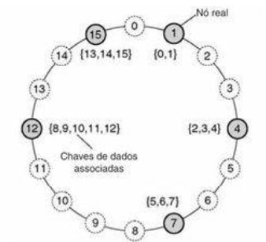

#  Arquiteturas de Sistemas

## 1. Arquiteturas Descentralizadas

**Arquiteturas Centralizados:** Todo o processamento e controle estão concentrados em uma única máquina ou em um ponto central. Os outros dispositivos (clientes) apenas enviam requisições e recebem respostas. Esse modelo prioriza simplicidade e controle, mas pode gerar gargalos e ponto único de falha. Exemplos:

- Mainframes: processamento todo em um servidor central.
- Bancos tradicionais: toda lógica crítica concentrada no servidor.

**Arquiteturas Distribuído:** Dividido em vários computadores suficientemente para que o sistema seja rápido e confiável, enfatizando que o usuário não perceba a divisão. Exemplos: 

- Sistemas NAS: Servidor acessado por Wi-Fi que aparece como Unidade Z e esconde toda a bagunça do hardware.
- Sistemas CDNs: Como a Netflix e Youtube. Quando você da play, você não perceve que o vídeo vem de um servidor perto de você e não da sede nos EUA.

**Arquiteturas Descentralizados:** Dividido em vários computadores por necessidade, enfatizando autonomia e independência como objetivo. Se tentar centralizar o sistema quebra. Exemplos:

- IA: Modelos de IA são grandes demais para uma placa de vídeo só, portanto o treinamento precisa ser dividido .
- Blockchain: Garante autonomia, ninguém precisa confiar em ninguém.
- Geografia e Latência (Edge Computing): Em vez de enviar um arquivo para um servidor gigante e distante (processo demorado), utilizar de um mini-computador, como uma RaspberryPI. Exemplo: câmeras de segurança.
- Leis: Muitas vezes, dados de usuários europeus precisar fica na Europa.

## 1. Arquiteturas Distribuídas Centralizadas

Está é a implementação física mais comum do estilo em camadas.  É um sistema distribuido, com vários computadores conectados por rede, porém possui a ssimetria como característica principal:

**Assimetria:** Os papéis são bem definidos e diferentes. O Servidor é passivo (espera requisições) e o Cliente é ativo (inicia requisições).

**Distribuição Vertical:** É a técnica usada para escalar sistemas centralizados. Consiste em pegar a divisão lógica (Interface, Processamento, Dados) e colocar cada "pedaço" em uma máquina ou nível diferente. Exemplo: Multicamadas.

## 2. Arquiteturas Distribuídas Descentralizadas 

Nos sistemas descentralizados, não há um único ponto de controle. A responsabilidade é distribuída entre vários nós, reduzindo gargalos e aumentando a tolerância a falhas. O principal representante dessa arquitetura são as Arquiteturas Peer-to-Peer.

### 2.1 Arquiteturas Peer-to-Peer
Possuem como característica:

**Simetria (Servents):** Todos os nós (processos) na rede são iguais. Eles agem simultaneamente como clientes e servidores (servents). Não existe um controle central; cada nó contribui com recursos (banda, armazenamento, processamento) para a rede.

**Distribuição Horizontal:** Enquanto a distribuição vertical divide o sistema em níveis funcionais (Interface/Lógica/Dados), a distribuição horizontal replica o sistema completo em múltiplos nós. Cada nó cuida de uma "fatia" do conjunto total de dados ou tarefas.

**Rede de Sobreposição (Overlay Network):** Como existe um limite físico e lógico para gerenciar conexões (memória para armazenar IPs e portas de comunicação), um nó não consegue estar conectado a todos os outros simultaneamente. Por isso, a rede P2P cria uma topologia virtual onde cada nó conhece apenas uma lista restrita de 'vizinhos'. As mensagens e buscas navegam por essa rede 'pulando' de vizinho em vizinho até encontrar o destino, utilizando a internet física apenas como o meio de transporte.

As arquiteturas P2P são classificadas pela forma como organizam essa rede de sobreposição e como localizam os dados:

#### 2.1.1 Redes P2P Estruturadas

Neste modelo, a rede segue uma topologia (desenho) matemática rígida, como um Anel ou uma Árvore. Tudo é previsível e determinístico.

**Tabela de Hash Distribuída (DHT):** É o mecanismo que faz a rede funcionar. O sistema usa uma função matemática (Hash) para dar um ID único para cada arquivo e também um ID único para cada máquina (nó) na rede. O arquivo é sempre guardado na máquina cujo ID seja mais próximo ou correspondente ao ID do arquivo.

  

#### 2.1.2 Redes P2P Não-Estruturadas

Aqui não há regras matemáticas rígidas. Os nós se conectam de forma praticamente aleatória. Quando você entra na rede, pede uma lista de vizinhos para um nó conhecido e se conecta a eles.

Existem dois algoritmos de buscar para achar um arquivo ou computador:

**Flooding:** O nó grita para todos os seus vizinhos: "Alguém tem o arquivo X?". Os vizinhos repassam a pergunta para os vizinhos deles, e assim por diante.

- Desvantagem: Gera um tráfego absurdo na rede. Para a internet não travar, usa-se um Contador TTL (Time to Live), que faz a busca morrer depois de pular alguns nós.

**Caminhada Aleatória (Random Walk):** O nó escolhe apenas um vizinho aleatório e pergunta. Se ele não tem, a pergunta vai para outro vizinho aleatório, até achar o arquivo.

- Vantagem/Desvantagem: Reduz muito o tráfego de rede, mas pode demorar demais. A estratégia prática é lançar várias caminhadas ao mesmo tempo para achar mais rápido.

### 2.2. BitTorrent

Como a busca no P2P Não-Estruturado é ineficiente quando a rede fica gigante, a solução pragmática foi criar "atalhos", quebrando um pouco a simetria total.

**Superpares (Superpeers):** Alguns nós da rede que têm máquinas mais potentes e internet mais rápida são promovidos a "Superpares". Eles funcionam como índices: não guardam todos os arquivos, mas sabem exatamente em qual nó comum está guardando. Se um Superpar sair do ar, a rede usa algoritmos para eleger um novo.

**BitTorrent:**

- O BitTorrent é uma rede P2P não-estruturada, mas que usa um elemento centralizador: o Tracker (Rastreador).
- O arquivo .torrent não contém o filme que você quer baixar, ele contém o endereço do Tracker.
- O Tracker age de forma similar a um Superpar: ele te entrega uma lista com os IPs dos computadores que estão baixando/enviando aquele arquivo (os pares ativos).
- A partir daí, a centralização acaba e você começa a baixar partes do arquivo diretamente dos outros computadores.
- Política de Colaboração: O BitTorrent força a simetria. Se você tentar só baixar sem enviar dados para os outros, a rede "pune" sua conexão e deixa seu download lento.

imagem 105

## 3. Arquiteturas Híbridas

Até aqui, vimos os modelos puros (Camadas, Pub-Sub, P2P). No mundo real, as empresas raramente usam um modelo só; elas criam Arquiteturas Híbridas, misturando tudo isso para resolver problemas complexos.

### 3.1 Definição da Computação em Nuvem

A ideia central do cloud computing é tirar o servidor físico de dentro da empresa e coloca-lo em Data Centers gigantes gerenciados por terceiros. 

Nela, temos um modelo de acesso rápido, sempre que necessário e sem a necessidade de interação com o provedor dos serviços, a um conjunto compartilhado de recursos computacionais configuráveis,tais como, redes, servidores, armazenamento, aplicações e serviços.

Assim, para o Tanenbaum, a Nuvem transforma a computação em uma "Utilitária" (como água ou energia elétrica): você abre a torneira, consome o que precisa e paga a conta no final do mês.

### 3.2 Pilares da Nuvem

**Serviço Sob Demanda (Self-Service):** Você não liga para um vendedor para pedir um servidor. Você entra num painel web, clica em um botão e o servidor sobe na mesma hora, de forma 100% automatizada.

**Acesso Amplo pela Rede:** Os recursos estão disponíveis de forma padronizada para qualquer dispositivo (PC, celular, tablet).

**Pooling de Recursos (Multilocação):** O provedor (Google, AWS) tem milhares de servidores físicos. Ele "fatia" esses servidores e aluga pedaços para milhares de clientes ao mesmo tempo. Aqui entra a Transparência de Localização: você não sabe (nem se importa) em qual rack ou país exato o seu dado está.

**Elasticidade Rápida:** É a escalabilidade no seu estado da arte. Seu site bombou na Black Friday? A nuvem aloca mais 10 servidores em segundos. O movimento caiu? Ela devolve os servidores.

**Serviço Mensurado:** Você paga exatamente pelo que usa (por gigabyte armazenado, por hora de processamento ou por requisição feita).

### 3.3 A Pirâmide de Serviços da Nuvem (XaaS)
O "X as a Service" (Tudo como Serviço) define o nível de controle que o desenvolvedor terá sobre a arquitetura.

**IaaS (Infraestrutura como Serviço):** O provedor te dá o "hardware virtual". Você recebe uma Máquina Virtual (VM) em branco.

- O que você gerencia: O Sistema Operacional (Linux/Windows), as linguagens, o banco de dados e a aplicação.
- Exemplo: Amazon EC2. É ideal para quem quer controle total do sistema distribuído.

**PaaS (Plataforma como Serviço):** O provedor te dá o ambiente de desenvolvimento pronto.

- O que você gerencia: Apenas o código da sua aplicação. O provedor cuida do servidor, de atualizar o sistema operacional e de proteger a rede.
- Exemplo: Google App Engine. A promessa é: "Apenas escreva seu código e nós fazemos ele rodar e escalar".

**SaaS (Software como Serviço):** O produto final está pronto para uso pelo cliente.

- O que você gerencia: Nada tecnicamente. Você só cria uma conta, faz login e usa pelo navegador.
- Exemplo: Google Docs, Netflix, Dropbox. Todo o processamento, armazenamento e arquitetura estão ocultos do usuário.

### 3.4 Computação em Borda e Névoa

O principal desafio da computação em nuvem é a latência, ou seja o tempo de viagem do dado. Em sistemas de Internet das Coisas (IoT), com milhões de sensores (câmeras, carros autônomos, termômetros), enviar todo e qualquer dado pela internet até um Data Center nos EUA para ser processado e voltar demora muito e entope a banda da internet. A solução para isso foi trazer o processamento para perto do cliente.

#### 3.4.1 Computação de Borda (Edge Computing)

Em vez de enviar o dado para a Nuvem, nós colocamos processamento na "borda" da rede, ou seja, exatamente onde o dado nasce.

**Como funciona:** A câmera de segurança não manda o vídeo bruto para a nuvem. Ela mesma tem um chip inteligente que processa a imagem, detecta se há um invasor e envia apenas o alerta de texto para a nuvem.

**Pragmatismo:** Economiza uma largura de banda colossal e a resposta é imediata (baixa latência).

#### 3.4.2 Computação em Névoa (Fog Computing)

A "Névoa" é o meio-termo entre a Borda (perto do chão) e a Nuvem.

**O Problema:** Às vezes, o dispositivo na borda (um sensor de temperatura) é muito fraco para processar dados complexos, mas a Nuvem ainda está muito longe.

**A Solução:** Coloca-se um mini-servidor local (o nó da névoa) no mesmo prédio ou bairro dos sensores. Os sensores mandam os dados rapidamente para esse mini-servidor, ele faz o processamento pesado e sincroniza com a Nuvem maior depois.

**Exemplo Prático:** Uma fábrica cheia de sensores fracos enviando dados para um servidor robusto instalado dentro da própria fábrica, antes de mandar relatórios para a AWS.
