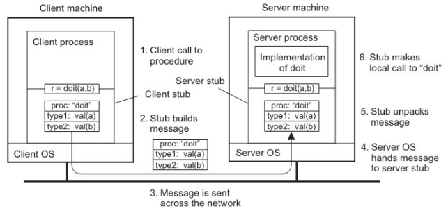

# Comunicação via Remote Procedure Call (RPC)

Em sistemas distribuídos, o uso de chamadas explícitas de comunicação tendem a ser muito complexas (é necessáŕio programar rede + lógica ao mesmo tempo)dificultando o desenvolvimento. Para isso surgiram as RPC, funções que tenta esconder essa complexidade.

## 1. Ideia básica

Tornar as trocas de mensagens entre diferente máquinas invisíveis para o programador, de modo que os procedimentos que envolveriram máquinas remotas podem ser chamadas como se fossem procedimento do espaço de endereçamento local.

**Exemplo:**

Sem RPC:

```bash
enviarMensagem("somar", {2,3})
```

Com RPC

```bash
resultado = somar(2,3)
```

## 2. Funcionamento
Exemplo: chamada remota de read de dados que estão em outra máquina.

**Apêndice/stub de cliente:** É uma função que finge ser o read local. Quando chamada, ela não executa a leitura diretamente, mas:

- Empacota os parâmetros (marshalling).
- Monta uma mensagem.
- Chama o SO local.
- SO local, invez de ler os dados direto, envia a mensagem para o S0 remoto.

**Apêndice/stub de servidor:** É o equiavalente do stub de cliente no servidor. É uma função que transforma requisições de fora em chamadas de procedimentos locais e retorna o resultado ao SO cliente. Ao receber a mensagem:

- SO recebe a mensagem da rede
- Entrega para o stub de servidor
- Stub de servidor:
  - Desempacota (unmarshalling) os parâmetros
  - Chama o procedimento real
- Procedimento executa e retorna o resultado
- Stub de servidor pega o resultado e empacota (marshalling)
- Stub pede para o SO enviar a resposta

Após receber a mensagem de volta, o cliente desempacota o resultado de forma usual e só sabe que os dados estão disponíveis: não tem ideia de que o trabalho foi realizado remotamente, e não locamente.


<div style="text-align: center;">
  
</div>

## 3. Passagem de parâmetros 

### 3.1 Por valor

Esse processo de transformar estruturas de dados em uma representação transmissível e depois reconstruí-las no destino é algo muito complicado.

**Marshalling:** Processo de empacotar os parâmetros/dados para o envio.
**Unmarshalling:** Processo de desempacotar e reconstruir os parâmetros/dados ao chegar, de modo que sejam equivalentes aos do cliente.

Isso é necessário porque máquinas podem ter arquiteturas diferentes, como little endian (numera os bytes da direita para esquerda) e big endian (numera os dados da esquerda para a direita), além de formatos distintos para números, alinhamento e representação interna.

Uma solução para esse empacotamento de valores em formato diferente é transaforma-los de forma indepedente da máquina de destino. Para isso usa-se corba, objetos em java e XML/JSON.

### 3.2 Por referência

A passagem de dados por valor é algo mais simples, já que dados podem ser copiados. Já passagens por referência, como ponteiros e estruturadas ligadas a memória loca, é mais difícil, pois o endereço existente no contexto local não faz necessariamente sentido no contexto de otura máquina. Assim, esse tipo de passagem são raras e proibidas no geral.


### 4. IDL e heterogeneidade

Se dois stubs usam o mesmo protocolo RPC, ou seja, o mesmo formato de comunicação, mensagem e empacotamento, a única coisa que muda entre eles é qual função da interface eles representam para a aplicação, e consequentemente o nome da função, seus parâmetros e tipo de retorno.

Assim, criar mecanismos de geração automática de stubs é algo muito conveniente, pois evita implementar manualmente a lógica de comunicação. No entanto, esses stubs precisam ser gerados para linguagens específicas, já que cliente e servidor podem estar escritos em linguagens diferentes.

Nesse contexto entram as IDLs, que permitem especificar a interface de forma independente de linguagem. A partir dessa definição, ferramentas geram automaticamente os stubs de cliente e servidor em diferentes linguagens, garantindo que ambos sigam a mesma interface e protocolo.

### 3.6 Limitações reais da transparência

RPC nunca fica “idêntica” a uma chamada local. Existem diferenças importantes:

- latência de rede;
- falhas de comunicação;
- timeouts;
- perda de disponibilidade;
- necessidade de tratar exceções remotas.

Essa é uma das ideias mais importantes em Tanenbaum: a transparência é desejável, mas sempre custa algum grau de complexidade e perda de controle.

### 3.7 RPC sincrona, assíncrona e one-way

A RPC tradicional é síncrona e transiente: o cliente espera a resposta. Mas existem variações:

- RPC assíncrona: o cliente dispara a chamada e recebe confirmação depois.
- RPC one-way RPC: não há espera de resposta imediata.

### 3.8 Quando usar RPC
RPC é útil quando:

- a aplicação quer simplicidade de programação;
- o serviço remoto é bem definido;
- a latência é tolerável;
- a semântica de chamada/resposta combina com o problema.

Ela é menos adequada quando o sistema exige grande flexibilidade, alto desacoplamento ou tolerância forte a desconexões
