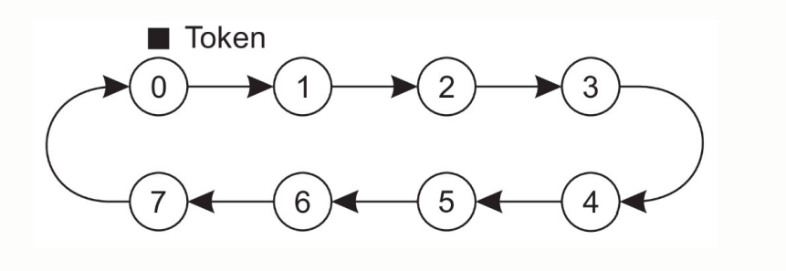

## 5. Exclusão Mútua

Após entender tempo e ordem, como impedir que vários processos usem o mesmo recurso crítico ao mesmo tempo?

Em sistemas locais, ess impedimento ocorre através de locks, semáforos e memória compartilhada. Em sistemas distribuídos, já que não existe uma memoria compartilhada central, a solução para atingir a exclusão mútua é feita apenas por troca de mensagens. Para isso, existem dois tipos de algorítmos:

**Baseados em Permissão:** O acesso é feito por requisições, que podem ser aceitas ou negadas.
- Desvantagem: Precisam dtrocar muitas mensagem para realizar uma ação.

**Baseados em Token (ficha):** Os processos se organizam em uma estrutura e uma ficha é transferida de um processo ao outro, apenas que tem a ficha pode acessar o recurso.
- Desvantagem: Processo de recuperação complicado caso o nó com a ficha cair.

### 5.1 Algoritmo Centralizado

Nele um coordenador controla quem pode entrar na seção. Funciona da seguinte forma:

- **Requisição:** Processo pergunta se pode acessar.
- **Negação/Concessão:** Coordenador concede ou nega, durante esse tempo o processo fica bloqueado. Caso negar, forma-se uma fila.
- **Liberação:** Processo acessa (ou não) os recursos e é liberado

**Vantagens:** 

- Usa poucas mensagens.
- Fácil de implementar.
- É justo e evita starvation.

**Desvantagem:** 

- Coordenador pode se tornar um gargalo: O cliente fica travado até receber a resposa, caso o coordenador cair ele fica sem resposta e todo o sistema sofre.
- Coordenador pode ficar sobrecarregado.
- Não é escalável.
- Frágil em grandes sistemas distribuídos.

### 5.2 Algoritmo Distribuído de Ricart e Agrawala

É baseado em mensagens e em relógio lógico e todos os processos participam da decisão, um processo só tem acesso se todos os outros processos derem OK. Funciona da seguinte forma:

1. Quando um processo quer entrar na seção crítica, ele envia pedido para os outros e espera resposta positiva.

2. Ao receber um pedido de acesso a um recurso, vindo de outro processo, o processo que recebeu tem **três opções**:

- **A) Ele não está acessando o recurso e nem quer acessar:** Então ele apenas da OK.

- **B) Ele está acessando o recurso:** Ele não da a resposta no momento; coloca o request em uma fila loca; responde OK depois de liberar o recurso. 

- **C) Ele não está acessando o recurso, porém quer acessar:** Responde OK imediatamente se tiver prioridade, caso contrário adia a resposta. Prioridade é ter menor timestamp.

3. Ao liberar o acesso, terá uma "fila" de requisões. Terá acesso quem tiver permissão de todos.

**Vantagens:**
- Evita deadlock e starvation

**Desvantagem:**
- Número de mensagens muito alto.
- Pouca tolerância a falhas.
- Parecido com o centralizado, um processo pode ficar sem resposta caso a mensagem for perdida.

imagem 111

### 5.3 Token-Ring

Nesse modelo, os processos estão organizados em anel e uma ficha de acesso circula entre eles. Somente quem possui o token pode acessar o recurso. 

- Se um processo não quer acessar nada, ele simplesmente repassa a ficha.
- Se um processo quer acessar o recurso, ele espera a fixa chegar até ele.
- Depois de usars e liberar o recurso, a ficha é passada para o próximo.

**Vantagens:**

- Evita deadlock.
- Evita starvation

**Desvantagem:**

- O token pode ser perder.
- O processo que posusi o token pode falhar.
- Dai precisa de um mecanismo para detectar a perda e reconstruir o anel.

  

### 5.4 Algortimo Descentralizado

Nesse modelo, invés de um único coordenador, o recurso é replicado e cada réplica tem seu próprio controlador. Para obter acesso, o processo precisa convencer uma maioria desses coordenadores.

O sistema cria N réplicas lógicas desse recurso, e cada réplica ganha um coordenador diferente.

Quando um processo quer acessar um recurso, ele joga o nome do recurso em uma **função hash**, que cospe quem são os N coordenadores.

O processo então vai  enviar um pedido permissão para esses N coordenadores, o pedido não chega ao mesmo tempo em todos e ele não precisa da permissão de todos, apenas da maoria simples "M":

> M > N / 2

Os coordenadores vão dar voto de "SIM" apenas para a primeira mensagem de acesso que chegar a eles, para os outros eles darão "NÃO". Nesse caso, os rejeitados não formam uma fila; eles aguardam um tempo (que pode ser aleatório)e dai tentam acessar denovo.

No caso do processo conseguir a maioria de votos "SIM", ele acessa o recurso. Enquanto estiver acessando, os coordenadores vão guardar seu voto. Após ele terminar, eles podem dar o voto para outra pessoa.

Deste modo, esse algoritmo impede o problema do coordenador se tornar um gargolo caso ele cair. Quando isso acontece, ele reinicia e esquece para quem ele tinha dado o seu voto "Sim" antes de cair, porém os outros coordenadores ainda lembram pra quem tinham votado.

**Vantagens:** Coordenador não vira um gargalo facilmente, somente se a maioria deles cairem.

**Desvantagem:** 

- Nao resolve starvation
- Alta complexidade de coordenação.
- Alto custo de consultas.
