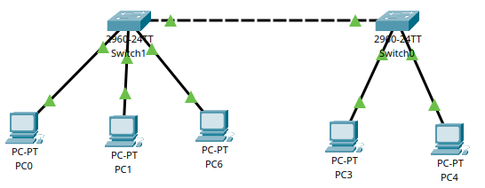
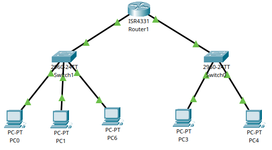
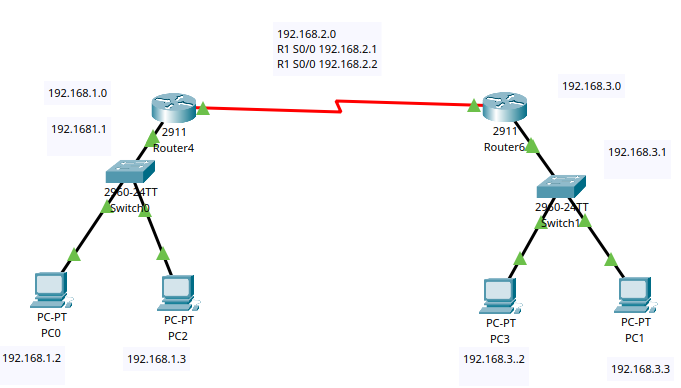
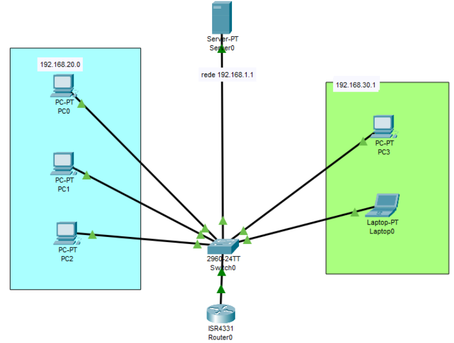

# Introdução ao Cisco Packet Tracer

--- 

## 1. O que é:

O Cisco Packet Tracer é um simulador de redes desenvolvido pela Cisco que possibilita simular sem precisar do hardware físico.Ele permite criar topologias de rede virtuais, testar configurações e simular o comportamento de dispositivos de rede como:

- Roteadores
- Switches
- Computadores (PCs e laptops)
- Servidores
- Dispositivos móveis

--- 

## 2. Passos básico:

### 2.1 Adicionar dispositivos

- PC ou Laptop: Simula um computador na rede;
- Switch: Permite conectar múltiplos dispositivos na mesma rede local (LAN);
- Roteador: Permite a comunicação entre redes diferentes (WAN ou sub-redes);


### 2.2 Configuração de IP

- Cada PC deve ter um IP único dentro da mesma rede/sub-rede do switch ou roteador;
- Configure o gateway padrão no PC, apontando para o IP do roteador;

### 2.3 Testar conectividade


#### 2.3.1 Por terminal*
- Ir em um PC/desktop/command prompt;
- Colocar ping + Ip do PC de onde quer testar;

```bash
ping 192.168.1.2   

// vai aparecer algo assim caso der certo
Reply from 192.168.1.2: bytes=32 time<1ms TTL=128
Reply from 192.168.1.2: bytes=32 time<1ms TTL=128
Reply from 192.168.1.2: bytes=32 time<1ms TTL=128
Reply from 192.168.1.2: bytes=32 time<1ms TTL=128

Ping statistics for 192.168.1.2:
    Packets: Sent = 4, Received = 4, Lost = 0 (0% loss),
Approximate round trip times in milli-seconds:
    Minimum = 0ms, Maximum = 0ms, Average = 0ms

```

#### 2.3.2 Por pacotes:
- Ícone de cartinha em cima, só clicar onde quer testar;
- Vai aparecer no canto inferior direito se deu certo ou não;

--- 

## 3. Comandos de Configuração Inicial

### 3.1 Configuração básica

```bash
enable                      # Acessa modo privilegiado
configure terminal          # Acessa modo de configuração global
hostname NOME               # Altera o nome do switch/roteador
banner motd #mensagem#      # Mensagem
do show ip interface brief  # Mostra resumo das entrada
exit                        # Sai da configuração global
```

### 3.2 Configuração de senha e login

```bash
enable
configure terminal
line console 0           # Acessa a porta de console
password SENHA           # Define a senha
login                    # Força o login
enable secret SENHA      # Para acessar o terminal
```

### 3.3 Salvando e reiniciando configurações

```bash
do copy running-config startup-config   # Salva as alterações
do reload                               # Reinicia o equipamento

enable
erase startup-config     # Apaga todas as informações salvas
n                        # Não salva ao apagar
```

### 3.4 Ajustes adicionais

```bash
enable
configure terminal
no ip domain lookup    # Desativa a tradução de comandos inválidos
```

---

## 4. Topologias

### 4.1 Conectar dois computadores
- Conectar um cabo cross-over via fast-ethernet;
- Colocar um IP em cada um dos pcs (PC - Desktop - Ip Config);
- Ex: 192.168.1.1 e 192.168.1.2;
- Testar conexão;

<p align="center">
  
</p>

---

### 4.2 Star Topology

- Todos os PCs se conectam e comunicam por um switch;
- Conectar cada PC com o switch com um cabo straight-throught;
- Demora um pouco para estabilizar;
- Colocar os IPs nos computadores;
- Testar a conexão;

<p align="center">
  
</p>

---

### 4.3 Conexão entre dois switchs

- Criar a star topology 1;
- Criar a star topology 2;
- Conectar os switchs com o cabo cross-over via fast-ethernet;
- Testar a conexão

<p align="center">
  
</p>

---

### 4.4 Conexão entre switchs com router

- Utilizar router sempre que os switches forem de sub-redes diferentes;
- Criar a star 1 com PCs de Ip 192.168.1.n e default gateway de 192.168.1.1
- Criar a star 2 com PCs de Ip 172.16.1.n e deafult gateway de 172.16.1.1
- Colocar como deafult gateway dos PCs o Ip da outra star;
- Conectar cada switch com o router atraves do gigaBitEthernet
- Conectar um Laptop e conectar no router com o cabo console via RS-232/Console
- Entrar no terminal do laptop e configurar router
    - Acessar config/GigabitEthernet0 e colocar o Ip da star 1;
    - Acessar config/GigabitEthernet0 e colocar o Ip da star 2;
    - Deixar Port Status On nos dois;
- Testar conexão (primeiro com o ping;)

``` bash
enable
configure terminal

interface GigabitEthernet0/0/0
ip address 192.168.1.1 255.255.255.0
no shutdown
exit

interface GigabitEthernet0/0/1
ip address 172.16.1.1 255.255.255.0
no shutdown
exit

copy running-config startup-config
reload
```

<p align="center">
  
</p>

---

### 4.5 Conexão de dois routers


- Criar star 1 com router1 
    - net 192.168.1.0
    - r1  192.168.1.1 (conectado g0/0 no sw1)
    - pc1 192.168.1.2
    - pc2 192.168.1.3
- Criar star 2 com router2
    - net 192.168.3.0
    - r1  192.168.3.1 (conectado g0/0 no sw2)
    - pc1 192.168.3.2
    - pc2 192.168.3.3
- Conectar os routers com cabo serial 
    - Addicionar o WIC neles antes
    - no S0/0/0
    - ip da rede 192.168.2.0


``` bash title="Configurar o r1:"
enable
configure t

// adicionar o gateway da rede
interface g0/0
ip add 192.168.1.1 255.255.255.0
no shut

// adicionar a serial s0/0/0
interface s0/0/0
ip address 192.168.2.1 255.255.255.252

// adicionar a rota pra o r2
ip route 192.168.3.0 255.255.255.0 192.168.2.2
```


``` bash title="Configurar o r2:"
enable
configure t

// adicionar o gateway da rede
interface g0/0
ip add 192.168.3.1 255.255.255.0
no shut

// adicionar a serial s0/0/0
interface s0/0/0
ip address 192.168.3.1 255.255.255.252

// adicionar a rota pra o r1
ip route 192.168.3.0 255.255.255.0 192.168.2.1
```

<p align="center">
  
</p>


---

### 4.6 Três routers com triangulação

- Star 1 (192.168.1.0)
    - r1  192.168.1.1 (conectado g0/0 no sw1)
    - pc1 192.168.1.2 dhcp
    - pc2 192.168.1.3 dhcp
- Star 2 (192.168.2.0)
    - r1  192.168.2.1 (conectado g0/0 no sw2)
    - pc1 192.168.2.2 dhcp
    - pc2 192.168.2.3 dhcp
- Star 3 (192.168.3.0)
    - r1  192.168.3.1 (conectado g0/0 no sw2)
    - pc1 192.168.3.2 dhcp
    - pc2 192.168.3.3 dhcp
- Conectar os routers com cabo serial 
    - Addicionar o WIC neles antes
    - no S0/1/0 e S0/1/1
- Rede r3-r2 (192.168.4.0)
- Rede r1-r2 (192.168.5.0)
- Rede r3-r1 (192.168.6.0)

``` bash title="Configurar o r1:"
// colocar o gateway
Router>en
Router#configure terminal
Router(config)#int g0/0/0
Router(config-if)#ip address 192.168.1.1 255.255.255.0
Router(config-if)#no shut
Router(config-if)#exit

// colocar o serial para o r3
Router(config-if)#exit
Router(config)#int s0/1/0
Router(config-if)#no shut
Router(config-if)#ip add 192.168.6.2 255.255.255.0

// colocar o serial para o r2
Router(config)#int s0/1/1
Router(config-if)#ip address 192.168.5.1 255.255.255.0
Router(config-if)#no shut
Router(config-if)#exit

// colocar o dhcp
Router(config)#ip dhcp pool dhcp
Router(dhcp-config)#default-router 192.168.1.1 
Router(dhcp-config)#network 192.168.1.0 255.255.255.0
Router(dhcp-config)#exit

// colocar routes
Router(config)#ip route 192.168.2.0 255.255.255.0 192.168.6.1
Router(config)#ip route 192.168.3.0 255.255.255.0 192.168.5.2
Router(config)#exit
```

``` bash title="Configurar o r2:"
// colocar o gateway
Router>en
Router#configure terminal
Router(config)#int g0/0/0
Router(config-if)#ip address 192.168.2.1 255.255.255.0
Router(config-if)#no shut
Router(config-if)#exit

// colocar o serial para o r1
Router(config-if)#exit
Router(config)#int s0/1/0
Router(config-if)#ip add 192.168.6.1 255.255.255.0
Router(config-if)#no shut

// colocar o serial para o r2
Router(config)#int s0/1/1
Router(config-if)#ip address 192.168.4.1 255.255.255.0
Router(config-if)#no shut
Router(config-if)#exit

// colocar dhcp
Router(config)#ip dhcp pool dhcp
Router(dhcp-config)#default-router 192.168.2.1
Router(dhcp-config)#network 192.168.168.2.0 255.255.255.0

// colocar routes
Router(config)#ip route 192.168.3.0 255.255.255.0 192.168.4.2
Router(config)#ip route 192.168.1.0 255.255.255.0 192.168.6.2
Router(config)#exit
```

``` bash title="Configurar o r3:"
// colocar o gateway
Router>en
Router#configure terminal
Router(config)#int g0/0/0
Router(config-if)#ip address 192.168.3.1 255.255.255.0
Router(config-if)#no shut
Router(config-if)#exit


// colocar o serial para o r1
Router(config-if)#exit
Router(config)#int s0/1/0
Router(config-if)#ip add 192.168.5.2 255.255.255.0
Router(config-if)#no shut


// colocar o serial para o r3
Router(config)#int s0/1/1
Router(config-if)#ip address 192.168.4.2 255.255.255.0
Router(config-if)#no shut

// colocar dhcp
Router(config)#ip dhcp pool dhcp
Router(dhcp-config)#default-router 192.169.3.0
Router(dhcp-config)#network 192.168.3.0 255.255.255.0

// colocar routes
Router(config)#ip route 192.168.2.0 255.255.255.0 192.168.4.1
Router(config)#ip route 192.168.1.0 255.255.255.0 192.168.5.1
Router(config)#exit
```
<p align="center">
  
</p>


### 4.6 DHCP Server

- Montar a star;
- Conectar o server no switch;
- Settar o ip do server (192.168.1.1);
- Acessar services/dhcp e colocar started ip address;
- Agora ir nos outros pcs em desktop/ipconfiguration e colocar dhcp;
- Vai aparecer automaticamente;

### 4.7 DHCP Server

- Montar a star com dois pcs;
  - PC1: Ip 10.0.0.4 e DNS 10.0.0.1;
  - PC2 (admin): Ip 10.0.0.5 e DNS 10.0.0.1;
- Conectar dois servers;
- Primeiro vai ser o Web Server com ip 10.0.0.1;
    - Acessar services/HTTP/index.html e alterar; 
- Segundo vai ser o DNS Server com ip 10.0.0.2;
  - Acessar services/DNS;
  - Deixar ligado;
  - Adicionar um nome (unb) e ip 10.0.0.2;
- Agora se for em desktop/web browsere acessar unb.com vai abrir o web server;
- Ir no server dns e adicionar admin com ip 10.0.0.5;
- Agora consegue dar ping no pc1 com: ping admin; 

<p align="center">
  
</p>


## 4.8 VLAN 
- Criar a star 1 (192.168.20.0);
- Criar a star 2 (192.168.30.0);
- conectar o servidor e o router;
- VLAN1: 192.168.1.1 (servidor dhcp)

``` bash title="Configurar o sw:"
# criar a vlan A e vlan B  
Switch>en
Switch#conf t
Switch(config)#vlan 2
Switch(config-vlan)#name A
Switch(config-vlan)#vlan 3
Switch(config-vlan)#name B

# Conecta o router e colocar no modo trunk
Switch(config-vlan)#interface gigabit 0/1
Switch(config-if)#sw mode trunk
Switch(config-if)#sw trunk allowed vlan all
Switch(config-if)#do wr
Switch(config-if)#exit

# atribuir os pcs da vlan A e vlan B
Switch(config)#interface range fa0/1-3
Switch(config-if-range)#sw access vlan 2
Switch(config-if-range)#exit
Switch(config)#interface range fa0/4-5
Switch(config-if-range)#sw access vlan 3
Switch(config-if-range)#exit
Switch(config)#do wr
Switch(config)#sh vlan brief
```

``` bash title="Configurar o router:"
Router>en
Router#conf t
Router(config)#interface g0/0/0
Router(config-if)#no ip add
Router(config-if)#no shut

# cria a subinterface 0.1 para o serve
Router(config-if)#interface g0/0/0.1
Router(config-subif)#encapsulation dot1q 1
Router(config-subif)#ip add 192.168.1.1 255.255.255.0
Router(config-subif)#ip helper-address 192.168.1.2
Router(config-subif)#exit

# cria a subinterface 0.2 para vlan 20
Router(config-subif)#interface g0/0/0.2
Router(config-subif)#encapsulation dot1q 2
Router(config-subif)#ip add 192.168.20.1 255.255.255.0
Router(config-subif)#ip helper-address 192.168.1.2
Router(config-subif)#exit

# cria a subinterface 0.3 para vlan 30
Router(config)#interface g0/0/0.3
Router(config-subif)#encapsulation dot1q 3
Router(config-subif)#ip add 192.168.30.1 255.255.255.0
Router(config-subif)#ip helper-address 192.168.1.2
Router(config-subif)#exit
Router(config)#do wr
```
<p align="center">
  
</p>


v