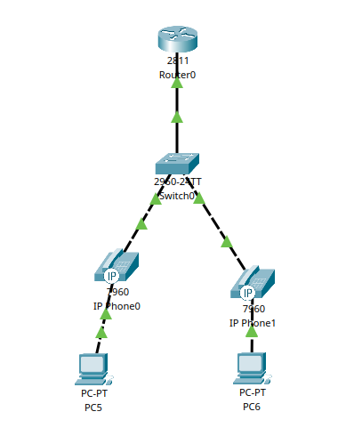
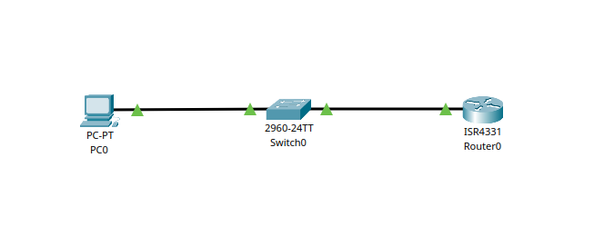

# Passos mais avançadods no Cisco Packet Traver

---

## 1. VOIP (Voice Over Internet Protocol)

É uma tecnologia que permite transmitir voz pela rede de dados usadno redes baseada em IP, em vez  de usar fios telefônicos e centrais analógicas.

### 1.1 Conceitos 

**Cisco CME**
Cisco Unified Communications Manager Express: uma solução onde o roteador funciona como um gateway de voz e servidor de chamadas, gerenciado os telefones IP.

**DHCP Option 150**
Configuração específica do serviço DHC'que indica aos dispositivos VOIP o endereço IP do servidor TFTP, de onde eles podem baixar seus arquivos de configuração.

**Directory Number (ephone-dn)**
Representa um canal de voz virtual do sistema CME.

**Ramais**
Ramal é o número de telefone interno usado para ligar de um telefone IP para outro dentro da rede. Cada ramal é configurado dentro de um diretório.

### 1.2 Passo a passo

**Principais elementos:** 

- 1 Router 2811.
- 1 Switch.
- 2 IP Phones.
- 2 PCs

**Conexões**

- Router Fa0/0 → Switch (porta Fa0/1).

- Telefones IP → Switch (portas Fa0/2 e Fa0/3).

**Etapa 1 - Configurar Switch**

- Colocar portas fa0/2 e fa0/3 em modo de acesso.  
- Criar a vlan 1, que vai incluir essas portas.

``` bash title="Etapa 1:"
Switch> enable
Switch# configure terminal
Switch(config)# interface range fastEthernet 0/2-3
Switch(config-if-range)# switchport mode access
Switch(config-if-range)# switchport voice vlan 1
Switch(config-if-range)# end
Switch# write

```

**Etapa 2 - Configurar Roteador**

- Acessar a interface fa0/0 (conectada ao switch).
- Definir o IP.

``` bash title="Etapa 2:"
Router> enable
Router# configure terminal
Router(config)# no ip domain-lookup
Router(config)# interface fastEthernet 0/0
Router(config-if)# ip address 192.168.0.1 255.255.255.0
Router(config-if)# no shutdown
Router(config-if)# end
Router# write
```
**Etapa 3 - Configurar do Serviço de Telefone (CME)**

- Criar um pool DHCP com um nome descritivo.
- Especificar o endereço de rede e a máscara da rede local.
- Definir o endereço do gateway padrão, que é o próprio roteador.
- Configurar a option 150, que informa aos telefones o endereço IP do
servidor TFTP (neste caso, o próprio roteador) de onde devem baixar suas configurações de voz.
- Opcionalmente, excluir o endereço IP do roteador do pool de distribuição para evitar conflitos.

``` bash title="Etapa 3:"
Router# configure terminal
Router(config)# ip dhcp pool VOIP
Router(dhcp-config)# network 192.168.0.0 255.255.255.0
Router(dhcp-config)# default-router 192.168.0.1
Router(dhcp-config)# option 150 ip 192.168.0.1
Router(dhcp-config)# exit
Router(config)# ip dhcp excluded-address 192.168.0.1
Router(config)# end
Router# write

```

**Etapa 4 - Configurar do Serviço de Telefone (CME)**

- Acessar o modo de configuração de serviço de telefonia.
- Definir o número máximo de telefones e o número máximo de diretórios.
- Especificar o endereço IP de origem e a porta que o serviço de telefonia utilizará para escuta.
- Habilitar a atribuição automática de números de ramal aos botoes dos telefones.

``` bash title="Etapa 4:"
Router# configure terminal
Router(config)# telephony-service
Router(config-telephony)# max-dn 2
Router(config-telephony)# max-ephones 2
Router(config-telephony)# ip source-address 192.168.0.1 port 2000
Router(config-telephony)# auto assign 1 to 2
Router(config-telephony)# exit
Router(config)# end
Router# write
```

**Etapa 5 - Configurar do Serviço de Telefone (CME)**

- Acessar o modo de configuração de diretório de telefonia.
- Para cada diretório criado, atribuir um número ramal único

``` bash title="Etapa 4:"
Router# configure terminal
Router(config)# telephony-service
Router(config-telephony)# max-dn 2
Router(config-telephony)# max-ephones 2
Router(config-telephony)# ip source-address 192.168.0.1 port 2000
Router(config-telephony)# auto assign 1 to 2
Router(config-telephony)# exit
Router(config)# end
Router# write
```

**Etapa 6 - Testar**
- Cada telefone vai receber um número de ramal.
- Tentar ligar de um telefone para o outro.

<p align="center">
  
</p>


---

## 2. Telnet 

Telnet é um protocolo de comunicação que permite acessar e controlar remotamente um dispositivo, como se estivesse fisicamente presente na rede local.

### 2.1 Funcionamento

- O cliente se conecta ao servidor.
- O servidor solicita usuário e senha.
- Autentificado, o cliente pode executar comandos remotamente.
- Toda a comunicação é feita por transmissão direta de texto, sem nenhum tipo de criptografia.

### 2.2 Características

- Inseguro, não possui nenhum tipo de criptografia (pessoas conectadas na rede com programas de captura de pacotes podem ver o que você esta digitando)
- Usado para gerenciar remotamente dispositivos e testar conectividades.
- Aconcelhado somente em ambientes fechados e controlados
- Trabalha com uma interface de linha de comando.

### 2.3 Passo a passo

**Principais elementos:** 

- 1 PC.
- 1 Switch.
- 2 Router.

**Conexões**

- Router G0/0 → Switch (porta Fa0/1).

- Switch Fa0/2 → PC Fa0/1.

**Etapa 1 - Configurar Router**

- Seleciona as linhas do terminal virtual VTY.
- Coloca a senha que será definida ao acessar o roteador remotamente
- Coloca a senha para acessar o console.
- Coloca a senha para acessar o modo privilegiado.
- Atribui IP a G0/0/0

``` bash title="Etapa 1:"
Router> enable
Router# configure terminal
Router(config)# line vty 0 4
Router(config-line)# password unb
Router(config-line)# login
Router(config-line)# exit
Router(config)# line console 0
Router(config-line)# password unb
Router(config-line)# login
Router(config-line)# exit
Router(config)# enable secret senha
Router(config)# interface gigabitEthernet0/0/0
Router(config-if)# ip address 192.168.1.1 255.255.255.0
Router(config-if)# no shutdown
Router(config)# end
Router# write
```

**Etapa 2 - Acessar pelo PC**

- Configurar IP (192.168.1.10) e gateway (192.168.1.1)
- Acessar promp de comando

``` bash title="Etapa 2:"
C:\>telnet 192.168.1.1
Trying 192.168.1.1 ...Open


User Access Verification

Password: 
Router>
```

<p align="center">
  
</p>


## 3. SSH (Secure Shell) 

SSH, assim com o Telnet, também é um protocolo de comunicação de rede que permite acessar e controlar remotamente dispositivos, porém, de forma segura.

### 3.1 Funcionamento

- Cada dispositivo possui um nome único, formado pelo hostname e pelo domain-name.
- Com base nesse nome único, é gerada uma chave RSA para autenticação e criptografia inicial.
- Cada equipamento possui usuários locais e senhas, utilizados para autenticação SSH.
- O cliente se conecta ao servidor.
- O servidor solicita usuário e senha.
- Uma vez autenticado, o cliente pode executar comandos remotamente.
- Toda a comunicação é protegida por chaves criptográficas, garantindo que os dados trocados fiquem seguro e criptografado.
### 3.2 Características

- Usado para garantir a comunicação remota segura de dispositivos em uma rede insegura.
- Criptografado e seguro.
- Também trabalha com uma interface de linha de comando.

### 3.3 Passo a passo

**Principais elementos:** 

- 4 PC.
- 2 Switch.
- 1 Router.

**Conexões**

- Router G0/0/0 → Switch1 (porta Fa0/1).
- Router G0/0/1 → Switch2 (porta Fa0/1).
- Switch1 Fa0/2-3 → PC1 e PC2
- Switch2 Fa0/2-3 → PC3 e PC4

**IPs**

- Router G0/0/0 → 192.168.1.1 (rede 1)
- Router G0/0/1 → 192.168.2.1 (rede 2)
- Switch1 VLAN1 → 192.168.1.10
- Switch2 VLAN1 → 192.168.2.10
- PC1 → 192.168.1.100 (gateway 192.168.1.1)
- PC2 → 192.168.2.100 (gateway 192.168.2.1)

**Etapa 1 - Configurar Router**

- Definir o nome do domínio do roteador.
- Criar um usuário e senha.
- Gerar a chave criptográfica RSA.
- Acessa o terminal VTY.
- Define que somente SSH será aceito.
- Usar o sistema de login local.
- Configra g0/0/0 e g0/0/1

``` bash title="Etapa 1:"
Router> enable
Router# configure terminal
Router(config)# hostname R1
# Definir um nome do domínio do roteador
# O SSH usa o hostname + domain-name para gerar a criptografia RSA.
R1(config)# ip domain-name cisco.com
# Cria um usuário e uma senha
R1(config)# username cisco secret cisco
# Gera a chave criptográfica RSA
R1(config)# crypto key generate rsa
How many bits in the modulus [512]: 1024
R1(config)# ip ssh version 2
R1(config)# line vty 0 15
# Define que apenas SSH será aceito como medo de acesso remoto
R1(config-line)# transport input ssh
R1(config-line)# login local
R1(config-line)# exit
# Define senha para o modo privilegiado.
R1(config)# enable secret unb
# Configura o ip da g0/0/0
R1(config)# interface g0/0/0
R1(config-if)# ip address 192.168.1.1 255.255.255.0
R1(config-if)# no shut
# Configura o ip da g0/0/1
R1(config)# interface g0/0/1
R1(config-if)# ip address 192.168.2.1 255.255.255.0
R1(config-if)# no shut
R1(config)# end
R1# write

```

**Etapa 2 - Configurar Switch 1**

- Criar o domínio de rede so sw.
- Criar um usario local e senha.
- Criar a criptografia para senha.
- Acessa o terminal vty.
- Cria a vlan 1 e define o gateway padrao.

``` bash title="Etapa 2:"
Switch> enable
Switch# configure terminal
Switch(config)# hostname SW1
SW1(config)# ip domain-name unb.local
SW1(config)# username unb password unb
# Define senha para o modo privilegiado.
SW1(config)# enable secret cisco
SW1(config)# crypto key generate rsa
How many bits in the modulus [512]: 1024
SW1(config)# ip ssh version 2
SW1(config)# line vty 0 4
SW1(config-line)# transport input ssh
SW1(config-line)# login local
SW1(config-line)# exit
SW1(config)# interface vlan 1
SW1(config-if)# ip address 192.168.1.10 255.255.255.0
SW1(config-if)# no shutdown
SW1(config)# ip default-gateway 192.168.1.1
# Define senha para o acesso físico direto
SW1(config)# line console 0
SW1(config-line)# password unb
SW1(config-line)# login
SW1(config)# end
SW1# write
```

**Etapa 3 - Configurar Switch 2**

- Criar o domínio de rede so sw.
- Criar um usario local e senha.
- Criar a criptografia para senha.
- Acessa o terminal vty.
- Cria a vlan 1 e define o gateway padrao.

``` bash title="Etapa 3:"
Switch> enable
Switch# configure terminal
Switch(config)# hostname SW2
SW2(config)# ip domain-name unb.local
SW2(config)# username unb password unb
SW2(config)# enable secret cisco
SW2(config)# crypto key generate rsa
How many bits in the modulus [512]: 1024
SW2(config)# ip ssh version 2
SW2(config)# line vty 0 4
SW2(config-line)# transport input ssh
SW2(config-line)# login local
SW2(config)# interface vlan 1
SW2(config-if)# ip address 192.168.2.10 255.255.255.0
SW2(config-if)# no shutdown
SW2(config)# ip default-gateway 192.168.2.1
SW2(config)# end
SW2# write
```

**Etapa 4 - Configurar Switch 2**

- Criar o domínio de rede so sw.
- Criar um usario local e senha.
- Criar a criptografia para senha.
- Acessa o terminal vty.
- Cria a vlan 1 e define o gateway padrao.

``` bash title="Etapa 3:"
Switch> enable
Switch# configure terminal
Switch(config)# hostname SW2
SW2(config)# ip domain-name unb.local
SW2(config)# username unb password unb
SW2(config)# enable secret cisco
SW2(config)# crypto key generate rsa
How many bits in the modulus [512]: 1024
SW2(config)# ip ssh version 2
SW2(config)# line vty 0 4
SW2(config-line)# transport input ssh
SW2(config-line)# login local
SW2(config)# interface vlan 1
SW2(config-if)# ip address 192.168.2.10 255.255.255.0
SW2(config-if)# no shutdown
SW2(config)# ip default-gateway 192.168.2.1
SW2(config)# end
SW2# write
```

**Etapa 5 - Acesso Direto a Dispositivos**

- **Roterador** a partir PC1:
  - Comando: Ssh –L cisco 192.168.1.1
  - Será solicitada a senha do usuário cisco. 
  - Para entrar no modo privilegiado,será solicitada a senha class.
- **Switch** a partir PC1:
  - Comando: Ssh –L unb 192.168.1.10
  - Será solicitada a senha do usuário unb. 
  - Para entrar no modo privilegiado,será solicitada a senha class.

**Etapa 6 - Acesso Direto a Dispositivos**

- **Do PC1 para o SW1** 
  - Ssh –L unb 192.168.1.10 (senha unb)
- **Do SW1 para o R1:**
  - Dentro da sessão do SW1, executar: Ssh –L cisco 192.168.1.1 (senha
cisco)
- **Do R1 para o SW2:**
  - Dentro da sessão do R1, executar: Ssh –L unb 192.168.2.10 (senha
unb)